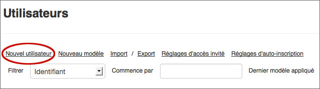
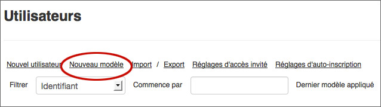
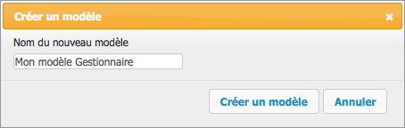

Gestion des utilisateurs
========================

.. toctree::
    :maxdepth: 3

.. topic:: L'essentiel

    **Disponible pour les utilisateurs disposant des droits de gestion des
    utilisateurs**, l'interface Utilisateurs permet de gérer la liste des
    utilisateurs enregistrés dans l'application Phraseanet et de leurs attribuer
    des droits.

L'interface *Utilisateurs* permet :

* De créer de nouveaux utilisateurs
* De valider des demandes d'inscription d'utilisateurs
* De gérer les droits des utilisateurs
* Créer des modèles applicables à des utilisateurs
* De paramétrer un accès invité disposant de droits spécifiques

Par défaut, l'interface affiche la liste des utilisateurs référencés sur la
solution Phraseanet.

.. image:: ../../images/General-Administration.jpg
    :align: center

Notions relatives aux utilisateurs et à leurs droits
----------------------------------------------------

Dans Phraseanet, si un utilisateur ne voit pas une fonction, c'est
certainement parce qu'il n'a pas les droits pour y accéder.

**Par exemple**, si un utilisateur n'a pas le droit d'accéder à une collection,
celui-ci ne la verra pas et peut donc parfaitement ignorer qu'elle existe.

**Cela est également vrai pour les interfaces elles mêmes** : certains
utilisateurs peuvent n'avoir accès qu'à certains modules ou qu'a certaines
fonctionnalités dévolues à la consultation.
Les administrateurs, eux, peuvent avoir accès à davantage d'interfaces (telles
que *Administration*, *Report*, *Thésaurus* ou *Upload*).

Enfin, **il n'est pas possible à un utilisateur disposant des droits de gestion
des utilisateurs de donner plus de droits qu'il n'en a lui-même**.

.. note::

    Un utilisateur n'ayant pas de droits attribués est un utilisateur fantôme.
    Il est signalé par une icône de fantôme dans la liste des utilisateurs.

.. image:: ../../images/Administration-utilisateurfantome.jpg
    :align: center

Trier les utilisateurs existants
--------------------------------

Lorsque vous recherchez un utilisateur, vous pouvez filtrer par : identifiant,
nom/prénom, email, pays, société, dernier modèle; ou bien entrer dans le champ
**Commence par** le début de l'identifiant de l'utilisateur afin de le retrouver
dans la liste.

Créer, modifier, supprimer un utilisateur
-----------------------------------------

Créer un nouvel utilisateur
***************************

Cliquer sur le bouton Nouvel utilisateur.

Une fenêtre overlay s'affiche.

Saisir le login du nouvel utilisateur et cliquer sur **Créer un utilisateur**.

La fenêtre de gestion des droits de l'utilisateur créé s'ouvre.

Pour savoir comment gérer les droits, se reporter à la section
`Édition des droits`_ .

Pour éditer les renseignements relatifs aux coordonnées de l'utilisateur,
cliquer sur l'onglet **Informations** puis éditer le formulaire.

Appliquer les modifications apportées en cliquant sur le bouton **Valider**.

Modifier les droits d'un utilisateur
************************************

Pour modifier les droits et informations d'un utilisateur, double cliquer
sur le nom de l'utilisateur.

Pour plus de détails relatifs aux droits utilisateurs, se reporter à la section
`Édition des droits`_.

Supprimer un utilisateur
************************

Pour supprimer un utilisateur du système Phraseanet, sélectionnez l'utilisateur
dans la liste puis cliquer sur le bouton **Supprimer**.

Créer des modèles utilisateurs
------------------------------

Il est possible de créer des modèles et de les appliquer à un ou plusieurs
utilisateurs.
Un utilisateur auquel est appliqué un modèle, cumule des droits définis par le
modèle.

.. note::

    Les modèles appartiennent aux utilisateurs qui les créent. Ils ne sont
    pas visibles par les autres administrateur.

Dans la liste des utilisateurs, un modèle est repéré par une icône **M**.

Pour créer un modèle utilisateur, cliquer sur **Nouveau modèle**.

Une fenêtre overlay présente un formulaire de saisie.

Donner un nom au nouveau modèle puis valider le formulaire.

Une fenêtre s'ouvre et présente le formulaire d'édition des **Droits** pour
éditer les droits de ce nouveau modèle.

Une fois le modèle paramétré, valider le formulaire.

Il est possible de rattacher plusieurs utilisateurs au modèle et de gérer
collectivement les droits de plusieurs utilisateurs à travers les modèles.

.. image:: ../../images/Administration-appliquermodele.jpg
    :align: center

L'accès invité
--------------

**L'accès invité** peut être mis en place sur Phraseanet, si souhaité.
Il donne la possibilité à des personnes non enregistrées sur le système d'avoir
un accès (temporaire) à l'application.

Pour configurer l'accès invité, cliquer sur le lien **Réglage de l'accès
invité**.

Les droits de l'accès invité sont paramétrables dans cet onglet.

Édition des droits
------------------

L'édition des droits concerne aussi bien les utilisateurs que les modèles.
Pour afficher le formulaire d'édition des droits d'un modèle ou d'un
utilisateur, double cliquer sur le nom de l'utilisateur ou du modèle dans la
liste des utilisateurs.

La fiche des droits s'ouvre et permet de gérer les **droits de consultation et
exploitation** à gauche et les droits de "gestion" au sens étendu à droite.

En haut à gauche de la fenêtre, on accède aux informations de l'utilisateur en
cliquant sur sa "Fiche" (en bleu ci-dessous).

.. note::

    La modification des droits des utilisateurs peut se faire en lot.

Ce cadre donne la liste des bases et des collections disponibles et auxquelles
l'utilisateur peut avoir accès.

.. image:: ../../images/Administration-droits.jpg
    :align: center

Les noms des collections apparaîssent sous les noms des bases auxquelles elles
appartiennent. La collection est la notion utilisée dans les interfaces
*Production*, *Classic*, *Report*, *Administration*.

La base de données contient une ou plusieurs collections.
Pour chacune de ces collections, des droits sont définis. Un droit est accordé
lorsque la case à l'intersection de la ligne et de la colonne est cochée. Le
droit n'est pas accordé lorsque la case est décochée.
La case grisée signifie que le droit n'est accordé que partiellement à certains
des utilisateurs sélectionnés.

Un utilisateur ne peut donner plus de droits qu'il n'en a lui même (point
rouge). Le signe "**i**" signifie qu'une fenêtre est accessible d'un clic pour
définir de façon plus précise des droits spécifiques.

.. note::

    En cliquant sur la flèche grise, Phraseanet vous donne la possibilité
    de cocher ou décocher toute la colonne, au lieu de cliquer sur les
    cases une par une.

Les droits de consultation
**************************

La première partie de la fenêtre des droits, la plus à gauche:

* Cocher **Accéder** pour permettre d'accéder à la base ou à la collection
* Cocher **Actif** pour activer l'utilisateur. A contrario, décocher la case
  désactive l'utilisateur sans perdre tout le paramétrage.
* Cocher **Paniers** pour autoriser la création des Paniers.
* Cocher **Voir Preview** pour autoriser la visualisation des images de choix.
* Cocher **Watermark** pour définir si l'utilisateur voit les images de choix
  avec un marquage.
* Coche*Télécharger Haute Def** pour autoriser le téléchargement du
  document original
* Cocher **Commander** pour autoriser la commande de documents
* Cliquer sur **Quota** pour ouvrir la fenêtre Quota de téléchargements.

Plusieurs options très fines sont à la disposition de l'utilisateur pour la
limitation :

**Limitation par les Quota**

La fenêtre "Quota des téléchargements" permet de définir pour l'utilisateur des
quotas de téléchargement par base ou par collection.

* Cocher sur Oui pour activer la gestion des quotas.
* Saisir le nombre de droits de téléchargements par mois pour cette collection.
  Le "reste" se calcule automatiquement en fonction du droit initial et du
  nombre de téléchargements effectués.
* Cliquer sur le bouton Valider pour enregistrer le paramétrage et fermer la
  fenêtre.

**Limitation dans le temps**

Cliquer sur **Limité Temps** pour ouvrir la fenêtre *Durée de vie*

Cette fenêtre permet de limiter dans le temps l'accès à une base ou à une
collection.

* Cocher sur Oui pour activer la gestion des limites dans les temps
* Sélectionner les bornes de la période d'accès autorisée
* Cliquer sur le bouton Valider pour enregistrer le paramétrage et fermer la
  fenêtre.
* Cliquer sur **Status** pour ouvrir la fenêtre *Status*.

**Limitation par les Status**

Cette fenêtre permet de paramétrer les status des documents pour l'utilisateur.

Un status peut être sur une des deux valeurs "une ou l'autre des cases cochées",
l'utilisateur ne voit que les documents dont le status est sur la même valeur.

Un status peut être sur les deux valeurs "les deux cases cochées", l'utilisateur
voit aussi bien les documents dont le statut est sur l'une ou l'autre des
valeurs.

*Se reporter aux réglages de la base pour la création et la gestion des status
bits.*

Cliquer sur le bouton Valider pour enregistrer le paramétrage et fermer la
fenêtre.

Les droits d'exploitation et de gestion
***************************************

La deuxième partie dans la fenêtre des droits permet de définir les droits
administratifs, c'est à dire les actions auxquelles l'utilisateur a accès,
par l'intermédiaire des icônes de la Palette des Actions notamment.
Cocher la case pour donner le droit correspondant sur la collection ou la base.

**Documents**

* Cocher **Ajouter** pour autoriser l'ajout d'un document dans la base ou
  collection
* Cocher **Éditer** pour autoriser l'édition de la description des documents
* Cocher **Changer status** pour autoriser l'utilisateur à changer le statut
  d'un document
* Cocher **Supprimer** pour autoriser l'utilisateur à supprimer un document
* Cocher **Outils Images** pour autoriser l'utilisateur à bénéficier des outils
* Cocher **Gestion Utilisateurs** pour autoriser la gestion des utilisateurs
* Cocher **Consulter Rapports** pour autoriser l'utilisateur à consulter les
  statistiques
* Cocher **Push** pour autoriser l'utilisation de la fonction *Push* et d'
  envoyer des documents à des destinataires.

**Droits sur la gestion des bases et collections**

* Cocher **Gestion Coll.** pour autoriser l'utilisateur à effectuer
  différentes opérations de gestion. Pour une collection: la renommer, la
  vider, la mettre online ou offline, la supprimer.
* La case **Structure Coll.** donne accès aux fonctions de réglages de
  collections dans *Phraseanet Administration*. Structure Coll. permet l'accès
  aux préférences de la collection et autorise la modification des listes de
  valeurs suggérées.
* La case **Publication Panier** permet à un utilisateur de publier sous forme
  de paniers des documents sur des pages de l'application *Classic*.
* La case **Modif. Thésaurus** permet à l'utilisateur d'accéder à l'
  application *Phraseanet Thésaurus*
* La case **Gestion Base** permet d'accéder aux fonctions de paramètres de
  bases de données comme création, purge et fonctions avancées de gestion de la
  solution

Demandes
--------

Disponible via le menu du module d'Administration, cette fenêtre liste les
demandes d'inscription des nouveaux utilisateurs dans l'écran *Inscription*.
Si un utilisateur a fait une demande sur plusieurs collections, il y a autant de
lignes de validation que de demandes.
Un "rollover" sur le nom permet d’afficher les informations relatives au
demandeur.

.. image:: ../../images/Administration-demande.jpg
    :align: center

Choisir les droits à attribuer par collections en cochant les cases. L'
utilisateur peut :

* refuser l'accès à la collection demandée
* donner accès à la collection demandée aux documents de type sous résolution
* donner accès à la collection demandée, avec les documents en haute définition
* donner accès à la collection demandée, sans les documents en haute définition

Cliquer sur **Valider** pour appliquer les choix effectués.
