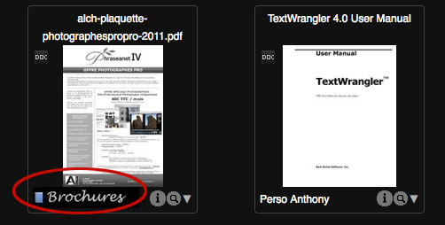
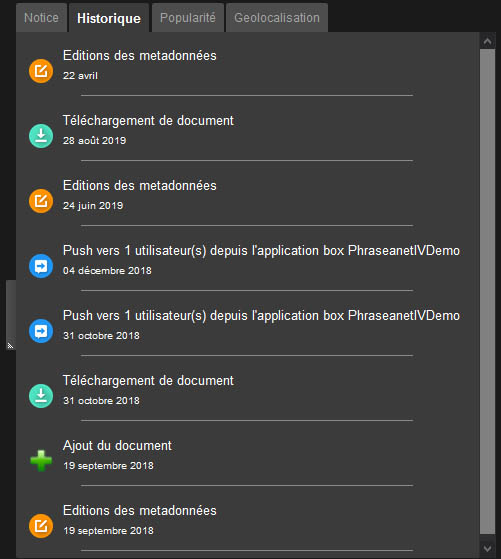
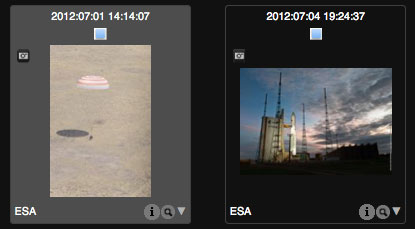
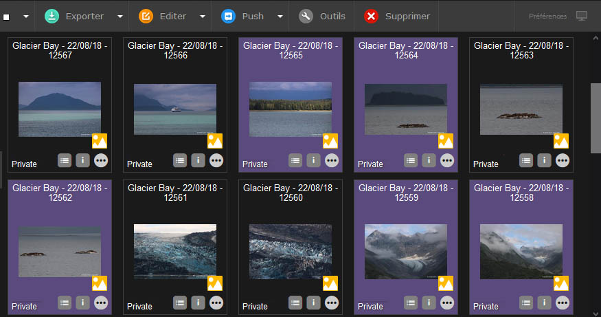
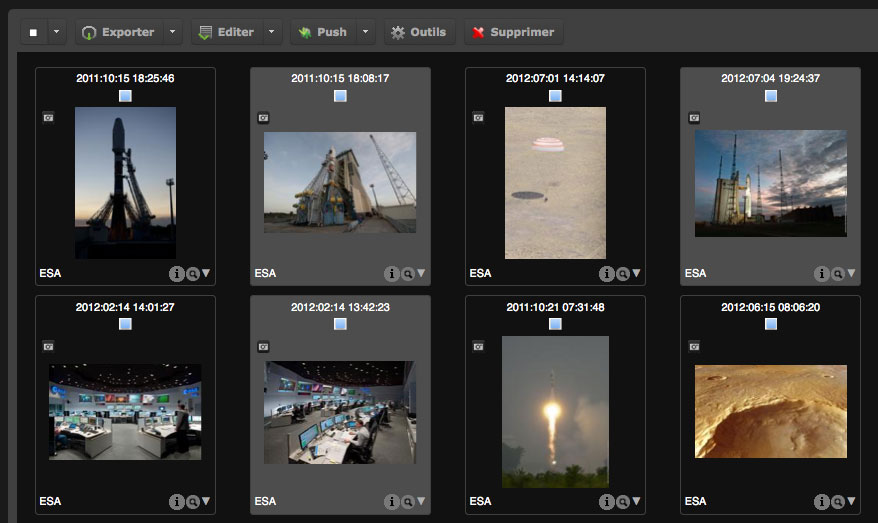
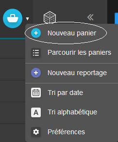

Affichage des résultats
=======================
.. toctree::
    :maxdepth: 3

.. topic:: L'essentiel

    *Production* est l'interface dédiée à la consultation, à la recherche,
    à la gestion et à l'édition des documents, selon les droits de
    l'utilisateur. Elle se lance par défaut lors d'une première connexion à
    l'application.

L'interface Production
----------------------

L'espace de travail
*******************

L'espace de travail de Production se partage en quatre zones :

.. figure:: ../../images/Production-zones.jpg
    :align: center

* **1. Le formulaire de recherche** permet de rechercher des médias et des
  reportages
* **2. La zone d'affichage** présente le contenu d'une recherche
* **3. La zone de travail** rassemble les onglets de facettes, de paniers et de
  reportages, de thésaurus et de plugins, s'il y en a d'installés. Cette zone
  est rétractable, escamotable.
* **4. La palette d'Actions** permet d'effectuer des actions sur les
  enregistrements et d'accéder aux **Préférences d'affichage**. Se référer à
  la page dédiée à la :doc:`Palette des Actions <Actions>`.

Un bandeau inférieur dans l'espace de travail renseigne sur le nombre de
réponses existantes et affiche un index de pagination des résultats. Cet index
permet de se déplacer dans les résultats.

.. note::

    Ne pas utiliser les boutons reculer et avancer du navigateur.

Présentation des résultats de recherche
***************************************

Les résultats de recherche sont présentés sous forme de grille ou de liste,
selon les :doc:`préférences utilisateurs <Personnaliser>`.
Les vignettes sont surmontées d'un titre de présentation paramétrable par les
administrateurs.

.. note::

    Pour paramétrer le titre des documents affichés sous les vignettes, voir
    :doc:`la section Administration<AdministrationBasesCollections>`.

**Le nom de la collection d'appartenance du document est affiché dans le coin
inférieur gauche** de la vignette. Il peut être substitué par un mini logo.

**Placer la souris sur une vignette pour afficher la description du document.**
Cette description se compose des champs documentaires non vides renseignés par
les gestionnaires du fonds.
Les termes ayant servis comme critères de recherche peuvent être surlignés : il
s'agit d'une option de paramétrage du moteur de recherche

.. image:: ../../images/Affichage-surlignagemc.jpg
    :align: center

**La loupe permet d'afficher la prévisualisation des médias**. Ces
prévisualisations sont liées aux natures des sous-définitions *preview* définies
dans le paramétrage des bases auxquelles appartiennent les médias.

Par défaut, il s'agit :

* d'une image pour les documents de type image
* d'une séquence vidéo pour les documents de type vidéo
* d'une séquence sonore pour les documents de type audio
* d'une animation flash pour certains types de documents bureautiques
* d'une icône générique si le système ne reconnait pas le type de fichier ou
  n'est pas en mesure de générer de fichiers de sous-définitions

**L'icône *i* permet d'afficher des informations techniques sur le média
original** : largeur et hauteur en pixels, type, poids, taille d’impression...
Les informations affichées sont fonctions de la nature du média.

Effectuer un double-clic sur la vignette d'un média pour l'afficher dans la vue
détaillée.

La vue détaillée
----------------

.. image:: ../../images/Affichage-vuedetaillee1.jpg
    :align: center

La vue détaillée affiche une liste des documents d'une page de réponse sous la
forme d'un train de vignettes navigables :

* La partie haute de la fenêtre présente les vignettes navigables
  à la souris ou au clavier, de gauche à droite ou inversement
* La prévisualisation du média sélectionné est présentée au centre
* La partie droite rassemble trois onglets présentant la notice, l’historique
  et des statistiques sur le média affiché
* Dans le cas ou un média appartient à des Paniers ou Reportages, l'information
  est mentionnée dans la partie droite de la fenêtre

Cliquer sur la vignette de choix pour afficher les informations du média ou
utiliser les flèches gauche et droite du clavier.

L'onglet Notice
***************

L'onglet Notice affiche les informations contenues des champs documentaires
remplis. L'affichage complémentaire d'informations techniques est fonction du
paramétrage.

.. _Afficher-Historique:

L'onglet Historique
*******************

L'onglet Historique liste les opérations réalisées par des utilisateurs sur le
média depuis son ajout dans la base.

.. _Afficher-Popularite:

L'onglet Popularité
*******************

L'onglet Popularité révèle des statistiques sur le média affiché :

* Nombre de visualisations
* Sources d'accès
* Statistiques de téléchargement.

.. note::

    Pour des statistiques détaillées concernant une base, consulter la page
    consacrée aux :doc:`statistiques <Statistiques>`.

Cliquer sur "Fermer" ou sur la touche "Echap" du clavier pour quitter la vue
détaillée.

.. _Affichage-Selections:

Sélection d'enregistrements
---------------------------

Sélection simple
****************

Sélectionner une vignette dans la zone des résultats, dans les paniers ou dans
les reportages en cliquant dans son cadre. La couleur de fonds de la vignette
change pour indiquer sa sélection.

Cette couleur de sélection est modifiable par chaque utilisateur dans les
`Préférences d'affichage<PersonnaliserInterface>`.

Sélection multiple
******************

**Pour sélectionner des enregistrements contigus**...

* Cliquer sur la première vignette de la série
* Enfoncer et maintenir la touche Maj (Shift) du clavier
* Cliquer sur la dernière vignette des enregistrements à sélectionner

Tous les enregistrements compris dans l'intervalle sont sélectionnés.

**Pour sélectionner des enregistrements non contigus**...

* Appuyer sur la touche Alt du clavier
* Cliquer successivement sur les vignettes des enregistrements à sélectionner

**Pour sélectionner des enregistrements sur plusieurs pages de résultats**...

* Sélectionner les vignettes sur une première page
* Cliquer sur la page à atteindre
* Maintenir enfoncée la touche “Alt” du clavier
* Sélectionner les vignettes de la nouvelle page de résultats
* Répéter l'opération sur d'autres pages si nécessaire

Le nombre d'éléments sélectionnés est mentionné en bas à gauche dans
l'interface.

.. image:: ../../images/Affichage-selection5.jpg
    :align: center

.. note::

    Le nombre d'enregistrements sélectionnés est limité à 400.

.. _Affichage-Selections-Type:

Sélection par type de médias
****************************

Pour sélectionner tous les enregistrements d’une page de recherche par type de
média, cliquer sur le menu de l'action de sélection (flèche à droite du carré
blanc) puis cliquer sur le type de médias correspondant.

.. image:: ../../images/Affichage-selectiontype.jpg
    :align: center

Paniers de sélection
--------------------

Les paniers de sélection sont destinés à rassembler des médias dans le but de
s'y référer ultérieurement.
Un panier existe par défaut. D'autres peuvent être créés.
Des sélections simples et multiples peuvent être réalisées sur les documents
d'un panier ouvert.

.. _Affichage-Panier-Creer:

Créer un panier
***************

* Cliquer sur le Menu contextuel de l'onglet Panier / Reportage dans la zone de
  travail
* Cliquer sur **Nouveau panier**

Une fenêtre en surimpression présente un formulaire de création de panier.

* Saisir un nom pour le nouveau panier et une description (facultatif).
* Cocher la case **Ajouter ma sélection courante** pour ajouter des documents
  préalablement sélectionnés dans les résultats.
* Cliquer sur le bouton **Créer**.

.. _Affichage-Panier-Ouverture:

Ouvrir ou fermer un panier
**************************

Pour ouvrir et révéler le contenu d'un panier, cliquer sur son nom. **Le panier
est alors considéré comme actif**. Répéter l'opération pour le fermer.

.. image:: ../../images/Affichage-Panier2.jpg
    :align: center

Pour révéler le contenu d'un panier fermé, sans l'ouvrir, placer la souris sur
nom du panier. Son contenu est affiché dans une fenêtre en surimpression.

.. _Affichage-Panier-Ajouter:

Ajouter des médias dans un panier
*********************************

A partir d'une sélection dans la zone d'affichage
^^^^^^^^^^^^^^^^^^^^^^^^^^^^^^^^^^^^^^^^^^^^^^^^^

Avec la souris, glisser-déposer la sélection de documents sur le panier choisi
figurant dans la zone de travail.

Il n'est pas nécessaire de glisser une sélection sur un panier ouvert pour
que celle-ci soit ajoutée à un panier. Cette action peut aussi s'effectuer
sur des paniers fermés.

A partir de la vue détaillée
^^^^^^^^^^^^^^^^^^^^^^^^^^^^

Cliquer sur l'icône "Panier" pour ajouter le document affiché au panier actif.

.. _Affichage-Panier-Detail:

Afficher le contenu d'un panier dans la vue détaillée
*****************************************************

Pour afficher le contenu d'un panier dans la vue détaillée, effectuer un double
clic sur une des vignettes d'un panier actif. La vue détaillée présente le
contenu du panier actif.

.. _Affichage-Panier-Suppression1:

Supprimer des médias d'un panier
********************************

Dans un panier ouvert, cliquer sur la croix située sous la vignette des
documents à supprimer du panier.

.. _Affichage-Panier-Suppression2:

Supprimer un panier
*******************

Pour supprimer un panier, cliquer sur la rubrique Supprimer du menu contextuel
du panier à supprimer puis confirmer la suppression dans la fenêtre de
confirmation.

.. seealso::

    Se reporter à la section dédiée aux
    :doc:`Paniers et aux Reportages <PaniersReportages>` pour d'autres
    fonctionnalités.
