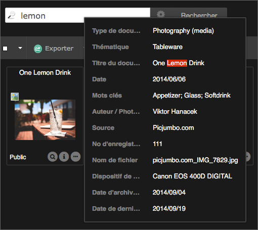
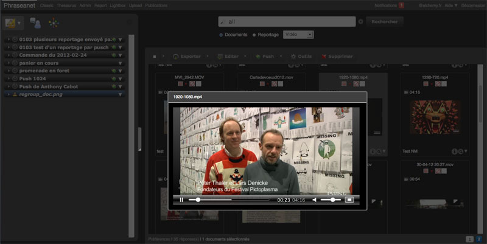
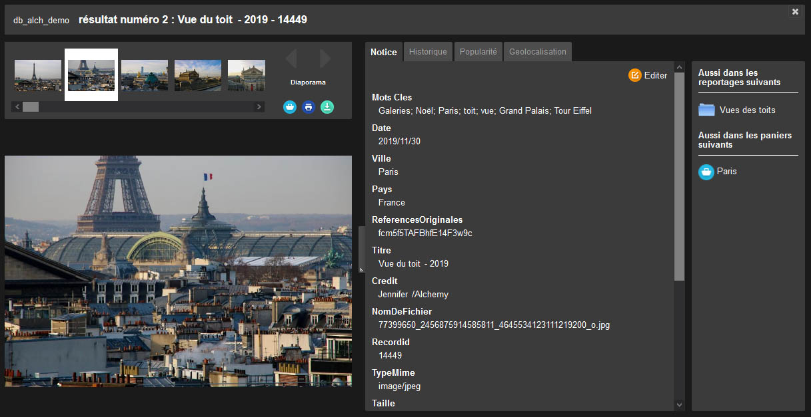
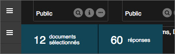
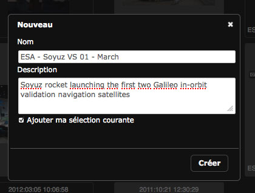

Affichage des résultats
=======================
.. toctree::
    :maxdepth: 3

.. topic:: L'essentiel

    Les interfaces *Phraseanet Production* ou *Classic* permettent de consulter
    et de parcourir une fonds médias dans *Phraseanet*.

    *Production* est une interface dédiée à la consultation, à la recherche,
    gestion et à l'édition des documents, tandis que *Classic* n'est dévolue qu'
    à la recherche et à la visualisation de documents dans des navigateurs
    anciens.

.. figure:: ../../images/Production-general.jpg
    :align: center

*Interface Phraseanet Production*

.. note::

    La zone d'affichage des résultats, dans *Prod* (ci-dessus) ou dans
    *Classic* (ci-dessous), est la zone centrale où apparaissent les
    images.

*Interface Phraseanet Classic*

.. figure:: ../../images/Classic-interface2.jpg
    :align: center

Présentation de la zone d'affichage
-----------------------------------

Dans *Production*:
La **Palette des Actions** figure en haut de page, au-dessus de la zone des
Résultats. Elle permet d'effectuer des actions sur les documents.
Pour plus de détails, se référer à la page dédiée à la
:doc:`Palette des Actions <Actions>`.

Le bandeau inférieur permet d'accéder aux **Préférences d'affichage**, renseigne
sur le nombre de réponses et affiche un index de pagination des résultats.
La pagination permet de se déplacer de pages en pages en cliquant sur le numéro
de la page, d'aller en fin de sélection en cliquant sur *Suivant* et de revenir
en arrière en cliquant sur *Précédent*.

.. note::

    N'utilisez pas les boutons reculer et avancer du navigateur utilisé.

Pour accéder à une page en particulier, modifier le numéro de la page en cours
puis valider en appuyant sur la touche **Entrée** du clavier.

.. image:: ../../images/Afficher-Nbreponses.jpg
    :align: center

Les vignettes sont surmontées d'un titre de présentation. Ce titre de
présentation est paramétrable par les Admininistrateurs fonctionnels de l'
application.

.. note::

    Comment paramétrer le titre des documents affichés sous les vignettes
    dans Phraseanet ? :doc:`Se reporter à la section Administration du
    manuel <AdministrationBasesCollections>`.

**La :terms: `Collection` d’appartenance du document est affichée dans le coin
inférieur gauche:**

.. image:: ../../images/Affichage-nomcoll.jpg
    :align: center

.. note::

    Le nom de la collection peut être substitué par un minilogo de
    collection.

**Passer le curseur sur une vignette pour afficher la description du document.**
Cette description est composée des champs documentaires non vides renseignés par
les gestionnaires du fonds.

Si vous en avez le droit, utiliser la fonction :doc:`Editer <Editer>` pour
modifier les informations affichées

Les termes ayant servis comme critères de recherche sont surlignés.

**La "Loupe" permet d'afficher un prévisualisation du document** : il s'agit d'
une image pour les documents de type image, d'une séquence vidéo pour les
documents de type vidéo, d'une séquence sonore pour les documents de type audio,
d'une animation flash pour certains types de documents bureautiques.

La prévisualisation du document dans *Phraseanet* est lié à la sous-définitions
*preview* telles que définis dans le paramétrage des bases auxquelles
appartiennent les documents.

.. note::

    La loupe n’est pas visible ? Soit l'utilisateur n'a pas le droit
    de voir les images de choix soit il n’existe pas de prévisualisation
    pour le type de document consulté.

**L'icône "i" permet d'obtenir des informations techniques sur le document
original** : largeur et hauteur en pixels, type, poids, taille d’impression…

.. image:: ../../images/Affichage-i.jpg
    :align: center

**Pour afficher une vue détaillée**, effectuer un double-clic sur la vignette
d'un média affiché dans la zone des résultats ou dans un panier. Une fenêtre
*overlay* affiche la prévisualisation du média.

La vue détaillée
----------------

La vue détaillée affiche la liste des documents d'une page sous la forme d'un
train de vignettes navigables.
* La partie haute de la fenêtre présente le train de vignettes qui est navigable
(à la souris ou au clavier) de droite à gauche.
* L'image de choix du média sélectionné est présentée au centre.
* Sur la partie droite, trois onglets présentent la description, l’historique
depuis l’ajout du document dans la base, des statistiques de popularité.
* Si le document appartient à des Paniers ou Reportages, l'information est
mentionnée dans la partie droite de la fenêtre.

Cliquer sur une vignette pour afficher l’image de choix ou utiliser les flèches
"gauche" et "droite" du clavier pour naviguer dans le train de vignettes.

Onglet Notice
*************

L'onglet *Notice* permet de visualiser les informations issues des champs
documentaires remplis ainsi que des informations techniques sur le document.

.. note::

    Selon la configuration de la solution et l’existence d’un thesaurus
    attaché à la base, certains mots clés de la légende sont cliquables.
    Soulignés de pointillés, ils permettent de rebondir sur d'autres
    recherches.

Onglet Historique
*****************

Cliquer sur l’onglet *Historique* pour afficher le contenu.

Cet onglet liste l’historique de toutes les opérations réalisées par les
utilisateurs sur le document depuis son ajout.

.. image:: ../../images/Affichage-vuedetaillee2.jpg
    :align: center

Onglet Popularité
*****************

Cet onglet affiche les statistiques de consultation et de téléchargement du
document en temps réel.

* Les statistiques de visualisation montrent d'abord sous forme de courbe le
    nombre total de visualisations.
* Un diagramme à camembert montre les sources d’accès au document.

.. image:: ../../images/Affichage-vuedetaillee3.jpg
    :align: center

Les statistiques de téléchargement affichent jour par jour le nombre de
téléchargements du document.

Cliquer sur "Fermer" ou sur la touche "Echap" du clavier pour fermer la fenêtre.

.. note::

    Pour des rapports de statistiques détaillés concernant une base
    *Phraseanet*, consulter la page consacrée aux :doc:`Statistiques
    <Statistiques>`.

Sélectionner des documents
---------------------------

Pour sélectionner des documents et effectuer ensuite des actions (export,
édition, suppression, etc.), deux possibilités :

* La sélection simple

Sélectionner une vignette dans la zone des résultats, dans les paniers ou dans
les reportages en cliquant dans son cadre. La couleur de fonds de la vignette
change.

.. image:: ../../images/Affichage-selection1.jpg
    :align: center

Cette couleur de sélection peut être modifiée par chaque utilisateur dans les
`Préférences d'affichage<PersonnaliserInterface>`.

* La sélection multiple

**Pour sélectionner une série de documents "continues"**, appuyer sur la touche
Maj (shift) du clavier et cliquer sur la première vignette de la série, puis sur
la dernière vignette de la série à sélectionner.
*Toutes les vignettes comprises entre ces deux vignettes sont sélectionnées.*

.. image:: ../../images/Affichage-selection2.jpg
    :align: center

**Pour sélectionner plusieurs vignettes "en discontinu"**, appuyer sur la touche
*Alt* du clavier et cliquer successivement sur les vignettes à sélectionner.

.. image:: ../../images/Affichage-selection3.jpg
    :align: center

**Pour sélectionner plusieurs vignettes sur plusieurs pages de résultats**,
sélectionner d’abord les images sur une page, cliquer sur la page à atteindre,
maintenir enfoncer la touche "Alt" du clavier puis cliquer sur une vignette de
la nouvelle page de résultats.

Le nombre d'éléments sélectionnés est mentionné en bas à gauche dans l'
interface.

* La sélection par type de médias

Pour sélectionner tous les documents d’une recherche selon leur type, cliquer
sur le menu de l'action de sélection (flèche à droite du carré blanc) puis
cliquer sur le type de documents à sélectionner.

.. image:: ../../images/Affichage-selectiontype.jpg
    :align: center

Dans cet exemple, seuls les documents de type *images* sont sélectionnés.

Pour placer une sélection de documents dans un Panier :

* Créer un panier : Se placer dans la barre des Onglets, au niveau des
  Paniers. Cliquer sur la flèche, puis cliquer sur le "plus" vert pour créer
  un nouveau panier (ou un reportage, choisir). Une fenêtre s'affiche, le
  nommer puis cliquer sur Valider.

* Pour plus d'informations, se reporter à la section dédiée aux :doc:`Paniers
  et aux Reportages <PaniersReportages>`.

.. note::

  Si une sélection de documents est effectuée et que l'utilisateur
  crée un nouveau panier ou reportage, une case à cocher permet d’ajouter
  *la sélection active* comme contenu du panier ou reportage.

* Pour faire une sélection de documents au sein d'un Panier :*
  Dans :doc:`la zone de travail <Onglets>`, ouvrir ou déployer un panier en
  cliquant sur son titre puis sélectionner les documents, comme vu
  précédemment. Effectuer ensuite les actions souhaitées au moyen de la barre
  des actions du panier.

