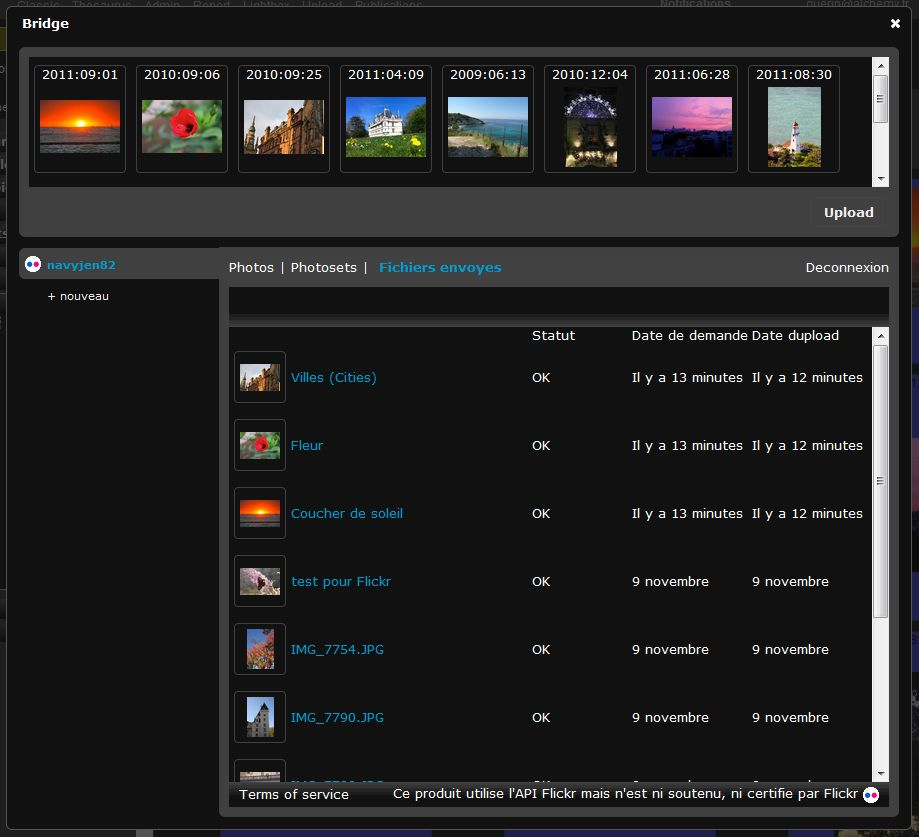

Bridge
=======
.. toctree::
   :maxdepth: 3

.. topic:: L'essentiel

    Le Bridge Phraseanet permet de publier ses photos et autres documents multimédia
    vers des sites extérieurs, tels que:

    * Flickr
    * Youtube
    * Dailymotion

    Pour publier des documents multimédia vers ces sites, il est d'abord
    nécessaire de sélectionner des documents, puis de lier ou de connecter son
    compte `Flickr`_, `YouTube`_ ou `Dailymotion`_, à Phraseanet, et enfin d'en
    effectuer la publication.

Sélection
---------

* Sélectionner une ou plusieurs images dans *Phraseanet Production*.

* Cliquer, dans la :doc:`Palette des Actions <Actions>`, sur la flèche du bouton
  de "Push".

Deux choix sont proposés: "Bridge" et "Publier":

.. image:: ../../images/Bridge-1.jpg
    :align: center

* Cliquer sur "Bridge"

Authentification
----------------

La fenêtre du Bridge s'ouvre:

* Cliquer sur "Nouveau" pour se connecter au compte choisi: Phraseanet propose de
  se connecter soit à son compte Flickr, Youtube ou Dailymotion...

.. image:: ../../images/Bridge-1b.jpg
    :align: center

Le site demande de s'authentifier, puis d'accorder la permission à Phraseanet de se
connecter.

Une fois connecté, Bridge récupère les informations existantes dans Flickr. Par
exemple, dans notre cas, les photos existantes sont présentes dans l'onglet "Photos",
voire dans l'onglet "Photosets" si les images sont organisées en albums dans Flickr.

L'utilisateur voit dans ce cas trois onglets:

* Photos
* Photosets
* Fichiers Envoyés

.. image:: ../../images/Bridge-3a.jpg
    :align: center

Publication
------------
Sélectionner à nouveau les images, mais cette fois-ci, parmi celles qui sont
présentes dans le bandeau du haut, puis cliquer sur le bouton "Upload" de droite.

La fenêtre "Upload" de Bridge s'ouvre. Il est possible de modifier les titres des
images sélectionnées, ainsi que les tags et d'entrer du texte dans la zone de
description.

* Une fois les informations entrées dans ces zones de texte, cliquer sur le bouton
  "Upload" en bas à gauche.

.. image:: ../../images/Bridge-2.jpg
    :align: center

Ensuite, au fur et à mesure que les images sont envoyées, il est possible de voir
l'avancement du transfert par un simple clic sur l'onglet "Fichiers envoyés".

* Le statut "OK" vous signale que l'image (ou la vidéo) a bien été transférée
* La date vient vous confirmer depuis combien de temps l'envoi a été effectué.

Enfin, lancer Flickr. Les photos y sont bien présentes:

.. image:: ../../images/Bridge-5.jpg
    :align: center

.. _Flickr: http://www.flickr.com/
.. _YouTube: http://www.youtube.com/
.. _Dailymotion: http://www.dailymotion.com/
