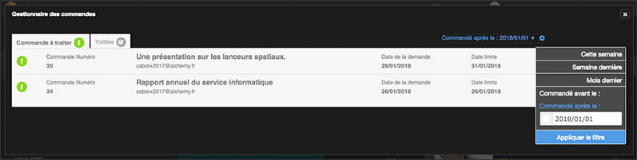
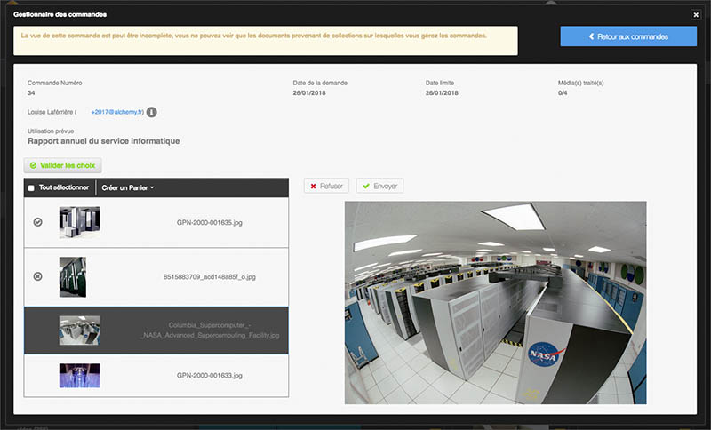

Gérer les commandes
===================
.. toctree::
    :maxdepth: 3

.. topic:: L'essentiel

    La rubrique **Commandes** de la barre de menu est accessibles aux
    utilisateurs listés comme Gestionnaire de commandes d'au moins une
    collection.

    Elle permet de parcourir et de traiter les demandes de documents qui
    proviennent d'utilisateurs ne disposant pas du droit **Documents** et
    disposant du droit **Commander**.

    Pour effectuer une commande, se reporter à la page consacrée aux exports.

Lister les commandes
--------------------

Cliquer sur la rubrique **Commandes** de la barre de menu pour afficher la
liste des commandes.
Les commandes sont réparties dans deux onglets :

* Commandes à traiter
* Commandes traitées

Les commandes sont présentées par ordre chronologique de date de la demande
et un dispositif de filtre permet d'en filtrer l'affichage.

Cliquer sur un élément de la liste pour afficher le contenu d'une commande
qu'elle soit à traiter ou déjà traitée.

Traiter une commande
--------------------

La fenêtre d'affichage d'une commande est divisée en trois zones :

* Le résumé de la commande, qui reprend les éléments fournis par l'utilisateur
  dans le formulaire de commande
* La liste des médias commandés
* Une zone d'affichage du média sélectionné qui présente une image de
  prévisualisation du média ainsi que sa notice

L'approbation ou le refus de délivrer les médias d'une commande s'effectue
média par média ou par sélection de médias.

* Sélectionner un ou plusieurs éléments dans la liste des médias commandés
* Cliquer sur le bouton Refuser ou Envoyer
* Passer au média suivant cas échéant

**Pour délivrer la commande auprès de l'utilisateur**...

* Cliquer sur le bouton Valider les choix
* Confirmer l'envoi de la commande en cliquant sur le bouton Envoyer dans la
  fenêtre en surimpression.

.. note::

    Il est possible de créer un panier rassemblant les médias d'une
    commande à partir du menu contextuel **Créer un Panier** pour s'y référer.

