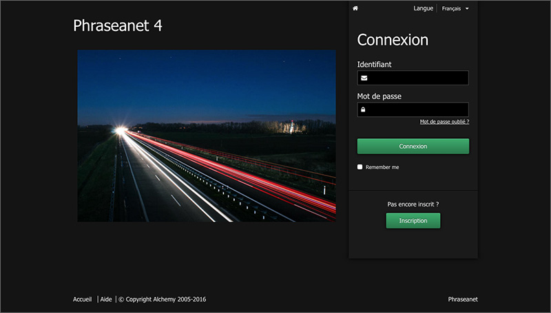

Connexion à Phraseanet
======================

Bien qu'il soit possible de consulter un fonds *Phraseanet* comme invité, ce qui
reste un choix de paramétrage possible, l'utilisateur peut être amené à créer un
compte et à s'identifier.

Inscription
-----------

Selon les choix de paramétrage du système, un lien permettant l'inscription de
nouveaux utilisateurs peut exister sur la page de connexion de *Phraseanet*.

* Cliquer sur **Inscription** dans la page d'accueil.

L'écran *Nouvel utilisateur* s'ouvre :

.. image:: ../../images/Inscription1.jpg
    :align: center

* Saisir un identifiant (minimum 5 lettres).
* Saisir un mot de passe.
* Compléter les champs relatifs à l'identité.
* Cocher les cases correspondantes aux :term:`bases<Base>` et :term:`collections
  <Collection>` de documents souhaitées.
* Cliquer sur le bouton Valider.

La page d'accueil s'affiche et informe l'utilisateur que sa demande a été prise
en compte. Un administrateur *Phraseanet* finalise ensuite l'inscription.

Authentification
----------------

* Se connecter à l'adresse internet de la solution Phraseanet au moyen d'un
  navigateur Web.
  La page d'accueil permettant la connexion s'affiche :

* Si elle ne convient pas, sélectionner la langue d'interface dans la liste
  déroulante.
* Saisir l'identifiant.
* Saisir le mot de passe.
* Cliquer sur **Connexion**.
* En cas d'oubli du mot de passe, suivre la procédure de récupération en
  cliquant sur le lien "Mot de Passe oublié".

Mot de passe perdu ?
--------------------

Cliquer sur le lien **Mot de Passe oublié ?**.
Sur la page *Mot de passe oublié*, remplir le formulaire proposé avec l'adresse
email lié au compte Phraseanet.

Une fois le formulaire complété et validé, un email est envoyé. Il permet
rejoindre, via un lien, l'interface de réinitialisation de mot de passe.
Ce lien n'est valide que pour une durée limitée dans le temps.
Si l'email n'est pas reçu, consulter le dossier des courriers indésirables
du programme de messagerie.

En cliquant sur le lien proposé par l'email reçu, rejoindre l'interface de
réinitialisation de mot de passe.
Suivre alors les instructions proposées à l'écran puis valider le formulaire
pour réinitialiser le mot de passe.

.. warning::

    Les mots de passe sont sensibles à la casse.

Après réinitialisation du mot de passe, se connecter au moyen du formulaire
disponible en page d’accueil de l'application Phraseanet.
