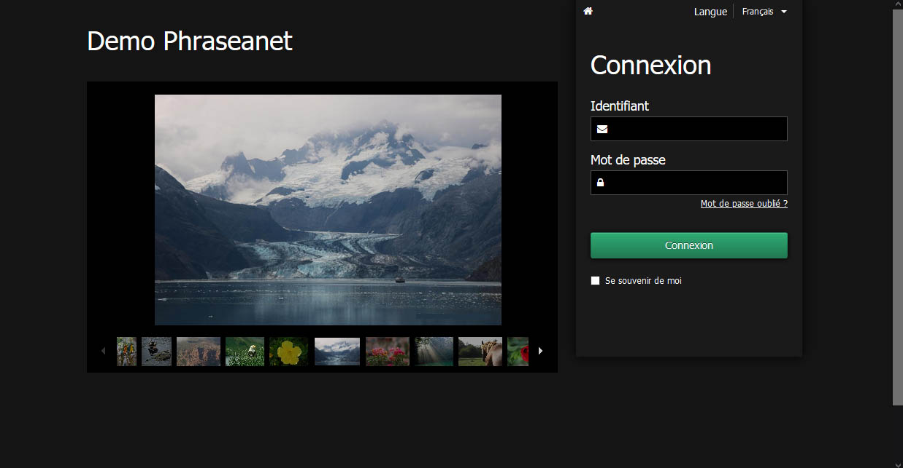

Connexion à Phraseanet
======================

Bien qu'il soit possible de consulter un fonds *Phraseanet* comme invité, ce qui
est un choix de paramétrage possible, l'utilisateur peut être amené à créer un
compte et à s'authentifier pour accéder à un fonds multimédia.

Authentification
----------------

* Se connecter à l'adresse internet de la solution Phraseanet au moyen d'un
  navigateur Web.
  La page d'accueil permettant la connexion s'affiche :

* Ajuster si besoin la langue d'interface avec le menu déroulant *Langue*.
* Saisir l'identifiant.
* Saisir le mot de passe.
* Cliquer sur **Connexion**.
* En cas d'oubli du mot de passe, suivre la procédure de récupération en
  cliquant sur le lien *Mot de Passe oublié ?*.

Authentification via des fournisseurs tiers
-------------------------------------------

*Phraseanet* permet de déléguer l'authentification de l'utilisateur à une
application tierce.

.. image:: ../../images/Authentification-oauth.jpg
    :align: center

Dans la version 3.8, la  page d'accueil permet de s'authentifier *via* les
applications web suivantes :

* Facebook
* Twitter
* Gmail
* GitHub
* Viadeo
* Linkedin

D'autres fournisseurs d'identité numérique peuvent s'ajouter.

Inscription
-----------

Selon les choix de paramétrage du système, un lien permettant de s'inscrire
comme nouvel utilisateur peut exister sur la page de connexion de *Phraseanet*.

* Cliquer sur **Inscription** dans la page d'accueil.

* Cliquer sur le bouton **Créer un compte manuellement** puis remplir et
  soumettre le formulaire.

**Ou bien**

* Choisir de se connecter au moyen d'une authentification déportée en
  sélectionnant le service fournisseur d'authentification.

.. image:: ../../images/Authentification-choix-inscription.jpg
    :align: center

* Remplir et soumettre le formulaire.

.. note::

    Même avec un fournisseur d'authentification il est nécessaire de fournir
    un mot de passe lors de l'inscription. Ce mot de passe est destiné au compte
    local *Phraseanet*. Il peut donc être différent de celui utilisé chez le
    fournisseur d'identité.

Lorsque le formulaire est soumis, la page d'accueil s'affiche et informe l'
utilisateur que sa demande d'inscription a été prise en compte. Un
administrateur *Phraseanet* finalise ensuite l'inscription.

Mot de passe perdu ?
--------------------

Cliquer sur le lien **Mot de Passe oublié ?**.
Sur la page *Mot de passe oublié*, remplir le formulaire proposé avec l'adresse
email liée au compte Phraseanet.

Une fois le formulaire complété et soumis, un email est envoyé. Il contient un
lient permettant de rejoindre, via un lien sécurisé, l'interface
d'initialisation de mot de passe.

.. note::

    Le lien n'est valide que pour une durée limitée.
    Si l'email n'est pas reçu, consulter le dossier des courriers indésirables
    du programme de messagerie.

Cliquer sur le lien proposé dans l'email reçu pour rejoindre l'interface de
ré-initialisation de mot de passe.
Suivre les instructions proposées à l'écran puis valider le formulaire
pour réinitialiser le mot de passe.

.. warning::

    Les mots de passe sont sensibles à la casse.

Après ré-initialisation du mot de passe, se connecter au moyen du formulaire
disponible en page d’accueil de l'application Phraseanet.

Le compte invité
----------------

Le compte invité est un compte comparable aux autres comptes *Phraseanet*. Il
permet de consulter une ou plusieurs collections sans nécessiter
d'authentification.

Une fois l'accès invité configuré, un bouton **Accès invité** apparaît en bas
de la page de connexion.

.. image:: ../../images/Authentification-invite.jpg
    :align: center

Se reporter à
:doc:`cette section <../../FAQ/Personnalisation/Parametrer-le-compte-invite>`
pour la mise en oeuvre de l'accès invité.

.. note::

    Lors de la connexion à *Phraseanet*, c'est la dernière application utilisée
    qui se lance par défaut.

