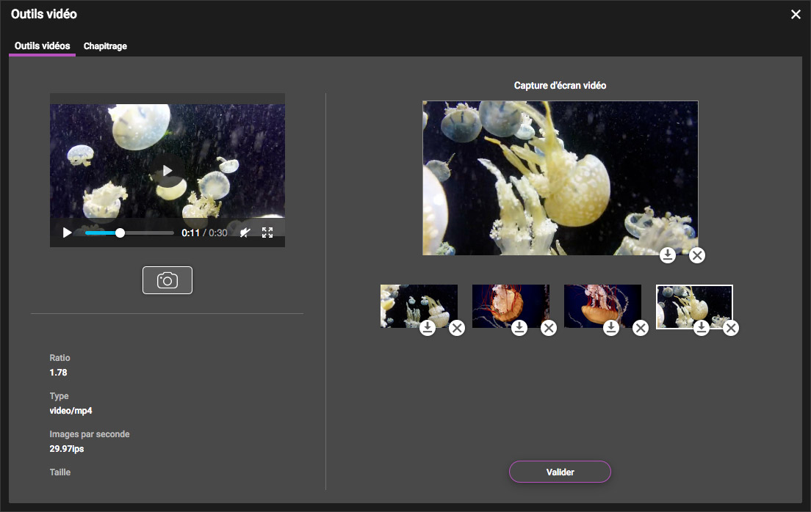
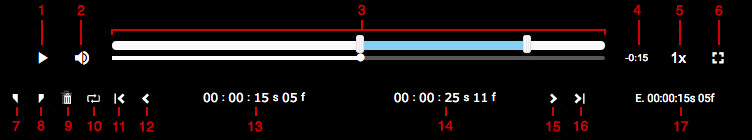

Éditer avec les outils vidéos
=============================
.. toctree::
   :maxdepth: 3

.. topic:: L'essentiel

    Les outils vidéos bénéficient d'une fenêtre dédiée. Ils permettent le
    choix de la vignette *thumbnail* et l'édition de chapitre pour un document
    vidéo.

Choix de la vignette *thumbnail*
--------------------------------

L'onglet Outils vidéo permet l'extraction de captures vidéo ainsi que le choix
de la vignette thumbnail d'un document vidéo.

Extraction de captures
**********************

* Lancer la lecture de la vidéo dans le lecteur
* Cliquer sur l'icône **Appareil photo** pour effectuer des captures

Les captures générées apparaissent dans la partie droite de la fenêtre. Elles
peuvent être exportées au moyen de l'icône placée sous celles-ci.

Choix de la vignette *thumbnail*
********************************

Le choix de la vignette *thumbnail* s'effectue en cliquant sur le bouton Valider
présent sous les captures effectuées.
Confirmer en validant une seconde fois l'action dans la fenêtre surgissante pour
appliquer le choix de la vignette.

.. note::

    Le choix de la vignette s'applique à toute les sous-définitions de type
    image des documents vidéos.

Edition du chapitrage dans une vidéo
------------------------------------

L'onglet Chapitrage permet de l'édition de chapitres dans une vidéo.
La partie gauche de la fenêtre liste les chapitres existant et regroupe les
boutons pour créer de nouveaux chapitres et sauvegarder le chapitrage.
La partie droite de la fenêtre présente un lecteur vidéo ainsi que des outils
de découpage.

Pour éditer les chapitre d'une vidéo...

* Lancer la lecture de la vidéo
* Cliquer sur le bouton Nouveau Chapitre pour créer un nouveau chapitre
* Donner un titre au chapitre en cliquant sur *entrez un titre*
* Cliquer sur **Sauvegarder** pour enregistrer le découpage dans le champ
  documentaire prévue dans la configuration

Les outils placés sous le lecteur vidéo permettent des contrôles supplémentaires
dans les découpages.

* 1. Lecture ou pause
* 2. Contrôle du volume
* 3. Barre de défilement de lecture
* 4. Temps restant avant fin de la vidéo
* 5. Vitesse de défilement de la lecture
* 6. Affichage du mode plein écran
* 7. Définir la position de lecture comme début du chapitre sélectionné dans la
  liste
* 8. Définir la position de lecture comme fin du chapitre sélectionné dans la
  liste
* 9. Supprimer le chapitre en cours de lecture
* 10. Lire le chapitre en boucle
* 11. Revenir au début du chapitre en cours de lecture
* 12. Reculer la tête de lecture d'un image
* 13. Timecode de début du chapitre
* 14. Timecode de fin du chapitre
* 15. Avancer la tête de lecture d'une image
* 16. Avancer à la fin du chapitre en cours de lecture
* 17. Timecode écoulé depuis le début de la vidéo

.. note::

    Lorsque la case à cocher "Pas de recouvrement entre les chapitres" est
    activée le début d'un chapitre demeure consécutif à la fin du chapitre
    précédent.

