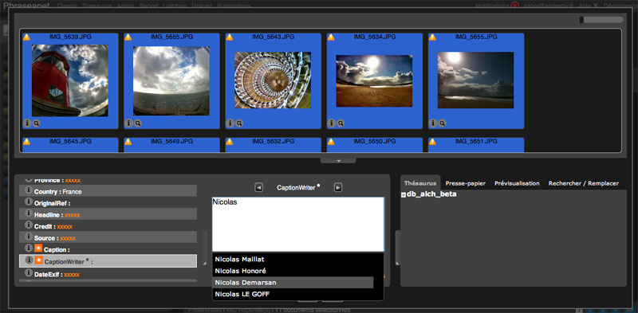

Éditer les notices documentaires
================================
.. toctree::
   :maxdepth: 3

Cette section du manuel rassemble les notions relatives à l'édition documentaire
des notices de médias et de reportages dans *Phraseanet*.

Éditer des enregistrements
--------------------------

.. topic:: L'essentiel

    L'action **Éditer** permet d'éditer la ou les fiches descriptives des
    médias, des reportages, pour saisir, compléter ou modifier le contenu des
    champs de description documentaire.

    Il est possible d'éditer ces descriptions à l’unité ou en lots et sous lots
    à partir d'enregistrements, de paniers, de reportages depuis la zone des
    résultats ou depuis la zone travail.

Principes généraux sur l'édition
********************************

La fenêtre est découpée en trois zones :

* **La barre de défilement** affiche les documents sélectionnés. La taille
  de la zone est modifiable. La taille des vignettes est modifiable en
  déplaçant le curseur.
* **La zone de saisie**  affiche la liste des champs descripteurs, la liste
  des status, et réserve un espace pour afficher le contenu du champs actif.
* **La zone des onglets d’assistance à la saisie** proposent des aides à la
  saisie.

.. image:: ../../images/Prod-Editer.jpg
    :align: center

* Sélectionner des médias, un panier ou un reportage

.. warning::
    Seuls peuvent être édités simultanément des enregistrements provenants d'une
    même base.

* Cliquer sur le bouton **Éditer**
* La fenêtre **Éditer** s'ouvre

Par défaut, toutes les vignettes sont sélectionnées.

**Les champs dont les contenus sont identiques** pour les documents sélectionnés
apparaissent *en clair*.

**Les champs dont les contenus sont hétérogènes** apparaissent avec des xxxxx en
 orange.

Il est possible de dé-sélectionner / sélectionner les documents en cliquant
sur les vignettes et en utilisant les combinaisons de touche "Maj" ou "Alt".
Cette possibilité de sélection en lots et sous-lots permet de renseigner des
informations communes à des médias et gagner ainsi en productivité.

Aucune modification ou ajout n’est effectué tant que l’utilisateur n’a pas
cliqué sur le bouton **Valider**.

* Pour passer d'un champ à un autre, utiliser sur la touche de tabulation (**
  TAB**) du clavier.
* **Pour annuler les modifications en cours**, cliquer sur **Annuler** ou
  appuyer sur la touche **Echap** ce qui a pour effet de quitter le formulaire
  d'édition.

Éditer des champs de type date
******************************

L'édition d'un champ de type date, qui obéit à un formatage normalisé, est
assisté par un calendrier d'aide à la saisie.

Sélectionner le ou les documents pour lesquels la date doit être modifiée ou
ajoutée.

*  Saisir manuellement la date selon le format **aaaa/mm/jj**,
* **Ou bien**, utiliser le calendrier proposé.

Éditer des champs de type texte intégral
****************************************

Sélectionner le ou les documents sur lesquels apporter des modifications
* Cliquer dans le champ à modifier
* Saisir les informations souhaitées

.. image:: ../../images/Prod-Editer-texte.jpg
    :align: center

Pour rappel, si le champ contient déjà des valeurs et que celles sont
hétérogènes, des "xxxxx" en orange sont affichés.

Dans ce cas, après saisie, cliquer sur le bouton adéquat selon que les
informations saisies doivent remplacer ou s'ajouter au champ courant, si
celui-ci contient des informations.

.. image:: ../../images/Prod-Editer-texte-ajouter.jpg
    :align: center

Éditer des champs textuels multi-valués
***************************************

Sélectionner le ou les documents sur lesquels apporter une modification.

* Cliquer dans un champ textuel de type multi-valué

Les informations déjà présentes dans les notices de chaque document sélectionné
sont affichées dans le champ.
Les termes descripteurs communs à toutes les notices sont inscrits en blanc,
ceux présents seulement dans au moins une notice sont en Orange.

.. image:: ../../images/Prod-Editer-textemulti.jpg
    :align: center

* Cliquer sur un des mots clés "Orange".

* Le terme s’affiche dans le masque de saisie.

Sous chacune des vignettes des médias sélectionnés, si le terme est absent des
notices, un symbole "plus" s'affiche.
Inversement, un symbole "moins" signifie que le termes n'est pas utilisé dans
le champ documentaire de la notice du média.

* Cliquer sur le symbole "plus" pour ajouter le terme pour cet enregistrement.

* Le symbole "plus" se transforme alors en symbole "moins".

Pour ajouter le terme à toutes les notices sélectionnées,

* Appuyer sur la touche "entrée" du clavier ou cliquer sur le symbole "plus"
  qui se trouve à droite du champ de formulaire de saisie.

* Cliquer sur le symbole "moins" à gauche du masque de saisie pour
  supprimer le terme du champs documentaire des notices des médias sélectionnés.

Éditer un champ lié une sources de données
******************************************

Les champs documentaires liés à des sources de données ont un champ de saisie
bénéficiant d'un dispositif d'auto-complétion. Elle permettent de sélectionner
des valeurs issues d'une liste d'autorité.
Le dispositif reste toutefois ouvert : il permet la saisie de termes non
présents dans la source de vocabulaire.

Placé sur un champ lié à une source de données, ...

* Saisir au moins trois caractères pour initialiser le dispositif
* Le système propose une liste de valeurs contenant la chaîne de caractères
* Sélectionner la valeur souhaitée au clavier ou à la souris

Éditer à partir du thésaurus
****************************

Sous réserve qu'un thésaurus soit déployé sur la base à laquelle appartiennent
les médias en cours d'édition, l'onglet Thésaurus permet d’indexer rapidement à
partir des termes contenus dans le thésaurus associé à la :term:`base`.
Les saisies sont assistées pour les champs qui sont liés à des branches de
thésaurus.

* Cliquer sur l'onglet thésaurus
* Sélectionner un champ du type textuel lié au thésaurus
* Débuter la saisie d'un terme

* L'onglet thésaurus s'actualise et affiche les termes commençants par les
  caractères saisis

.. image:: ../../images/Prod-Editer-thesaurus.jpg
    :align: center

* Effectuer un double clic sur le terme à ajouter au champ dans l'onglet
  Thésaurus

* Le terme est immédiatement ajouté aux documents sélectionnés.

.. note::
    Il est aussi possible de déployer l'*arbre* du thésaurus pour
    chercher et sélectionner des termes à indexer. Cliquer sur les
    symboles *plus* qui se trouvent devant les termes.

Éditer à partir des valeurs suggérées
*************************************

Si des valeurs suggérées ont été définies pour le champ, la liste apparaît
sous forme de menu contextuel dans la fenêtre à gauche du nom du champ.

:doc:`Se reporter à la section Préférences: Valeurs suggérées dans l'interface
Phraseanet Administration <AdministrationBasesCollections>`

.. image:: ../../images/Prod-Editer-valeurssugg.jpg
    :align: center

* Cliquer sur le menu contextuel
* Faire un double clic pour sélectionner une valeur suggérée dans la liste
* La valeur est ajoutée au champ.

.. note::

    Pour cumuler des valeurs, sélectionner une valeur dans la liste en
    appuyant sur la touche "ctrl" ou "cmd" du clavier

Utiliser l'onglet Presse Papier
*******************************

* Cliquer sur l'onglet Presse Papier

Copier et coller des termes ou des expressions dans ou depuis le presse papier
vers des masques de saisie de champs.

Utiliser l'onglet  Rechercher/Remplacer
***************************************

Cet onglet permet à l’utilisateur de chercher et remplacer des termes contenus
sur les documents en cours d’édition.

* Cliquer sur l’onglet Rechercher / Remplacer

.. image:: ../../images/Prod-Editer-chercherremplacer.jpg
    :align: center

* Restreindre si nécessaire la fonction à un champ en particulier,
  à partir du menu déroulant, par défaut dans tous les champs
* Saisir le terme à Rechercher dans les notices des documents en cours
  d’édition
* Saisir le terme de remplacement
* Appliquer les options si nécessaire
* Cliquer sur Valider

* Le nouveau terme remplace le précédent dans les notices

Utiliser l'onglet Modèles
**************************

Créer un modèle de description documentaire
^^^^^^^^^^^^^^^^^^^^^^^^^^^^^^^^^^^^^^^^^^^

Cette fonction permet de créer et d'utiliser ensuite des modèles de description
de notices pré remplies.

Un modèle se créé à partir d'une notice en cours d'édition.

* Cliquer sur l’onglet Modèles
* Sélectionner une notice en cliquant sur une vignette

.. note::

    Si plusieurs documents sont sélectionnés, le modèle ne pourra
    reprendre que le contenu homogène des champs

* Cliquer sur Ajouter

.. image:: ../../images/Prod-Editer-modeles.jpg
    :align: center

* Donner un titre au modèle
* Choisir les champs à reprendre dans le modèle, les champs contenant des
  valeurs sont sélectionnés par défaut
* Cliquer sur Valider pour enregistrer le modèle

* Le nouveau modèle est affiché dans la liste des modèles disponible

Appliquer un modèle à une sélection de médias
^^^^^^^^^^^^^^^^^^^^^^^^^^^^^^^^^^^^^^^^^^^^^

* Sélectionner les documents
* Sélectionner l'onglet **Modèles** puis effectuer un double clic sur le titre
  du modèle à appliquer

* L'ensemble des informations contenus dans le modèle est appliqué aux
  documents

.. note::
    Il est possible de revoir les valeurs des champs d'un modèle en cliquant sur
    la flèche se trouvant devant le titre du modèle.

.. warning::
    Un modèle est la propriété de l'utilisateur qui l'a créé, il ne
    peut être utilisé que par lui.

Éditer des reportages
---------------------

Chaque reportage dispose de sa propre notice descriptive. Elle est identique à
celle des médias d'une base. Comme pour l'édition de documents, la descriptions
en lots des notices de reportage est possible.

Éditer les notices de reportages
********************************

En mode recherche reportage

* Sélectionner un ou plusieurs reportages depuis la zone d'affichage des
  résultats
* Cliquer sur **Éditer**

* => la fenêtre Éditer s'ouvre

**Dans le cas d'un seul reportage sélectionné** : Le reportage et son contenu
sont sélectionnés par défaut. La saisie peut s'appliquer à la notice du
reportage **ET** au notices des documents contenus dans le reportage.

**Dans le cas d'une sélection de plusieurs reportages**, le principe est
identique à celle de l'édition des documents et seules les notices des
reportages sont modifiées.

Éditer un reportage et son contenu
**********************************

* Sélectionner un seul reportage depuis la zone d'affichage des résultats ou
  le menu contextuel du reportage affiché dans la zone de travail.
* Cliquer sur Éditer

ou

* -> Cliquer sur Éditer depuis la barre d'action locale du reportage quand
  celui-ci est dans la zone de travail.
* => La fenêtre Éditer s'ouvre

.. image:: ../../images/Prod-Editer-reportage.jpg
    :align: center

Les reportages ont par défaut une image de "dossier" pour les illustrer.

* -> Cliquer sur le menu contextuel d’une des vignettes
* -> Cliquer sur *Définir comme image principale*
* -> L’image du dossier est remplacée par la vignette du document choisi

Pour compléter la notice du reportage:

* -> Cliquer sur l’image de représentation du reportage en haut à gauche de
  la fenêtre *Éditer*
* -> Seule la notice du reportage sera modifiée

* -> Sélectionner l’image de représentation du reportage et les autres
  vignettes pour modifier à la fois la notice reportage et les notices des
  documents qui composent le reportage.
* -> Compléter les champs à modifier

* -> Cliquer sur Valider pour enregistrer les modifications.

Éditer les Status
-----------------

La première ligne de la liste de champs permet de changer les status des
documents sélectionnés.

* -> Cliquer sur la première ligne de la liste de champs "Status".
* -> Cocher les cases correspondant au changement d’état à appliquer sur les
  documents.
* -> Cliquer sur Valider pour enregistrer les modifications ou poursuivre
  l’indexation.
