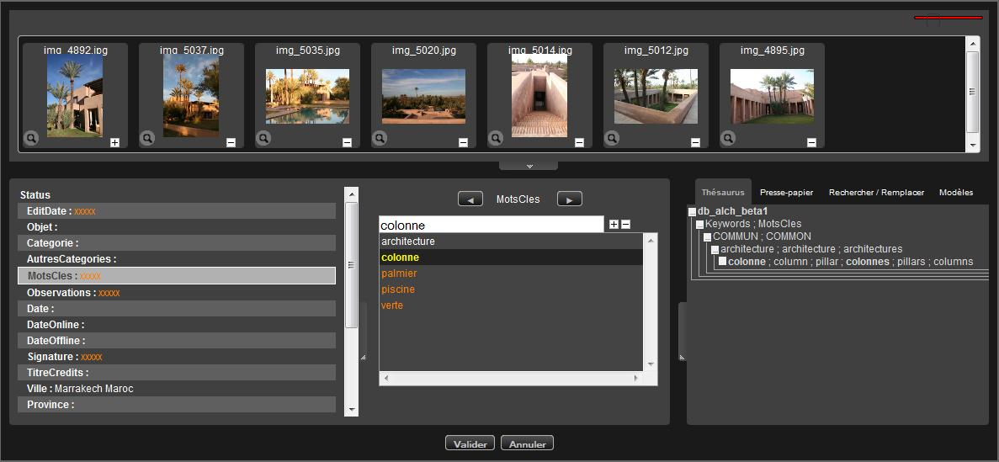
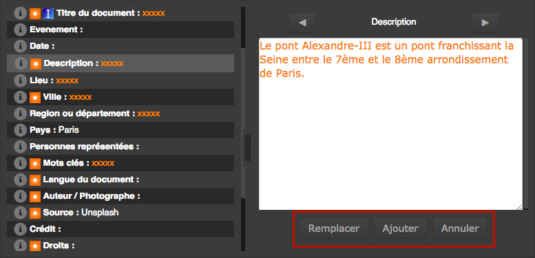
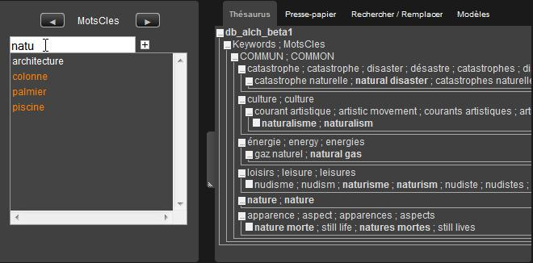
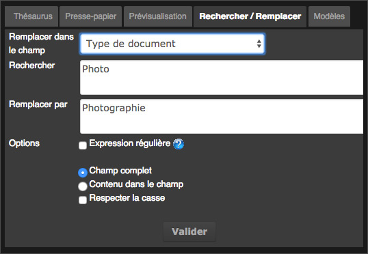
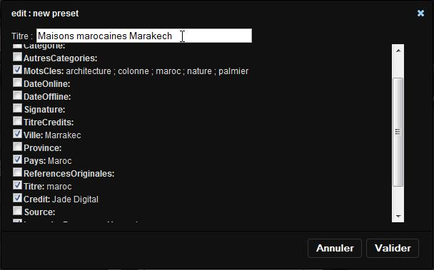

Éditer les notices documentaires
================================
.. toctree::
   :maxdepth: 3

.. topic:: L'essentiel

    L'action Editer permet d'éditer les notices descriptives des documents et
    reportages d'une même base.

    Les notices sont éditables à l'unité, en lots et sous lots à partir des
    documents et des reportages sélectionnés dans la zone d'affichage ou dans la
    zone de travail.

Éditer des enregistrements
--------------------------

Sélectionner un ou plusieurs enregistrements dans la zone d'affichage ou dans
un panier ou reportage ouvert dans la zone de travail puis cliquer sur l'un des
boutons d'action Editer pour ouvrir le formulaire d'édition.

Principes généraux sur l'édition
********************************

La fenêtre est découpée en trois zones :

* **La barre de défilement** affiche les documents sélectionnés. La taille des
  vignettes et la taille de cette zone sont modifiables
* **La zone de saisie** affiche les status, la liste des champs documentaires et
  réserve un espace pour afficher le contenu du champ actif
* **La zone des onglets d'assistance à la saisie** regroupe des outils d'aides à
  la saisie

**Par défaut, tous les enregistrements sont sélectionnés.**

Les champs dont les contenus documentaires sont identiques pour tous les
documents sélectionnés apparaissent en clair.

Les champs dont les contenus sont hétérogènes apparaissent avec des xxxxx
en orange.

Il est possible de désélectionner ou sélectionner les documents dans la barre
de défilement de la même façon que dans la zone d'affichage.

.. seealso::

    Se reporter à :ref:`la section consacrée aux sélections <Affichage-Selections>`
    dans la zone d'affichage

Cette possibilité de sélection en lots et en sous-lots permet de renseigner des
informations communes à des médias et gagner ainsi en productivité.

Pour passer d'un champ à un autre, **utiliser sur la touche de tabulation du
clavier**

**Aucun ajout ou modification dans les notices n'est pris en compte tant que
l'utilisateur n'a pas cliqué sur le bouton Valider**.

**Pour annuler les modifications en cours**, cliquer sur Annuler ou appuyer
sur la touche Echap pour quitter le formulaire d'édition.

Editer des champs de type texte
*******************************

* Sélectionner le ou les enregistrements sur lesquels apporter des
  modifications
* Cliquer dans le champ à modifier
* Saisir les informations souhaitées

Si le champ édité contient des informations hétérogènes, choisir si les
informations saisies doivent remplacer ou s'ajouter au champ.

Editer des champs de type texte multi-valués
********************************************

* Sélectionner le ou les enregistrements sur lesquels apporter des
  modifications.
* Cliquer dans un champ texte multi-valué
* Saisir le terme ou expression dans le champ de formulaire puis cliquer sur
  le plus ou valider avec la touche Entrer pour ajouter le terme au champ
  multi-valué

Les termes ou expressions déjà présents dans les notices des enregistrements
sélectionnés sont tous affichés dans le champ. **En blanc**, ceux présents dans
toutes les notices, **en orange** ceux présents dans au moins une des notices.

Pour ajouter ou supprimer un terme descripteur figurant dans la liste des
termes utilisés à d'autres notices d'enregistrements sélectionnés :

* Cliquer sur un des termes de la liste des descripteurs utilisés
* Cliquer sur les symboles "plus" pour ajouter le terme aux notices
  d'enregistrements sélectionné dans la barre de défilement
* Cliquer sur les symboles "moins" pour supprimer le terme aux notices
  d'enregistrements sélectionné dans la barre de défilement

Editer des champs de type date
******************************

Un champ de type date obéit à un format normalisé. Il est nécessaire de
respecter les règles de saisie.

Sélectionner le ou les enregistrements pour lesquels la date doit être ajoutée
ou modifiée.

* Saisir la date selon le format aaaa/mm/jj

**Ou bien**,

* Utiliser le calendrier d'aide à la saisie proposé

Editer un champ lié à une source de données
*******************************************

Les champs documentaires liés à des sources de données bénéficient d'un
dispositif d'auto-complétion. L'auto-complétion permet de sélectionner des
valeurs issues d'une liste d'autorité. Le dispositif est cependant ouvert : la
saisie de termes non présents dans la source de vocabulaire reste possible.

Placé sur un champ lié à une source de données, ...

* Saisir au moins trois caractères pour initialiser le dispositif
  d'auto-complétion
* Sélectionner la valeur souhaitée au clavier ou à la souris

Editer à partir du thésaurus
****************************

Sous réserve qu'un thésaurus soit déployé sur la base à laquelle appartiennent
les enregistrements en cours d'édition, l'onglet Thésaurus permet d'indexer
rapidement à partir de termes contenus dans le thésaurus.
La saisie est assistée pour les champs qui sont liés à des branches de
thésaurus.

* Cliquer sur l'onglet thésaurus
* Sélectionner un champ texte lié au thésaurus
* Débuter la saisie d'un terme
* L'onglet thésaurus s'actualise et affiche les termes commençants par les
  caractères saisis

* Effectuer un double clic sur le terme à ajouter au champ dans l'onglet
  Thésaurus
* Le terme est ajouté aux documents sélectionnés.

.. note::

    Il est possible de parcourir l'arbre du thésaurus pour chercher et
    sélectionner des termes souhaité. Cliquer sur les symboles plus et moins
    qui se trouvent devant les termes du thésaurus.

Editer à partir des valeurs suggérées
*************************************

Une liste de valeurs suggérées apparaît sous la forme d'un menu contextuel dans
la fenêtre de gauche listant les champs éditables de la structure documentaire
de la base.

.. Seealso::

    Se reporter à la section consacrée au
    :ref:`paramétrage des valeurs suggérées <AdministrationBasesCollections-valeurs>`
    dans l'interface Admin

* Cliquer sur le menu contextuel
* Effectuer un double clic pour ajouter la valeur suggérée dans le contenu du
  champ

.. note::

    Pour cumuler des valeurs suggérées dans un champ, sélectionner les valeurs
    dans la liste en appuyant sur la touche "Ctrl" ou "Cmd" du clavier.

Editer les Status
*****************

Cliquer sur la rubrique Status dans la liste des champs pour éditer les status
des enregistrements sélectionnés.

* Modifier l'état des Status au moyen des boutons radio

Utiliser les dispositifs d'aide à la saisie
-------------------------------------------

Le Presse Papier
****************

L'onglet Presse Papier dans la zone des onglets d'assistance permet de copier
et de coller des termes ou des expressions à utiliser dans les notices.

Rechercher/Remplacer
********************

L'onglet permet de chercher et de remplacer des termes ou expressions contenus
dans les notices d'enregistrements en cours d'édition.

* Cliquer sur l'onglet Rechercher / Remplacer

* Restreindre si nécessaire la fonction à un champ en particulier, à partir du
  menu déroulant, par défaut dans tous les champs
* Saisir le terme à Rechercher dans les notices des documents en cours
  d'édition
* Saisir le terme de remplacement
* Appliquer des options si nécessaires
* Cliquer sur Valider
* Le nouveau terme remplace le précédent dans les notices

Modèles
*******

L'onglet permet de créer et d'appliquer des modèles de description à des
notices d'enregistrements.

Créer un modèle de description documentaire
^^^^^^^^^^^^^^^^^^^^^^^^^^^^^^^^^^^^^^^^^^^

**Un modèle se créé à partir d'une notice en cours d'édition**.

* Cliquer sur l'onglet Modèles
* Sélectionner l'enregistrement dont la notice sert de modèle.

.. note::

    Si plusieurs enregistrements sont sélectionnés, le modèle ne tient compte
    que des champs dont les contenus sont homogènes.

* Cliquer sur Ajouter

* Donner un titre au modèle
* Choisir les champs à inclure dans le modèle en cochant ou décochant les
  cases à cocher. Les champs contenant des valeurs sont sélectionnés par défaut
* Cliquer sur Valider pour enregistrer le modèle

Appliquer un modèle à une sélection de médias
^^^^^^^^^^^^^^^^^^^^^^^^^^^^^^^^^^^^^^^^^^^^^

* Sélectionner des enregistrements
* Afficher l'onglet Modèles puis effectuer un double clic sur le titre
  du modèle à appliquer aux enregistrements

.. note::

    Un modèle est la propriété de l'utilisateur qui l'a créé, il ne peut être
    utilisé que par lui.

Particularités de l'édition des reportages
------------------------------------------

Reportages et documents partagent la même structure de notices documentaires.
Les reportages s'éditent de la même façon que les documents et deux
particularités sont à signaler.

Notices des reportages et notices des documents
***********************************************

L'édition de reportages présente les notices des reportages sélectionnés **et**
les notices de leurs contenus.

Les reportages et leurs contenus sont sélectionnés par défaut. La saisie peut
s'appliquer à la notice des reportages et aux notices des documents qu'ils
contiennent.

Choix d'un image représentative
*******************************

Par défaut les reportages sont représentés un dossier. Il est possible de
leur attribuer la vignette d'un document lors de l'édition.

Dans la barre de défilement des documents du reportage...

* Cliquer sur le menu contextuel d'une vignette de document
* Cliquer sur la rubrique Définir comme image principale

.. note::

    Jusqu'en version 3.8.5, seul les vignettes des documents de type image
    pouvaient être attribuées aux reportages.
