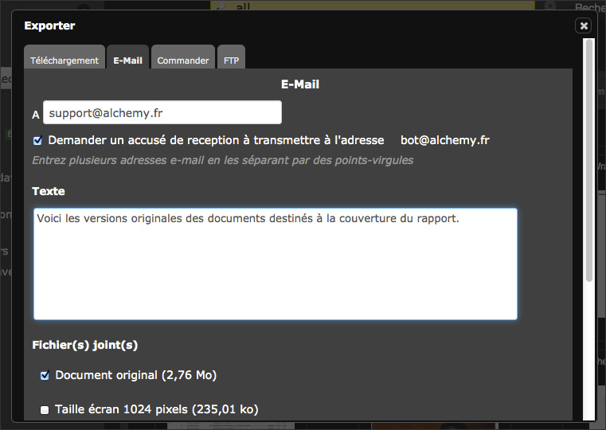
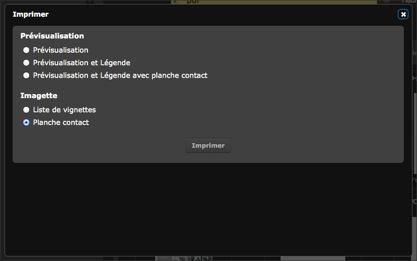

Exporter et Imprimer
====================
.. toctree::
    :maxdepth: 3

.. topic:: L'essentiel

    L'action `Exporter`_ est l'une des actions possibles dans la
    :doc:`palette des actions <Actions>` dans *Production*.
    Plusieurs modes d'export sont proposés : le téléchargement,
    l'envoi par e-mail ou encore la transmission via :term:`FTP <FTP>`.

    Les documents non téléchargeables peuvent être commandés.

    L'action `Imprimer`_ est un type d'export particulier. Il s'agit
    d'une impression de notices au format PDF.

.. image:: ../../images/PaletteExporter.jpg
    :align: center

Exporter
--------

Cette action permet d'exporter, au choix et selon les droits de l'utilisateur ou
les attributs des sous-définitions :

* le document original
* les sous-définitions de documents
* les notices au format `XML`_ ou `YAML`_

**Près de chaque format figurent les poids respectifs de l'ensemble des éléments
à exporter.**

.. note::

    Au delà d'une certaine limite de poids fixée par les administrateurs,
    l'utilisateur peut récupérer les médias qu'il souhaite exporter au moyen
    d'un lien reçu par e-mail.

Il est possible d'exporter à l'unité ou en lots des médias sélectionnés ou les
contenus de paniers et de reportages depuis la zone d'affichage des résultats
ou depuis la zone d'affichage des paniers et reportages.

En cliquant sur **Exporter**, jusqu'à quatre options d'export sont proposées :

* :ref:`Le téléchargement <Telechargement>` : il permet de transférer les
  données sur le disque dur de l'ordinateur dans un fichier Zip.
* :ref:`L'envoi par E-mail <Export-Email>` : il permet d'envoyer à des
  destinataires un lien pour récupérer les médias dans un fichier Zip.
* :ref:`L'envoi par FTP <Export-FTP>` : si ce type d'export est mis en oeuvre,
  l'envoi par FTP permet de déposer les médias exportés sur un serveur de
  fichiers supportant ce type de connexion.
* :ref:`L'onglet Commander <Export-Commande>` permet de commander des documents
  non disponibles au téléchargement auprès des
  :ref:`gestionnaires de collections <AdministrationBasesCollections-Gestionnaires>`.

.. note::

    L'export peut être effectué sur des lots de documents, en provenance de
    plusieurs bases ou collections différentes, sur lesquelles l'utilisateur
    peut ne pas disposer des droits d'export. Dans ce cas, le nombre de
    documents qu'il est possible d'exporter est indiqué.

Sélectionner une ou plusieurs enregistrements (documents ou reportages) puis
cliquer sur le bouton Exporter. Les options de téléchargement sont présentées
dans les onglets de la fenêtre en surimpression.

.. _Telechargement:

L'export par téléchargement
***************************

* Utiliser les cases à cocher pour sélectionner quels éléments exporter
* Cliquer sur **Télécharger**
* Suivre la procédure proposée par le navigateur

.. image:: ../../images/Exporter-telecharger.jpg
    :align: center

.. _Export-Email:

L'export par E-Mail
*******************

* Saisir l'adresse e-mail du destinataire, utiliser le point virgule en
  cas d’envoi vers des destinataires multiples
* Saisir l'objet de l'e-mail
* Sélectionner quels fichiers doivent être joints à l'archive Zip téléchargeable
  via le lien proposé dans le corps de l'e-mail
* Compléter si besoin le message de l'e-mail
* Cliquer sur **Envoyer**
* Un message confirmant l’envoi de l’e-mail apparaît

.. _Export-FTP:

FTP
***

Cet onglet permet de saisir les coordonnées du serveur FTP de destination sur
lequel déposer les documents exportés. Il est possible de faire appel à un
favori FTP.

.. note::

    Le favori FTP est éditable dans :ref:`l'onglet Informations <MenuPhraseanet-Informations>`
    des paramètres de compte.

.. image:: ../../images/Exporter-FTP.jpg
    :align: center

.. _Export-Commande:

Commander des documents
***********************

Cet onglet permet d'adresser des demandes de téléchargement pour les
utilisateurs ne bénéficiant pas des droits de téléchargement sur des médias.

.. image:: ../../images/Exporter-commande.jpg
    :align: center

* Remplir et soumettre le formulaire affiché.
* Le gestionnaire de commande est averti par notification dans l'interface et
  par e-mail. Il examine, valide ou refuse les demandes de documents.
  L'utilisateur est alors avertit par notification écran et e-mail.
* Pour les commandes délivrées, l'utilisateur réceptionne les documents demandés
  dans Lightbox, via un lien figurant dans les notifications.

.. note::

    Le formulaire de commande n'est accessible que si un :ref:`gestionnaire de
    commande <AdministrationBasesCollections-Gestionnaires>` est défini.

Imprimer
--------

Cette Action permet d'imprimer les vignettes, les images de choix, les
descriptions des médias dans un document PDF auto-généré.

* Sélectionner un ou plusieurs médias puis cliquer sur "Imprimer".

Dans la fenêtre **Imprimer**, cocher les cases correspondant aux choix
souhaités:

* **Image de choix**, pour n'imprimer que les images de choix.
* **Image de choix et légende**, pour imprimer les images de choix et la
  description du document.
* **Image de choix et description avec planche contact**, pour imprimer les
  images de choix, les descriptions et les vignettes regroupées dans une planche
  contact.
* **Liste de vignettes**, pour imprimer la liste des vignettes.
* **Planche contact**, pour imprimer les vignettes regroupées dans une planche
  contact.

Cliquer sur **Imprimer** pour lancer la génération du document PDF.
Les enregistrements sélectionnés sont rassemblés et présentés sous la forme
choisie dans un document PDF (Acrobat Reader ou d'autres logiciels capables de
lire ce type de fichier doivent être installés sur le poste de travail).
Imprimer le fichier PDF ou l'enregistrer sur le disque dur du poste de travail.

.. image:: ../../images/Actions-Imprimer2.jpg
    :align: center

.. _XML: https://wikipedia.org/wiki/Xml
.. _YAML: https://wikipedia.org/wiki/Yaml
