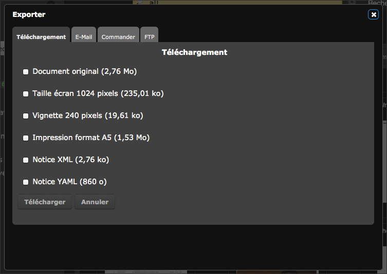

Exporter et Imprimer
====================
.. toctree::
    :maxdepth: 3

.. topic:: L'essentiel

    L'action `Exporter`_ est l'une des actions possibles dans la
    :doc:`Palette des Actions <Actions>` dans *Phraseanet Production*.
    Plusieurs modes d'export sont proposés: utiliser le téléchargement,
    envoyer par email ou encore envoyer via le :term:`FTP <FTP>`.

    L'action `Imprimer`_ est considéré comme un type d'export particulier c'est
    pourquoi les fonctionnalités d'impression sont détaillées dans cette page.

Exporter
--------

Cette action permet d'exporter, au choix:

* le document original
* les sous-définitions de documents
* les notices au format `XML <https://wikipedia.org/wiki/Xml>`_ ou
  `YAML <https://wikipedia.org/wiki/Yaml>`_

*Près de chaque format figurent les poids respectives des éléments à exporter.*

Il est possible d'exporter à l'unité ou en lots des médias ou les contenus de
Paniers et Reportages depuis la zone d':doc:`affichage des Résultats <Afficher>`
ou depuis la
:doc:`zone d'affichage des paniers et reportages <PaniersReportages>`.

**En cliquant sur "Exporter", trois options d'export sont proposées dans des
onglets :**

* le Téléchargement : Il permet de transférer les données sur son disque
  dur dans un fichier compressé nommé par exemple Export.zip.
* L'envoi par Mail : Il permet d'envoyer à un destinataire un lien lui
  permettant de récupérer des médias contenus dans un fichier compressé de type
  Zip.
* L'envoi par FTP : Si le paramétrage de l'application le permet, l'envoi par
  FTP permet de déposer les média exportés sur un serveur de fichiers
  supportant des connexions de type FTP.

.. image:: ../../images/Exporter-general.jpg
    :align: center

.. note::

    L'export peut être effectué sur des lots de documents, en
    provenance de plusieurs bases ou collections différentes, sur
    lesquelles l'utilisateur peut ne pas disposer des droits d'export.
    Dans ce cas, le nombre de documents qu'il est possible d'exporté
    est indiqué.

L'export par Téléchargement
***************************

* Sélectionner une ou plusieurs vignettes et cliquer sur l'icône *Exporter*.
* La fenêtre de téléchargement s'ouvre.
* Utiliser les cases à cocher pour sélectionner quel élément exporter.
* Cliquer sur *Télécharger*.
* Suivre la procédure proposée par le navigateur.

L'export par E-Mail
*******************

* Saisir l'adresse email du destinataire, utiliser le point virgule " ; " en
  cas d’envoi vers des destinataires multiples.
* Saisir l'objet de l'email.
* Sélectionner quels fichiers doivent joints à l'archive Zip téléchargeable
  via le lien proposé dans le corps de l'email.
* Compléter si besoin le message de l'email.
* Cliquer sur Envoyer.

.. note::

    Le lien de téléchargement transmis.

* Cliquer sur Envoyer.
* Un message confirmant l’envoi de l’email apparaît.

.. image:: ../../images/Exporter-mail.jpg
    :align: center

FTP
***

Cet onglet permet de saisir manuellement les coordonnées du serveur FTP de
destination mais peut aussi appeler des "pré-configurations".

.. note::

    Les Pré-configurations correspondent à l'adresse FTP saisie
    dans la partie "Mon compte".

Il est possible de demander l’envoi d’un email de confirmation à l’utilisateur
envoyant les éléments et au destinataire pour l’informer de la mise à
disposition des éléments sur son serveur FTP.

Il est également possible de tester le serveur FTP de destination et/ou
d’envoyer les éléments.

Une fenêtre intermédiaire s’ouvre et informe l’utilisateur de l’état de son
envoi.

.. image:: ../../images/Exporter-FTP.jpg
    :align: center

Demande de documents
********************

Cet onglet permet d'adresser des demandes de téléchargement pour les
utilisateurs ne bénéficiant pas des droits de téléchargement.

.. image:: ../../images/Exporter-commande.jpg
    :align: center

Remplir et soumettre le formulaire affiché.

Le gestionnaire de commande est averti de la commande par notification dans
Phraseanet ou bien par email.

Imprimer
--------
Cette Action permet d'imprimer les vignettes, les images de choix, les
descriptions des médias dans un document pdf auto-généré.

* Sélectionner un ou plusieurs médias puis cliquer sur "Imprimer".

La fenêtre Imprimer s'ouvre.

.. image:: ../../images/Actions-Imprimer1.jpg
    :align: center

Cocher les cases correspondant aux choix souhaités:

* Image de choix, pour n'imprimer que les images de choix.
* Image de choix et légende, pour imprimer les images de choix et la
  description du document.
* Image de choix et description avec planche contact, pour imprimer les images
  de choix, les descriptions et les vignettes regroupées dans une planche
  contact.
* Liste de vignettes, pour imprimer la liste des vignettes.
* Planche contact, pour imprimer les vignettes regroupées dans une planche
  contact.

Cliquer sur Imprimer. Les documents demandés s'affichent sous forme d'un
document PDF (*Format Acrobat de Adobe* - un *Reader Acrobat* doit être installé
sur le poste de travail)

.. image:: ../../images/Actions-Imprimer2.jpg
    :align: center

Imprimer le document PDF sur l'imprimante de son choix ou l'enregistrer sur le
disque dur de son poste de travail.
