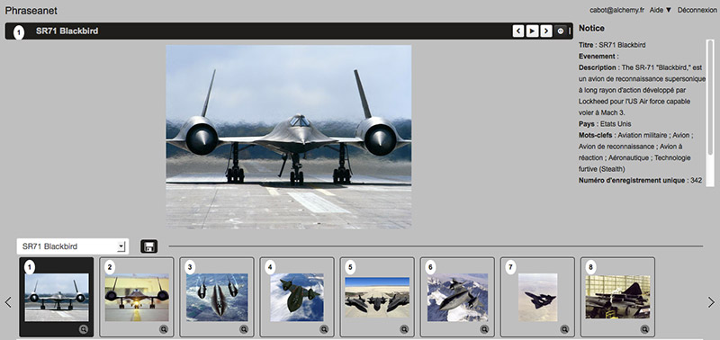

Présentation
============

.. toctree::
    :maxdepth: 4

Généralités
-----------

Phraseanet est une solution de gestion de média numériques fullweb.
Construite à partir de composants standards, Phraseanet s'installe sur des
plateformes Linux, Windows ou Mac Os. Elle utilise principalement les briques
Mysql, Php et Apache.

Pour utiliser Phraseanet
------------------------

L'utilisateur doit disposer d'un ordinateur équipé d'une connexion internet et
d'un navigateur internet récent.
Le support de Javascript doit être activé et le plug-in Adobe `FlashPlayer`_
installé.

Il doit disposer d'une adresse email valide à laquelle il a accès.

.. note::

    Sur les PC Windows, Internet Explorer 7 est la version minimum conseillée du
    navigateur Microsoft. Toutefois, *Phraseanet Classic* permet de consulter le
    fonds au moyen de navigateurs réputés obsolètes comme Internet Explorer 6.

Les modules
-----------

Phraseanet est un système complet pour l’archivage, l’organisation et la
diffusion de vos documents multimédia.

La solution se compose des 7 interfaces suivantes, accessibles à partir d’un
menu principal:

* Phraseanet `Upload`_
* Phraseanet `Production`_
* Phraseanet `Classic`_
* Phraseanet `Administration`_
* Phraseanet `Report`_
* Phraseanet `Thesaurus`_
* Phraseanet `Lightbox`_

Upload
******

Disponible seulement à partir de l'interface Production, *Phraseanet Upload* vous
permet d’importer vos documents multimédia à partir de votre disque dur.
Vous choisissez la :term:`collection <Collection>` dans laquelle vous souhaitez
voir vos documents archivés, vous les réordonnez éventuellement, puis effectuez
l’import. Ce gestionnaire de téléchargement vous permet de transférer vos documents
depuis un navigateur web à la vitesse d’un transfert :term:`FTP <FTP>` !

:doc:`Comment importer des documents dans votre base Phraseanet <Importer>`

Production
**********

* Phraseanet Production* est le module le plus important. Il permet de:
  :doc:`rechercher <Rechercher>`, :doc:`d'éditer <Editer>`,
  :doc:`de visualiser et d'organiser <Afficher>`,
  :doc:`de partager <Push>` vos documents.
  Cette interface est dédiée aux gestionnaires et contributeurs.

* Production* est l'une des interfaces les plus importantes dans Phraseanet. En effet,
  elle permet aux gestionnaires des photothèques de gérer leurs documents. Selon leurs
  droits, ils peuvent éditer les documents, les partager, créer des paniers et bien
  d'autres actions.

.. figure:: ../../images/Production-zones.jpg
    :align: center

L'espace de travail est divisé en quatre parties:

* La :doc:`Recherche <Rechercher>`: Entrez un ou plusieurs mots clés (1)
* L':doc:`affichage des réponses <Afficher>` (2)
* La :doc:`zone de travail <Onglets>`: vos paniers et reportages, la gestion
  des mots candidats... (3)
* La :doc:`Palette des Actions <Actions>`. Elle permet d'effectuer
  des actions sur les documents: :doc:`éditer <Editer>`, :doc:`supprimer <Actions>`,
  :doc:`partager <Push>`,... (4)

Classic
*******

* Phraseanet Classic* est une vue dédiée aux utilisateurs finaux, permettant de
  :doc:`consulter simplement les documents <Afficher>`. Classic est le module à
  privilégier pour la consultation sous Internet Explorer 6.

Comme dans l'interface de *Production*, l'espace de recherche figure dans le coin
gauche en haut de page; la barre des Onglets affichant cette fois trois onglets
(Collection, Propositions, Historique) est en-dessous; On retrouve également les
paniers en bas de page.

Enfin, le reste de la fenêtre est consacrée à l'affichage des résultats.

.. figure:: ../../images/General-Classic.jpg
   :align: center

Sous chaque vignette se trouvent 5 icônes:

.. figure:: ../../images/General-Classic2.jpg
   :align: center

Ces icônes permettent:

* Agrandir la vignette: avec la loupe

.. figure:: ../../images/General-Classic3.jpg
   :align: center

Les 4 autres icônes permettent de:

* consulter les informations relatives à l'image
* ajouter au panier
* imprimer
* exporter

.. figure:: ../../images/General-Classic4.jpg
   :align: center

Administration
**************

:doc:`Phraseanet Administration <Administration>` permet de gérer votre système,
de créer des bases et des collections, de créer des utilisateurs et de gérer leurs
droits.

La gestion des droits est très fine: on peut ainsi donner ou non des droits à un
utilisateur sur une :term:`collection <Collection>` donnée, mais également sur le
type d’actions qu’il peut effectuer sur les documents.
*Admin* est l’interface la plus technique de Phraseanet et elle reste pourtant
très simple d’utilisation.

Voici l'une des vues de *Phraseanet Administration*. Les onglets à gauche permettent
de voir qui est connecté en temps réel sur la base, d'accéder à la
liste des utilisateurs et de pouvoir administrer leurs droits (droits
de visualisation, téléchargement, filigranes, etc. sur les documents et sur les
collections).

*Administration* permet aussi d'accéder au setup, au réglage de la structure, etc.

.. image:: ../../images/General-Administration.jpg
    :align: center

:doc:`Pour plus d'informations, se reporter à la section dédiée à l'Administration
<Administration>`.

Report
******

Véritable application de :doc:`Statistiques <Statistiques>`, *Phraseanet Report*
présente de très nombreux détails sur l’activité de votre base Phraseanet:
quelles ont été les questions les plus posées, quels sont les utilisateurs les
plus actifs sur le système, et des informations telles que le nombre de connexions,
le nombre de téléchargements, le nombre de connexions ou de téléchargement par
plateformes et navigateurs, etc.

L'interface Report

Pour la présentation intégrale de l'interface permettant d'afficher les nombreux
rapports de statistiques, reportez-vous à la section :doc:`Statistiques <Statistiques>`.

.. figure:: ../../images/General-Report.jpg
   :align: center

Thesaurus
*********

La création et la gestion de :doc:`Thesaurus <Thesaurus>` est possible dans
Phraseanet. Il gère la synonymie, permet de lever des ambiguités selon le contexte.
On rebondit de terme en terme. Il représente un vrai plus dans l’utilisation d’une
solution de photothèque professionnelle.

L'interface Thesaurus

Pour l'utilisation du Thesaurus, reportez-vous à la section :doc:`Thesaurus
<Thesaurus>`.

.. figure:: ../../images/General-Thesaurus.jpg
   :align: center

Lightbox
********

Interface collaborative, *Phraseanet Lightbox* permet entre autres de :doc:`connaître
les avis d’utilisateurs sur des documents <Push>`. Elle permet aussi de pouvoir
visualiser et/ou télécharger des documents spécifiques envoyés par un autre
utilisateur Phraseanet.

L'interface Lightbox

Pour envoyer et partager, comparer des documents. Se reporter à la section consacrée
au :doc:`Push <Push>`.

.. _FlashPlayer: http://get.adobe.com/fr/flashplayer/
