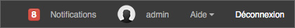

Introduction
============
.. toctree::
   :maxdepth: 3

Les modules
-----------
Phraseanet est un système complet pour l’archivage, l’organisation et la 
diffusion de vos documents multimédia. 

La solution se compose des 7 interfaces suivantes, accessibles à partir d’un 
menu principal:

* Phraseanet `Upload`_
* Phraseanet `Production & Classic`_
* Phraseanet `Administration`_
* Phraseanet `Report`_
* Phraseanet `Thesaurus`_
* Phraseanet `Lightbox`_

Upload
******
*Phraseanet Upload* vous permet d’importer vos documents multimédia à partir 
de votre disque dur. 
Vous choisissez la :term:`collection <Collection>` dans laquelle vous souhaitez 
voir vos documents archivés, vous les réordonnez éventuellement, puis effectuez 
l’import. Ce gestionnaire de téléchargement vous permet de transférer vos documents 
depuis un navigateur web à la vitesse d’un transfert :term:`FTP <FTP>` !

:doc:`Comment importer des documents dans votre base Phraseanet <Importer>`

Production & Classic
********************
*Phraseanet Production* est le module le plus important. Il permet de:
:doc:`rechercher <Rechercher>`, :doc:`d'éditer <Editer>`, 
:doc:`de visualiser et d'organiser <Afficher>`, 
:doc:`de partager <Push>` vos documents. 
Cette interface est dédiée aux gestionnaires et contributeurs. 

*Phraseanet Classic* est une vue dédiée aux utilisateurs finaux, permettant de 
:doc:`consulter simplement les documents <Afficher>`.

Administration
**************
:doc:`Phraseanet Administration <Administration>` permet de gérer votre système, 
de créer des bases et des collections, de créer des utilisateurs et de gérer leurs 
droits. 

La gestion des droits est très fine: on peut ainsi donner ou non des droits à un 
utilisateur sur une :term:`collection <Collection>` donnée, mais également sur le 
type d’actions qu’il peut effectuer sur les documents. 
*Admin* est l’interface la plus technique de Phraseanet et elle reste pourtant 
très simple d’utilisation.

Report
******
Véritable application de :doc:`Statistiques <Statistiques>`, *Phraseanet Report* 
présente de très nombreux détails sur l’activité de votre base Phraseanet: 
quelles ont été les questions les plus posées, quels sont les utilisateurs les 
plus actifs sur le système, et des informations telles que le nombre de connexions, 
le nombre de téléchargements, le nombre de connexions ou de téléchargement par 
plateformes et navigateurs, etc.

Thesaurus
*********
La création et la gestion de :doc:`Thesaurus <Thesaurus>` est possible dans 
Phraseanet. Il gère la synonymie, permet de lever des ambiguités selon le contexte. 
On rebondit de terme en terme. Il représente un vrai plus dans l’utilisation d’une 
solution de photothèque professionnelle.

Lightbox
********
Interface collaborative, *Phraseanet Lightbox* permet entre autres de :doc:`connaître 
les avis d’utilisateurs sur des documents <Push>`. Elle permet aussi de pouvoir 
visualiser et/ou télécharger des documents spécifiques envoyés par un autre 
utilisateur Phraseanet.

Menu
----
Accès aux interfaces
********************
Phraseanet s'ouvre.
La dernière application utilisée pour quitter se lance par défaut.
Toutes les applications proposent en haut de la fenêtre la même barre de navigation.

**La partie gauche de la fenêtre affiche la liste les interfaces auxquelles 
vous avez accès.**

.. image:: ../../images/General-menu.jpg
   :alt: alternate text
   :align: center

En cliquant sur le nom d'une application, le navigateur internet lance celle-ci 
dans un nouvel onglet.

.. note:: Une interface est manquante dans le menu? Vérifiez vos droits, car si 
          vous n'avez pas un droit d'accès, l'interface n'apparaîtra pas.

Accès aux notifications et autres données 
******************************************
Dans la partie droite se trouvent vos notifications, :doc:`vos informations de 
compte <Connexion>`, l'aide en ligne et le lien pour se déconnecter.

.. figure:: ../../images/General-menu 0.jpg
   :alt: alternate text
   :align: center

Les notifications
^^^^^^^^^^^^^^^^^^
Lorsque vous envoyez une :doc:`sélection d'images <PaniersReportages>` à un ou 
plusieurs autres utilisateurs, pour par exemple leur demander leur avis (et donc 
une validation) sur les documents (voir section :doc:`Push <Push>`), le destinataire 
reçoit l'information en temps réel dans l'interface de *Production* s'il est 
connecté. Celui-ci est également notifié par email de l'arrivée de la demande.

Dans ce cas, l'onglet "Notifications" comporte une bulle avec le chiffre représentant 
le nombre de demandes qu'il n'a pas encore lues:

Cliquer sur l'onglet Notifications. La liste des notifications les plus récentes 
apparaît. 

.. image:: ../../images/General-notifications.jpg
   :alt: alternate text
   :align: center

Pour visualiser *toutes les notifications*, cliquer dessus. Une fenêtre 
en Overlay s'affiche et les notifications plus anciennes sont chargées.

Aide
^^^^
En cliquant sur l'onglet "Aide", l'utilisateur est redirigé vers cette documentation 
en ligne.
En cliquant sur la flèche près de l'aide, deux sous-onglets apparaîssent: les 
*Raccourcis claviers*, et *A propos*.  

.. image:: ../../images/General-menu3.jpg
   :alt: alternate text
   :align: center

Voici un exemple de quelques raccourcis claviers utiles dans Phraseanet.

.. image:: ../../images/General-raccourcis.jpg
   :alt: alternate text
   :align: center

Nous allons maintenant voir ci-dessous à quoi ressemblent véritablement les modules, 
pour vous aider à vous familiariser avec les différentes interfaces.

Phraseanet est une application s'exécutant dans un navigateur Web.
Elle permet de réaliser des tâches complexes avec la simplicité de l'interface 
d'une application de bureau.
Elle intègre l’utilisation de la plupart des raccourcis claviers communément utilisés.

Interface Production
---------------------
Espaces de travail
******************
*Production* est l'une des interfaces les plus importantes dans Phraseanet. En effet, 
elle permet aux gestionnaires des photothèques de gérer leurs documents. Selon leurs 
droits, ils peuvent éditer les documents, les partager, créer des paniers et bien 
d'autres actions.

.. figure:: ../../images/Production-zones.jpg
   :alt: alternate text
   :align: center

Un espace de travail divisé en quatre parties:

  * La :doc:`Recherche <Rechercher>`: Entrez un mot clé (1)

  * L':doc:`affichage des réponses <Afficher>` (2)

  * La :doc:`barre des onglets <Onglets>`: vos paniers et reportages, la recherche 
    avancée, la gestion des mots candidats... (3)

  * La :doc:`Palette des Actions <Actions>`. Elle permet d'effectuer 
    des actions sur les documents: :doc:`éditer <Editer>`, :doc:`supprimer <Actions>`, 
    :doc:`partager <Push>`,... (4)

Personnalisation
****************

**Préférences d'affichage des résultats:**
L'utilisateur peut personnaliser l'affichage. Pour connaître les possibilités dans 
le détail, consulter la section consacrée à l':doc:`affichage des résultats 
<Afficher>`. 

**Préférences d'affichage des paniers et reportages:** Cliquer sur le menu 
contextuel des paniers.

.. figure:: ../../images/General-prefpaniers.jpg
   :alt: alternate text
   :align: center

Cliquer sur *Préférences*.

Une fenêtre en :term:`Overlay <Overlay>` s’ouvre:

.. figure:: ../../images/General-Prefpaniers2.jpg
   :alt: alternate text
   :align: center

Cocher les cases pour afficher les :term:`status <Statusbit>`, la description 
et/ou le titre des documents dans les paniers. 
Fermer en cliquant sur la croix en haut à droite ou appuyer sur la touche "Echap" 
du clavier.

**Modifier la taille d’affichage de la zone de paniers**

Cliquer sur l’onglet séparant la zone paniers de celle des résultats.

Déplacer le curseur vers la gauche ou la droite pour changer la taille des zones 
d’affichage.

Relâcher le curseur dès que le nombre de vignettes par ligne dans la zone des 
paniers est atteint.

.. note:: Ensuite, l'application ajuste seule l’espace pour optimiser l’affichage.

A noter également: depuis la version 3.6, la Barre des Onglets est rétractable: 

  .. image:: ../../images/Onglets-Retractable0.jpg
	   :alt: alternate text
	   :align: center

Un clic sur l'icône présente sur le côté droit permet de la masquer quasi - 
entièrement, ce qui laisse un espace totalement dédié à l'affichage et à la 
consultation des Résultats :

  .. image:: ../../images/Onglets-Retractable.jpg
	   :alt: alternate text
	   :align: center

Un clic sur n'importe quelle partie de la Barre des Onglets la fait réapparaître 
instantanément.

Interface Classic
-----------------
*Classic* est l'interface qui permet de consulter simplement ses documents.

Comme dans l'interface de *Production*, l'espace de recherche figure dans le coin 
gauche en haut de page; la barre des Onglets affichant cette fois trois onglets 
(Collection, Propositions, Historique) est en-dessous; On retrouve également les 
paniers en bas de page.

Enfin, le reste de la fenêtre est consacrée à l'affichage des résultats.

.. figure:: ../../images/General-Classic.jpg
   :alt: alternate text
   :align: center

Sous chaque vignette se trouvent 5 icônes:

.. figure:: ../../images/General-Classic2.jpg
   :alt: alternate text
   :align: center

Ces icônes permettent:

  * Agrandir la vignette: avec la loupe

.. figure:: ../../images/General-Classic3.jpg
   :alt: alternate text
   :align: center

Les 4 autres icônes permettent de: 

  * consulter les informations relatives à l'image
  * ajouter au panier
  * imprimer
  * exporter

.. figure:: ../../images/General-Classic4.jpg
   :alt: alternate text
   :align: center
  
Interface Administration
------------------------
Voici l'une des vues de *Phraseanet Administration*. Les onglets à gauche permettent 
d'accéder entre autres de voir qui est connecté en temps réel sur la base, à la 
liste des utilisateurs et de pouvoir leur changer et créer leurs droits (droits 
de visualisation, téléchargement, filigranes, etc. sur les documents et sur les 
collections). 

*Administration* permet aussi d'accéder au setup, au réglage de la structure, etc.

.. image:: ../../images/General-Administration.jpg
   :alt: alternate text
   :align: center

:doc:`Pour plus d'informations, se reporter à la section dédiée à l'Administration 
<Administration>`.
			  
Interface Report
----------------
Pour la présentation intégrale de l'interface permettant d'afficher les nombreux 
rapports de statistiques, reportez-vous à la section :doc:`Statistiques <Statistiques>`.

.. figure:: ../../images/General-Report.jpg
   :alt: alternate text
   :align: center
   
Interface Thesaurus
-------------------
Pour l'utilisation du Thesaurus, reportez-vous à la section :doc:`Thesaurus 
<Thesaurus>`.

.. figure:: ../../images/General-Thesaurus.jpg
   :alt: alternate text
   :align: center

Interface Lightbox
------------------
Pour envoyer et partager, comparer des documents. Se reporter à la section consacrée 
au :doc:`Push <Push>`. 

.. figure:: ../../images/General-Lightbox.jpg
   :alt: alternate text
   :align: center