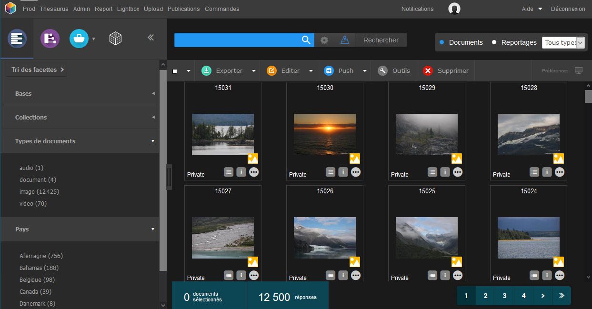

Présentation de Phraseanet
==========================
.. toctree::
    :maxdepth: 4

Généralités
-----------

*Phraseanet* est une solution de gestion de médias numériques.

Elle s'adresse à tous les professionnels qui ont besoin d’un outil performant
pour assurer la gestion et la diffusion de leurs images, vidéos, sons et autres
documents multimédias ou bureautiques.

Installée sur un serveur local ou distant, elle s'exécute à travers un
navigateur internet.

Pour utiliser Phraseanet
------------------------

L'utilisateur doit disposer d'un ordinateur équipé d'une connexion internet et
d'un navigateur internet récent.
Le support de Javascript doit être activé et le plug-in
`Adobe Flash Player <http://get.adobe.com/fr/flashplayer/>`_ peut être requis.

Il dispose également d'une adresse e-mail valide à laquelle il a accès.

.. note::

    Sur les PC Windows, Internet Explorer 9 est la version minimum
    conseillée du navigateur Microsoft.

Les modules Phraseanet
----------------------

Phraseanet est un système complet pour l'archivage, l'organisation et la
diffusion de documents multimédia.

La solution repose sur des modules ou interfaces, accessibles selon les droits
de l'utilisateur à partir d'une barre de menu principal :

* `Production`_
* `Lightbox`_
* `Upload`_
* `Administration`_
* `Thésaurus`_
* `Report`_

Production
**********

*Phraseanet Production* est l'interface la plus importante pour de nombreux
utilisateurs.
Complète, cette interface permet, selon les droits de l'utilisateur,
d':doc:`importer <Importer>`, de :doc:`décrire <Editer>`, de
:doc:`rechercher <Rechercher>`, :doc:`de visualiser, d'organiser <Afficher>`,
de :doc:`partager <Push>` et de :doc:`diffuser <Publier>` des documents
multimédias.

Lightbox
********

Interface collaborative, *Phraseanet Lightbox* permet de visualiser et/ou
télécharger des documents spécifiques envoyés par des utilisateurs *Phraseanet*.
Des fonctionnalités de validation permettent de :doc:`connaître les avis
d’utilisateurs sur des médias <Push>`.

.. image:: ../../images/General-Lightbox.jpg
   :align: center

.. seealso::

    Pour envoyer, partager, comparer des documents dans *Lightbox*, se reporter
    à la section consacrée au :doc:`Push et à la Validation<Push>`.

Upload
******

Disponible à partir de l'interface Production, *Phraseanet Upload* permet aux
utilisateurs qui en ont le droit, d'importer des fichiers multimédia dans
Phraseanet à partir du disque dur de l'ordinateur.
Ce gestionnaire de téléchargement montant permet de transférer des médias sans
requérir à un logiciel de transfert :term:`FTP <FTP>`.

.. seealso::

    Se reporter à la section consacrée à :doc:`l'upload de documents<Importer>`.

Administration
**************

:doc:`Admin <Administration>` est une interface métier permettant de gérer et
de surveiller l'application, de créer des bases et des
:term:`collections <Collection>`, de déclarer des structures documentaires, de
créer des utilisateurs ou de gérer leurs droits.

.. image:: ../../images/General-Administration.jpg
    :align: center

.. seealso::

     :doc:`Se reporter à la section dédiée à l'Administration <Administration>`.

Thésaurus
*********

La création et la gestion de :doc:`Thésaurus <Thesaurus>` est possible dans
*Phraseanet*.
Outre la gestion des termes génériques et des termes spécifiques, le thésaurus
Phraseanet gère la synonymie et les relations inter linguistiques. Il apporte
un vrai plus dans l'utilisation de *Phraseanet*.

.. image:: ../../images/General-Thesaurus.jpg
   :align: center

.. seealso::

     :doc:`Se reporter à la section dédiée au Thésaurus <Thesaurus>`.

Report
******

*Report* permet l'export de données relatives aux connexions, aux
téléchargements et aux contenus documentaires des bases et collections selon
des intervalles de dates.

.. image:: ../../images/General-Report.jpg
   :align: center

.. seealso::

    Se reporter à la section :doc:`Statistiques <Statistiques>` pour une
    présentation de ce module.
