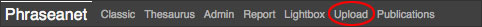
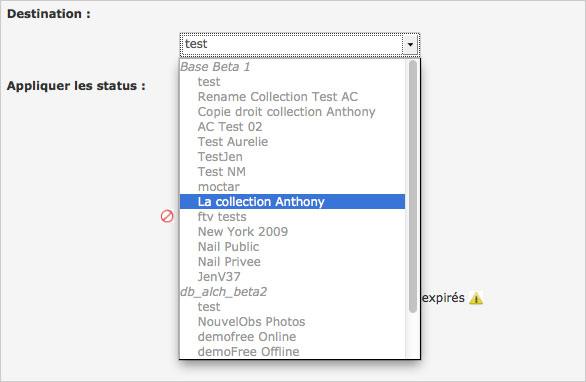

Importer
=========

.. toctree::
    :maxdepth: 3

.. topic:: L'essentiel

    Reposant sur la technologie :term:`HTML5` l'interface *Phraseanet Upload*
    est accessible dans Production via un lien placé dans la barre de menu
    Phraseanet.
    *Upload* est une interface dédiée à l'ajout de médias vers des collections
    sur lesquelles l'utilisateur dispose des droits d'ajout.

.. image:: ../../images/Upload-zones.jpg
    :align: center

.. note::

    Pour les navigateurs qui ne bénéficient pas du plein support de
    HTML5, un mode d'affichage reposant sur le plug-in Adobe `FlashPlayer
    <http://get.adobe.com/fr/flashplayer/>`_ est disponible dans *Phraseanet
    Upload*.

.. image:: ../../images/Upload-Version-Flash.jpg
    :align: center

Cliquer sur le lien **Utiliser l'uploader Flash** pour utiliser ce mode.
Ce mode Flash n'offre pas une alternative mais un mode d'affichage
dégradé. Il ne permet pas d'accéder à toutes les fonctionnalités
développées sur le socle technologique de HTML5.

Comment ajouter des médias ?
----------------------------

Cliquer sur Upload dans le :doc:`menu <General>` Phraseanet.

*Phraseanet Upload* se lance dans une fenêtre overlay.

Sélectionner des fichiers
*************************

Cliquer sur **Sélectionner les fichiers**.

.. image:: ../../images/Upload-zone1.jpg
    :align: center

L'application lance l’explorateur de fichiers de l'ordinateur.
Aller au dossier où se trouvent les fichiers, les sélectionner puis cliquer sur
**Ouvrir**.

.. image:: ../../images/Upload-fichiers.jpg
    :align: center

L'interface affiche alors la liste des fichiers, représentés éventuellement par
leurs vignettes qui apparaissent en bas d'écran.

.. image:: ../../images/Upload-fichiers2.jpg
    :align: center

Choisir la collection de destination
************************************

Sélectionner la collection de destination dans la liste déroulante ou figurent
les collections disponibles.

Appliquer des status
********************

Si besoin, appliquer les :term:`status` si nécessaire (optionnel).

.. image:: ../../images/Upload-zone3.jpg
    :align: center

Réordonner les média
********************

Si besoin, l'utilisateur peut réordonner les médias avant de les importer.
Sélectionner un fichier et le glisser / déposer ailleurs dans la liste. Il peut
également choisir de retirer de la liste une ou plusieurs images en cliquant
sur le bouton Annuler au-dessous de chaque vignette, ou alors de réinitialiser
la liste d'envoi en cliquant sur le bouton **Vider la liste**.
Sinon, cliquer sur **Envoyer** pour transmettre les fichiers vers *Phraseanet*.

.. image:: ../../images/Upload-reordonner.jpg
    :align: center

Transmettre les médias
**********************

Lorsque l'utilisateur clique sur **Envoyer**, tous les médias sont transférées
vers la collection *Phraseanet* sélectionnée.
Le téléchargement montant est représentée par des barres de progression sur
le côté droit de la fenêtre (« Fichiers transmis »).

.. image:: ../../images/Upload-zone4.jpg
    :align: center

Une barre de progression générale ainsi qu'une barre de progression par document
permet de suivre l'état du transfert.

Lors du transfert, les médias sont ajoutés à la collection de destination.

Après transfert, les médias transmis sont consultables dans les interfaces
*Phraseanet Production* (consultation et gestion des documents) et *Classic*
(simple consultation).

La Quarantaine
--------------

Lors de l'ajout de fichiers, certains fichiers peuvent être placés en
**Quarantaine**.

Cliquer sur l'onglet **Quarantaine** pour l'afficher de la fenêtre *Upload* pour
l'afficher.

.. image:: ../../images/Upload-Quarantaine0.jpg
    :align: center

La quarantaine est un espace où sont isolés des fichiers en attente d'une action
utilisateur.
Par défaut, la quarantaine ne s'active que si des fichiers sont identifiés comme
étant des doublons de documents existants préalablement uploadés, l'analyse
reposant sur l'examen d'un identifiant universel unique (UUID pour *Universally
Unique IDentifier*).

La quarantaine permet aussi d'isoler des fichiers ne répondant pas à des
critères complémentaires déterminés par l'administrateur système.

Pour le paramétrage des critères supplémentaires de rétention en quarantaine,
consulter le paragraphe consacré au **Service des douanes** sur
:doc:`cette page<../../../Admin/Configuration>`.

Lors de l'*upload*, un média placé en quarantaine est lui signalé par un label
de couleur rouge.

.. image:: ../../images/Upload-Quarantaine2.jpg
    :align: center

Dans la quarantaine, pour chaque fichier est indiquée la raison pour laquelle il
a été placé : le document peut être un doublon, ou peut ne pas correspondre à
des critères d’éligibilité (format, colorimétrie, dimensions)...*etc*.

Trois choix sont alors proposés à l'utilisateur :

.. image:: ../../images/Upload-Quarantaine1.jpg
    :align: center

* **Ajouter** le fichier comme nouvel enregistrement dans la collection
  initialement choisie
* **Supprimer** le fichier
* **Substituer** le fichier existant

L'utilisateur décide de l'action à entreprendre pour vider la file de fichiers
présents dans la quarantaine.

Puis passer au document suivant, le cas échéant.

La **Quarantaine** peut être également intégralement vidée si besoin au moyen du
bouton **Vider la quarantaine** placé en haut à gauche de l'écran.
