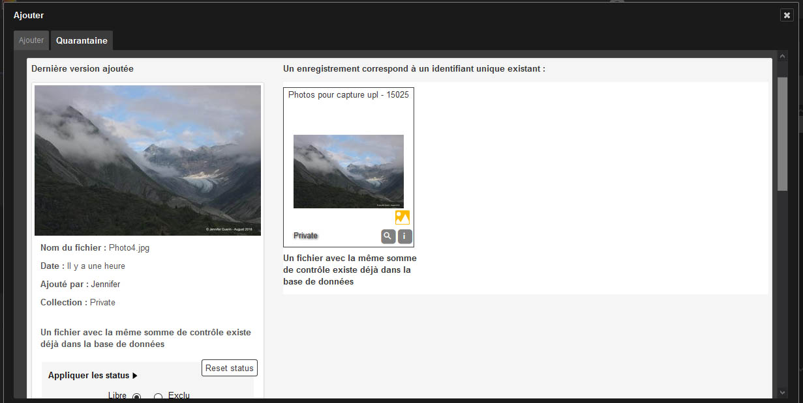

.. todo:: Mettre à jour les captures

Importer
=========
.. toctree::
   :maxdepth: 3

.. topic:: L'essentiel

    Vous pouvez importer des documents en utilisant l'interface Phraseanet Upload. 
    C'est une interface dédiée à l'ajout de documents vers des collections sur
    lesquelles l'utilisateur dispose des droits d'ajout. 

.. image:: ../../images/Upload-zones.jpg
	   :alt: alternate text
	   :align: center 

Ajouter des documents
---------------------
Cliquer sur Upload dans le :doc:`menu <General>` Phraseanet.

*Phraseanet Upload* se lance dans une fenêtre overlay.

Sélectionner des fichiers
*************************
Cliquer sur "Sélectionner les fichiers".

.. image:: ../../images/Upload-zone1.jpg
	   :alt: alternate text
	   :align: center 
 
L'application lance l’explorateur de fichiers, aller jusqu'au dossier où se trouvent
les fichiers à ajouter. 
Cliquer sur Ouvrir.

.. image:: ../../images/Upload-fichiers.jpg
	   :alt: alternate text
	   :align: center 

Une fois les documents choisis, l'interface affiche la liste des fichiers, représentés
par leurs vignettes qui apparaissent en bas d'écran. 

Choisir la collection de destination
************************************
Choisir la collection de destination: Cliquer sur le menu déroulant des collections
disponibles.

Appliquer des status
********************
Si besoin, appliquer les statuts si nécessaire (optionnel).

.. image:: ../../images/Upload-zone3.jpg
	   :alt: alternate text
	   :align: center

Réordonner les documents
************************
L'utilisateur peut éventuellement ré-ordonner les documents : Cliquer sur un 
fichier et le glisser/ déposer ailleurs dans la liste. Il peut également choisir
de retirer de la liste une ou plusieurs images (en cliquant sur le bouton Annuler
au-dessous de chaque vignette), ou alors de retirer toutes les photos en cliquant
sur « Clear list ». Sinon, cliquer sur « Envoyer ».

.. image:: ../../images/Upload-reordonner.jpg
	   :alt: alternate text
	   :align: center

Transmettre les documents
*************************
Lorsque l'utilisateur clique sur "Envoyer", toutes les images sont transférées
vers la collection Phraseanet, cela est visible en temps réel sur le côté droit 
de la fenêtre (« Fichiers transmis »).

.. image:: ../../images/Upload-zone4.jpg
	   :alt: alternate text
	   :align: center
 
Une barre de progression générale ainsi qu'une barre de progression par document
permet de suivre l'état du transfert.
Chaque fichier est transféré. Les documents sont ajoutés à la collection de 
destination.
Il est désormais possible d'aller consulter vos documents, à partir des interfaces
Phraseanet Production (consultation et gestion des documents) ou Phraseanet 
Classic (simple consultation). 

La Quarantaine
--------------
Lors de l'ajout de fichiers, certains fichiers peuvent être placés en "quarantaine".

La quarantaine est un espace de douane où sont isolés des fichiers en attente 
d'une action utilisateur. 
La quarantaine ne s'active que si des fichiers photos sont identifiés
comme étant des nouvelles versions de documents existants préalablement uploadés,
modifiés puis ajoutés à nouveau. 

La quarantaine permet aussi d'isoler des fichiers photo ne répondant pas à des 
critères paramétrés.

Dans l'interface d'ajout, Un document qui entre dans la base est signalé par la 
couleur verte, un document placé en quarantaine est lui signalé par la couleur 
rouge. Pour chaque fichier est indiquée la raison pour laquelle il y a été placé : 
Par exemple, le document peut être un doublon, ou bien celui-ci peut ne pas 
correspondre aux caractères d’elligibilité (formats, colorimétrie, dimensions...).

Trois choix sont alors proposés à l'utilisateur:

Ajouter le fichier comme nouveau document dans la base
Rejeter le fichier
Remplacer le fichier existant
L'utilisateur doit cliquer l'une des icônes:

Puis passer au document suivant, le cas échéant.
