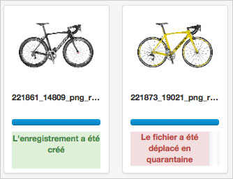

Importer
========

.. toctree::
    :maxdepth: 3

.. topic:: L'essentiel

    Accessible dans Production via un lien placé dans la barre de menu, Upload
    est dédié à l'ajout de médias dans les collections sur lesquelles
    l'utilisateur dispose de droits d'ajout.

.. image:: ../../images/Upload-zones.jpg
    :align: center

Pour les anciens navigateurs qui ne bénéficient pas du plein support de
HTML5, un mode d'affichage reposant sur le plug-in Adobe `FlashPlayer
<http://get.adobe.com/fr/flashplayer/>`_ est disponible.

Sélectionner la rubrique **Utiliser l'uploader Flash** dans la liste déroulante
proposée en bas à droite de l'écran pour exécuter ce mode.

.. note::

    Le mode Flash est un mode d'affichage dégradé : il ne permet pas d'accéder à
    toutes les fonctionnalités développées sur le socle technologique HTML5.

Ajouter des médias
------------------

Cliquer sur Upload dans la :doc:`barre de menu <General>` pour lancer
l'interface dans une fenêtre overlay.

Ajouts de fichiers
******************

* Cliquer sur **Sélectionner les fichiers** (1). L'explorateur de fichiers de
  l'ordinateur se lance.
* Sélectionner les fichiers à intégrer en navigant dans l'arborescence de
  répertoires puis cliquer sur Ouvrir.

Les fichiers sélectionnés apparaissent dans la partie gauche de l'interface
Upload (2).

.. image:: ../../images/Upload-fichiers2.jpg
    :align: center

.. note::

    Dans l'interface Upload, l'affiche des vignettes de rendu des médias
    est généré par le navigateur lui-même.
    Certaines conditions peuvent faire que ces vignettes ne s'affichent pas
    sans qu'il s'agissent d'une anomalie de fonctionnement de l'application.

A partir de la version 4.0.8 il est possible d'ajouter un fichier par son URL :

* Renseigner l'URL de la ressource dans le champ de formulaire
* Cliquer sur le bouton **Ajouter cette URL**

Réordonner, supprimer des médias de la liste d'import
*****************************************************

* **Réordonner les médias** avant de les importer. Sélectionner un fichier et
  le glisser / déposer ailleurs dans la grille.

.. image:: ../../images/Upload-reordonner.jpg
    :align: center

* **Supprimer** de la liste un ou plusieurs médias en cliquant sur le bouton
  Annuler au-dessous des vignettes, ou bien
* **Réinitialiser la liste d'envoi** en cliquant sur le bouton
  **Vider la liste**.

Choisir la collection de destination
************************************

* Sélectionner la collection de destination dans la liste déroulante où
  figurent les collections disponibles (3).

.. image:: ../../images/Upload-prezone3.jpg
    :align: center

Appliquer des *status*
**********************

* Appliquer si nécessaire des :term:`status` aux médias.

.. image:: ../../images/Upload-zone3.jpg
    :align: center

Transmettre les médias
**********************

* Cliquer sur **Envoyer** pour verser les fichiers dans Phraseanet.

Tous les médias sont transférés vers la collection sélectionnée.
Des barres de progression indiquent l'avancement du transfert dans la partie
**Fichiers transmis** (4).

.. image:: ../../images/Upload-zone4.jpg
    :align: center

Après transfert, les médias transmis sont consultables dans l'interface
Production.

.. note::

    D'autres possibilités d'ajout sont possibles notamment l'import par
    répertoire FTP. Le principe est d'importer les fichiers contenus dans un
    répertoire au moyen d'une tâche d'archivage.

La Quarantaine
--------------

Lors de l'ajout de fichiers, certains fichiers peuvent être placés en
Quarantaine : ils sont signalés par un label de couleur rouge et des
notifications peuvent être diffusées par le système.

.. note::

    Par défaut, entrent en quarantaine les fichiers dont l'
    :term:`identifiant universel unique <Identifiant universel unique (UUID)>`
    est déjà présent dans au moins un des médias de la base de destination.

    D'autres critères de mise en quarantaine peuvent être paramétrés par les
    administrateurs (format, espace colorimétrique, dimensions…*etc*.).

.. seealso::

    Pour le paramétrage des critères supplémentaires de mise en quarantaine,
    consulter le paragraphe consacré au Service des douanes sur
    :doc:`cette page<../../../Admin/Configuration>`.

Cliquer sur l'onglet Quarantaine de la fenêtre Upload pour afficher son contenu.

.. image:: ../../images/Upload-Quarantaine0.jpg
    :align: center

Pour chacun des médias de la quarantaine, trois actions sont proposées :

.. image:: ../../images/Upload-Quarantaine1.jpg
    :align: center

* **Ajouter** le fichier comme nouvel enregistrement dans la collection
  initialement choisie
* **Supprimer** le fichier
* **Substituer** le fichier existant

L'utilisateur décide de l'action à entreprendre pour vider la file de fichiers
en quarantaine.

La Quarantaine peut être vidée intégralement au moyen du bouton **Vider la
quarantaine** placé en haut à gauche de la fenêtre.
