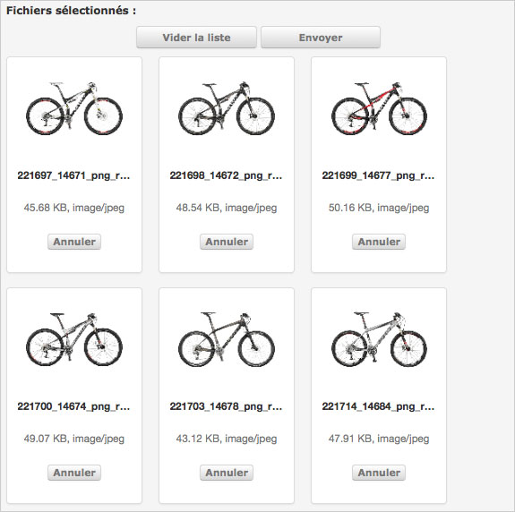

Importer
=========

.. toctree::
   :maxdepth: 3

.. topic:: L'essentiel

    Reposant sur la technologie :term:`HTML5` l'interface Phraseanet Upload est
    accessible dans Production via un lien placé dans la barre de menu
    Phraseanet.
    C'est une interface dédiée à l'ajout de documents vers des collections sur
    lesquelles l'utilisateur dispose des droits d'ajout.

.. image:: ../../images/Upload-zones.jpg
    :align: center

.. note::

    Pour les navigateurs qui ne bénéficient pas du plein support de
    HTML5, un mode d'affichage reposant sur le plug-in Adobe `FlashPlayer`_
    est disponible dans Phraseanet Upload.

    .. image:: ../../images/Upload-Version-Flash.jpg
        :align: center

    Cliquer sur le lien **Utiliser l'uploader Flash** pour utiliser ce mode.
    Ce mode Flash n'offre pas une alternative mais un mode d'affichage
    dégradé. Il ne permet pas d'accéder à toutes les fonctionnalités
    développées sur le socle technologique de HTML5.

Ajouter des documents
---------------------
Cliquer sur Upload dans le :doc:`menu <General>` Phraseanet.

.. image:: ../../images/Upload-lancer.jpg
    :align: center

*Phraseanet Upload* se lance dans une fenêtre overlay.

Sélectionner des fichiers
*************************
Cliquer sur "Sélectionner les fichiers".

.. image:: ../../images/Upload-zone1.jpg
    :align: center

L'application lance l’explorateur de fichiers. Aller au dossier où se trouvent
les fichiers, les sélectionner puis cliquer sur Ouvrir.

.. image:: ../../images/Upload-fichiers.jpg
    :align: center

L'interface affiche alors la liste des fichiers, représentés par leurs vignettes
qui apparaissent en bas d'écran.

Choisir la collection de destination
************************************
Choisir la collection de destination : Cliquer sur le menu déroulant des
collections disponibles.

.. image:: ../../images/Upload-prezone3.jpg
    :align: center

Appliquer des status
********************
Si besoin, appliquer les statuts si nécessaire (optionnel).

.. image:: ../../images/Upload-zone3.jpg
    :align: center

Réordonner les documents
************************
L'utilisateur peut éventuellement ré-ordonner les documents : Cliquer sur un
fichier et le glisser/ déposer ailleurs dans la liste. Il peut également choisir
de retirer de la liste une ou plusieurs images (en cliquant sur le bouton Annuler
au-dessous de chaque vignette), ou alors de retirer toutes les photos en cliquant
sur « **Vider la liste** ». Sinon, cliquer sur « **Envoyer** ».

.. image:: ../../images/Upload-reordonner.jpg
    :align: center

Transmettre les documents
*************************
Lorsque l'utilisateur clique sur "Envoyer", toutes les images sont transférées
vers la collection Phraseanet, cela est visible en temps réel sur le côté droit
de la fenêtre (« Fichiers transmis »).

.. image:: ../../images/Upload-zone4.jpg
    :align: center

Une barre de progression générale ainsi qu'une barre de progression par document
permet de suivre l'état du transfert.

Lors du transfert, les documents sont ajoutés à la collection de destination.

Après transfert, il est désormais possible d'aller consulter les documents transmis
dans les interfaces Phraseanet Production (consultation et gestion des documents)
ou Phraseanet Classic (simple consultation).

La Quarantaine
--------------
Lors de l'ajout de fichiers, certains fichiers peuvent être placés en "Quarantaine".

Cliquer sur l'onglet **Quarantaine** pour l'afficher.

.. image:: ../../images/Upload-Quarantaine0.jpg
    :align: center

La quarantaine est un espace de douane où sont isolés des fichiers en attente
d'une action utilisateur.
La quarantaine ne s'active que si des fichiers sont identifiés comme étant de
nouvelles versions de documents existants préalablement uploadés,modifiés puis
ajoutés à nouveau.

La quarantaine permet aussi d'isoler des fichiers photo ne répondant pas à des
critères paramétrés.

Dans l'interface d'ajout, un document qui entre dans la base est signalé par la
couleur verte, un document placé en quarantaine est lui signalé par la couleur
rouge.

.. image:: ../../images/Upload-Quarantaine2.jpg
    :align: center

Dans la quarantaine, pour chaque fichier est indiquée la raison pour laquelle il
a été placé : le document peut être un doublon, ou bien celui-ci peut ne pas
correspondre aux caractères d’elligibilité (format, colorimétrie, dimensions)...*etc*.

Trois choix sont alors proposés à l'utilisateur :

.. image:: ../../images/Upload-Quarantaine1.jpg
    :align: center

* **Ajouter** le fichier comme nouveau document dans la base
* **Supprimer** le fichier
* **Substituer** le fichier existant

L'utilisateur décide de l'action a entreprendre pour vider la file de fichiers
présents dans la quarantaine.

Puis passer au document suivant, le cas échéant.

.. _FlashPlayer: http://get.adobe.com/fr/flashplayer/
