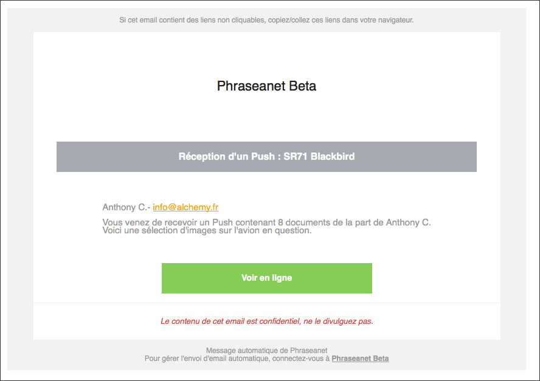
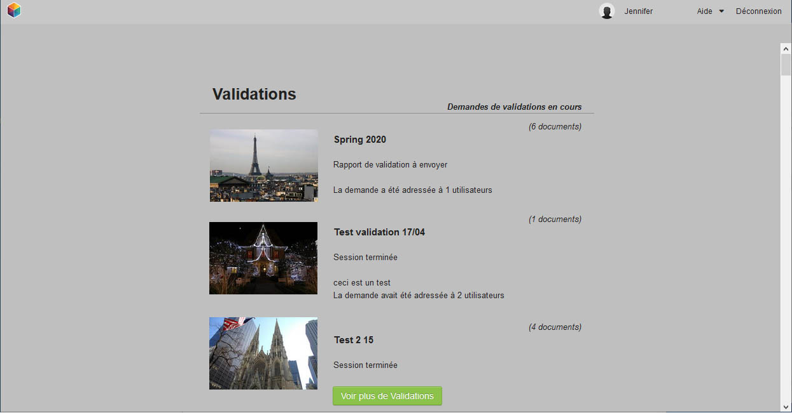

Lightbox
========

.. toctree::
    :maxdepth: 3

.. topic:: L'essentiel

    *Phraseanet Lightbox* est une interface de consultation collaborative.
    Elle propose des fonctions de comparaison, de diaporama, d'export, et
    permet de valider et de commenter des médias.
    Elle permet aux utilisateurs non authentifiés de visionner des images
    sans avoir à s'identifier.

Accéder à la Lightbox
---------------------

Pour les utilisateurs non authentifiés
**************************************

Cette interface s'obtient en cliquant sur un lien HTML reçu par email lorsqu'un
utilisateur Phraseanet transmet un :doc:`Push ou une demande de validation
<Push>`.

Pour les utilisateurs authentifiés
**********************************

Lightbox est disponible dans la barre de lancement des applications Phraseanet.

.. image:: ../../images/General-menu.jpg
    :align: center

Cliquer sur la rubrique **Lightbox** du menu pour rejoindre l'interface
*Phraseanet Lightbox*.

La fenêtre affichée dresse la liste des **Push** et de **demandes de
validation** que l'utilisateur a produit ou reçu.

L'interface
-----------

L'interface de la Lightbox est simple et intuitive.

.. image:: ../../images/Lightbox-interface.jpg
    :align: center

* 1. La barre d'action renseigne sur le nom du fichier, permet de naviguer dans
  les enregistrements et donne accès au téléchargement du média affiché.
* 2. La table lumineuse, au centre, montre le média sa description et ses
  caractéristiques. Cette zone varie selon que l'on visionne un Push ou une
  demande de Validation.
* 3. La zone d'affichage des vignettes liste les médias de la Lightbox

Naviguer
********

Pour naviguer dans les médias d'une Lightbox :

* Sélectionner l'image à afficher dans la zone d'affichage des vignettes avec la
  souris.
* Utiliser les flèches de clavier.
* Utiliser les flèches avancer et reculer situées à droite de la barre d'action

Lancer le diaporama
*******************

Pour lancer un diaporama des médias présents dans une lightbox, cliquer sur le
bouton **lecture** situé dans la barre d'action.

Téléchager des média
********************

Pour télécharger le média affiché sur la table lumineuse, cliquer sur l'icône
d'enregistrement située dans la barre des actions.

.. image:: ../../images/Lightbox-enregister.jpg
    :align: center

Pour télécharger tous les médias contenus dans une lightbox, cliquer sur l'icône
située à gauche en bas de l'interface.

.. image:: ../../images/Lightbox-enregister-tout.jpg
    :align: center

Comparer deux médias
********************

Il peut être intéressant d'afficher deux médias côte à côte pour les comparer.

* afficher un premier média sur la table lumineuse en cliquant sur sa vignette
* en appuyant sur la touche **Ctrl** (PC Windows) ou **Cmd** (Mac OS) de l'
  ordinateur, cliquer sur le média à comparer.

Ce dispositif est très utile dans une démarche de
:doc:`validation de documents <Push>`.

Valider des documents dans la Lightbox
--------------------------------------

La validation de documents dans *Phraseanet* est une demande d'appréciation
formulée sur des médias.
L'utilisateur à qui est adressée une demande de validation donne son avis par
**oui** ou par **non** et peut s'il le souhaite donner un commentaire.

.. image:: ../../images/Lightbox-validation.jpg
    :align: center

Pour ajouter un commentaire, cliquer sur la bulle présente dans la barre d'
actions

.. image:: ../../images/Lightbox-validation_appreciation.jpg
    :align: center

Après validation, cliquer sur le bouton **Envoyer mon rapport**.

L'émetteur de la demande de validation sera immédiatement averti des
appréciations et commentaires.
