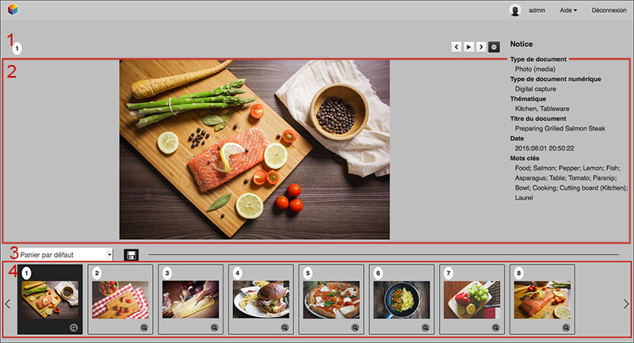
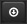

Lightbox
========

.. toctree::
    :maxdepth: 3

.. topic:: L'essentiel

    Lightbox est une interface de consultation collaborative. Elle propose des
    fonctions de comparaison, de diaporama, d'export, et permet de valider ou
    de commenter des médias. Les bénéficiaires de Push et Validation prennent
    connaissance des contenus qui leurs sont adressés par cette interface.

Accéder à Lightbox
------------------

Pour les utilisateurs non authentifiés
**************************************

L'interface s'affiche en cliquant sur le lien HTML proposé dans les e-mails
notifiant les :doc:`Push et demandes de validation <Push>`. Les utilisateurs
peuvent avoir besoin de s'authentifier pour afficher les contenus poussés.

.. image:: ../../images/Lightbox-reception_email.jpg
    :align: center

Pour les utilisateurs authentifiés
**********************************

Dans l'application, cliquer sur la rubrique Lightbox de la barre de menu permet
de rejoindre l'interface.

L'interface dresse la liste des Push et des demandes de validation que
l'utilisateur a produit ou reçu. Cliquer sur un des éléments de la liste pour
afficher son contenu.

.. image:: ../../images/Lightbox-menu.jpg
    :align: center

Dans Production, la rubrique Lightbox du menu contextuel de chaque panier
permet d'afficher son contenu dans cette interface.

L'interface
-----------

L'interface de Lightbox est simple et intuitive.

* **1**. La barre d'action renseigne sur le titre du média affiché, permet de
  naviguer dans les enregistrements et donne accès au téléchargement du média
  affiché.
* **2**. La table lumineuse, au centre, montre le média sa description et ses
  caractéristiques. Cette zone varie selon que l'on visionne un Push ou une
  demande de Validation.
* **3**. Une zone de menu permet de naviguer dans les Push et Validations.
* **4**. La zone d'affichage des vignettes liste les médias du panier ou de la
  validation

Naviguer
********

Pour naviguer dans les médias d'une Lightbox :

* Sélectionner l'image à afficher dans la zone d'affichage des vignettes avec la
  souris.
* Utiliser les flèches de clavier.

**Ou bien**

* Utiliser les flèches *Avancer* et *Reculer* à droite de la barre d'action

Lancer le diaporama
*******************

Pour lancer un diaporama des médias listés, cliquer sur le bouton **lecture**
dans la barre d'action.

.. image:: ../../images/Lightbox-play.jpg
    :align: center

Téléchager des médias
*********************

Pour télécharger le média affiché sur la table lumineuse, cliquer sur l'icône
d'enregistrement dans la barre des actions.

Pour télécharger tous les médias d'un panier ou d'une validation, cliquer sur
l'icône d'export en bas à gauche de l'interface.

.. image:: ../../images/Lightbox-enregister-tout.jpg
    :align: center

Le téléchargement à partir de Lightbox est identique à celui de l'Export dans
Production.

.. image:: ../../images/Lightbox-enregister-export.jpg
    :align: center

.. seealso::

    `Se reporter à la section consacrée à l'Export dans Phraseanet Production <Exporter>`_.

Comparer deux médias
********************

Lightbox permet d'afficher deux médias côte à côte pour les comparer.

.. image:: ../../images/Lightbox-comparer.jpg
    :align: center

* Afficher un premier média sur la table lumineuse en cliquant sur sa vignette
* En appuyant sur la touche **Ctrl** (PC Windows) ou **Cmd** (Mac OS) du
  clavier, cliquer sur le média à comparer dans le train de vignettes.

Ce dispositif est très utile dans une démarche de
:ref:`validation de documents <Push-Validation-de-documents>`.

.. _Push-Validation-de-documents:

Valider des documents dans la Lightbox
--------------------------------------

La validation de documents est une demande d'appréciation formulée sur des
médias. L'utilisateur à qui est adressée une demande de validation donne son
avis par oui ou par non sur chaque média.

.. image:: ../../images/Lightbox-validation.jpg
    :align: center

Il peut, s'il le souhaite, donner un commentaire sur les médias. Pour ce faire,
cliquer sur la bulle présente dans la barre d'actions.

.. image:: ../../images/Lightbox-validation_appreciation.jpg
    :align: center

Après validation, cliquer sur le bouton **Envoyer mon rapport**.

L'émetteur de la demande de validation est immédiatement averti des
appréciations et commentaires.
