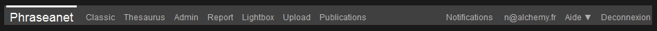
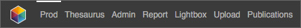
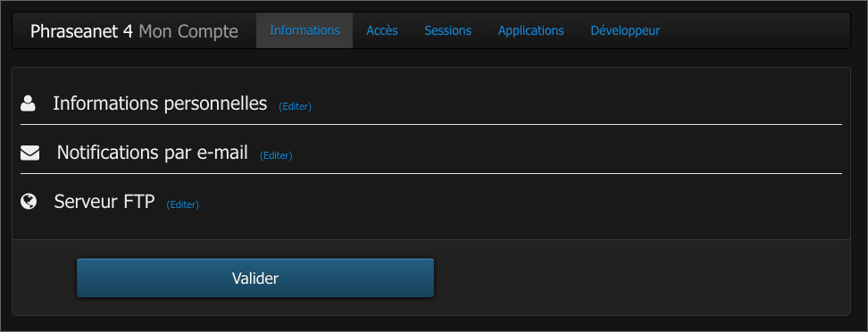
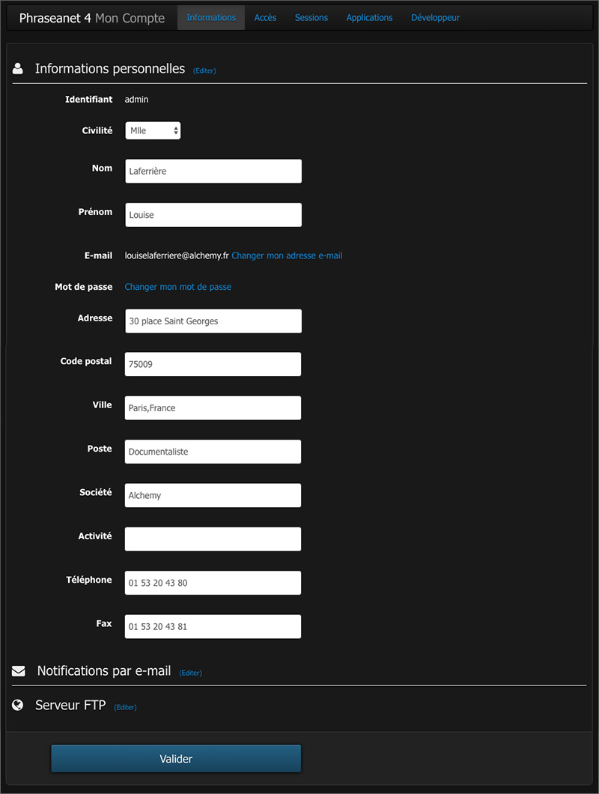
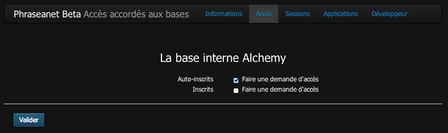
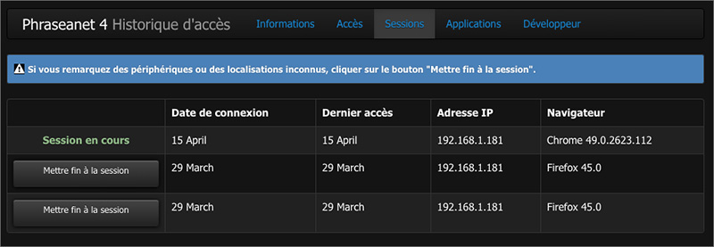
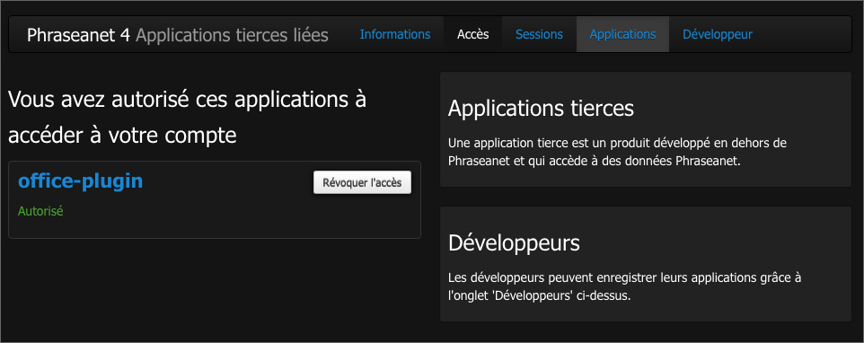

Le menu Phraseanet
==================
.. toctree::
    :maxdepth: 2

.. topic:: L'essentiel

    La barre de menu *Phraseanet* permet l'accès aux différentes interfaces de
    l'application, aux paramètres du compte utilisateur ainsi qu'à des
    informations et ressources.

Accès aux interfaces
--------------------

Les interfaces *Phraseanet* proposent en haut de leurs fenêtres une barre de
menu.

**La partie gauche de la barre de menu liste les interfaces auxquelles
l'utilisateur à accès.** Cliquer sur le nom de l'application pour la lancer dans
un nouvel onglet ou une nouvelle fenêtre du navigateur.

**Les rubriques de la barre de menu sont fonctions des droits de
l'utilisateur.**

Si l'utilisateur n'a pas accès à certaines fonctionnalités,
le lien vers l'interface l'exploitant n'apparaît pas dans la barre de menu.
Ainsi, les utilisateurs dont les droits se limitent à la consultation du fonds
ont accès à un nombre limité de rubriques.

D'autres, comme les administrateurs fonctionnels disposent d'une barre de menu
plus complète.

**La partie droite de la barre de menu** affiche les notifications,
l'identifiant du compte, l'aide en ligne avec les raccourcis clavier et le lien
de déconnexion.

.. image:: ../../images/General-menu2.jpg
    :align: center

Accès aux notifications
-----------------------

Les notifications sont des messages informatifs affichés en temps réel dans l'
interface *Production*.
Elles renseignent l'utilisateur sur des événements : nouvelles publications,
réceptions de paniers, demandes de validation, ... *etc*.

**Cliquer sur la rubrique Notifications pour les afficher**.

.. image:: ../../images/General-notifications.jpg
    :align: center

Les notifications affichées dans l'interface sont relayées par l'envoi
d'e-mail. Pour gérer les notifications reçues, accéder à
:ref:`l'onglet Informations <MenuPhraseanet-Informations>` des paramètres de
compte.

Accès aux paramètres du compte
------------------------------

Cliquer sur l'identifiant utilisateur pour accéder aux paramètres du compte.
Une nouvelle page s'ouvre et présente des formulaires et des listes groupés dans
des onglets thématiques.

.. _MenuPhraseanet-Informations:

L'onglet Informations
*********************

Il regroupe les informations personnelles. Le formulaire permet de compléter ou
de modifier :

* les informations d'identité,
* les coordonnées postales, téléphoniques ou d'e-mail,
* de paramétrer la réception de notifications par e-mail
* d'éditer un favori :term:`FTP` permettant la réception de documents sur un
  serveur supportant ce type de connexion.

.. seealso::

    :doc:`Activer la réception de documents sur un serveur FTP <../../FAQ/Parametrage/activer-ftp>`

L'onglet Accès
**************

Il liste les collections sur lesquelles l'utilisateur peut effectuer des
demandes d'accès.

Pour faire une demande d'accès à de nouvelles bases ou collections :

* Cocher la ou les cases correspondantes aux accès aux nouvelles
  Bases/Collections
* Valider la demande en cliquant sur le bouton **Valider**

Un message indique alors qu'une demande d'accès est en cours. Elle nécessite
d'être examinée par un administrateur pour validation.

L'onglet Sessions
*****************

Il liste les sessions de l'utilisateur et donne des informations relatives aux
dates de connexion et d'accès, aux adresses IP, et navigateurs utilisés.

Cliquer sur le bouton **Mettre fin à la session** pour supprimer une session
active.

L'onglet Applications
*********************

Il liste les applications tierces autorisées à se connecter à Phraseanet au
moyen du compte de l'utilisateur.

.. seealso::

  :doc:`Autoriser une application tierce à se connecter à un compte Phraseanet <../../FAQ/Utilisateurs/ajouter-application>`

L'onglet Développeur
********************

Il permet la mise en place des clés d':term:`API` pour que des applications
tierces puissent communiquer avec Phraseanet.

.. seealso::

  :doc:`Consulter la section API de la documentation Développeur <../../Devel/API/V1>`

Rubriques d'aide
----------------

Cliquer sur *Aide* pour consulter la documentation en ligne.
Cliquer sur la flèche contiguë à la rubrique d'aide donne accès à deux
sous-rubriques :

.. image:: ../../images/General-menu3.jpg
    :align: center

* La rubrique *Raccourcis* affiche un récapitulatif des raccourcis claviers
  disponibles
* La rubrique *A propos* affiche les informations de version de Phraseanet

Se déconnecter
--------------

Cliquer sur **Déconnexion** pour mettre fin à la session et quitter
*Phraseanet*.
