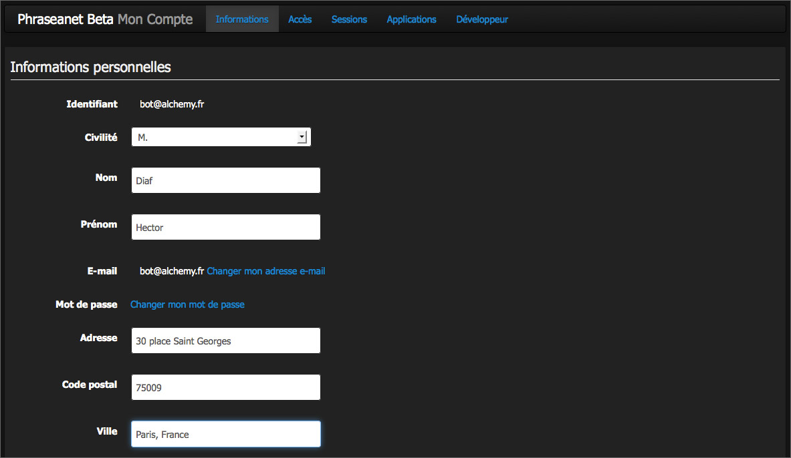

Le menu Phraseanet
------------------
.. toctree::
    :maxdepth: 2

.. topic:: L'essentiel

    La barre de menu *Phraseanet* permet d'accéder aux différentes interfaces de
    l'application, aux paramètres du compte utilisateur ainsi qu'à des
    informations et ressources.

.. image:: ../../images/MenuPhraseanet.jpg
    :align: center

Accès aux interfaces
********************

.. note::

    Lors de la connexion à *Phraseanet*, c'est la dernière application utilisée
    qui se lance par défaut.

Toutes les interfaces *Phraseanet* proposent en haut de leurs fenêtres un menu
identique au sein d'une barre de menu.

**La partie gauche de la barre de menu affiche la liste des interfaces
auxquelles l'utilisateur à accès.**

.. image:: ../../images/General-menu.jpg
    :align: center

En cliquant sur le nom d'une application, le navigateur internet lance celle-ci
dans un nouvel onglet ou une nouvelle fenêtre.

.. note::

    Une interface est manquante dans la barre de menu ? C'est une question de
    droits.
    Si l'utilisateur n'a pas accès à certaines fonctionnalités, le lien
    vers l'interface l'exploitant n'apparaît pas.

**La partie droite de la barre de menu affiche les notifications, l'identifiant
du compte, l'aide en ligne avec les raccourcis clavier et le lien de
déconnexion.**

Accès aux notifications
***********************

Les notifications sont des messages informatifs affichés en temps réel dans l'
interface *Phraseanet Production*.
Elles renseignent l'utilisateur sur les nouvelles publications disponibles, les
demandes de validation, la réception de paniers... *etc*.

Se reporter à la section
:doc:`personnaliser l'interface <PersonnaliserInterface>`.

Accès aux paramètres du compte
******************************

Cliquer sur l'identifiant utilisateur affiché.
Une nouvelle page s'ouvre et présente des formulaires et de listes groupés dans
des onglets thématiques.

Informations
^^^^^^^^^^^^

L'onglet Informations regroupes les informations personnelles. Son formulaire
permet de compléter ou de modifier les informations relatives à l'identité,
aux coordonnées postales, téléphoniques, d'email, de paramétrer la réception des
notifications *Phraseanet* adressées par email ou d'activer un compte
:term:`FTP` permettant la réception de documents sur un serveur supportant ce
type de connexion.

.. note::

    :doc:`Comment activer la réception de documents sur un serveur FTP ? <../../FAQ/Parametrage/activer-ftp>`

Accès
^^^^^

L'onglet *Accès* liste les bases et collections de l'application Phraseanet.
Il mentionne les collections auxquelles l'utilisateur connecté a accès.
L'utilisateur peut à tout moment effectuer une demande d'accès à des collections
supplémentaire qui lui sont proposées.

Pour faire une demande et accéder à de nouvelles bases ou collections de
documents et en visualiser le contenu :

* Cocher une ou plusieurs cases pour demander l'accès à de nouvelles
  Bases/ Collections
* Valider la demande en cliquant sur le bouton *Valider*

Un message indique alors qu'une demande d'accès est en cours.

.. image:: ../../images/Accesbasescoll.jpg
    :align: center

Sessions
^^^^^^^^

La section *Sessions* liste les sessions Phraseanet de l'utilisateur. Elle donne
des informations relatives aux dates de connexion et d'accès, aux adresses IP,
et navigateurs utilisés.

.. image:: ../../images/ListeSessions.jpg
    :align: center

Applications
^^^^^^^^^^^^

La section *Applications* liste les applications tierces autorisées à se
connecter au compte Phraseanet de l'utilisateur.

.. note::

  :doc:`Comment autoriser une application tierce à se connecter à mon compte Phraseanet ? <../../FAQ/Utilisateurs/ajouter-application>`

Développeur
^^^^^^^^^^^

La section *Développeur* permet la mise en place de clés d':term:`API` afin que
des applications tierces puissent communiquer avec un compte Phraseanet. Un lien
vers la documentation destinée aux développeurs est disponible dans cette
section afin de découvrir comment mettre en oeuvre l'API *Phraseanet*.

Accès à l'aide en ligne
***********************

En cliquant sur l'onglet "Aide", l'utilisateur est redirigé vers l'accueil de la
documentation en ligne.
En cliquant sur la flèche près de l'aide, deux sous-onglets apparaissent : les
*Raccourcis claviers*, et *A propos*.

.. image:: ../../images/General-menu3.jpg
    :align: center

La rubrique Raccourcis permet d'afficher un récapitulatif des raccourcis
claviers disponibles dans *Phraseanet*.

.. image:: ../../images/General-raccourcis.jpg
    :align: center

La rubrique A propos permet d'afficher les informations de version de
Phraseanet.

.. image:: ../../images/General-version.jpg
    :align: center

Se déconnecter
**************

Cliquer sur le lien *Déconnexion* pour mettre fin à la session et quitter
*Phraseanet*.
