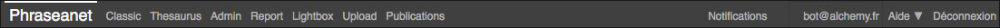

Le menu Phraseanet
------------------
.. toctree::
    :maxdepth: 2

.. topic:: L'essentiel

    La barre de menu Phraseanet permet d'accéder aux différentes interfaces de
    la solution ainsi qu'aux paramètres du compte utilisateur.

Accès aux interfaces
********************

La dernière application utilisée pour quitter se lance par défaut.
Toutes les applications proposent en haut de la fenêtre la même barre de
navigation.

**La partie gauche de la barre de menu affiche la liste les interfaces
auxquelles l'utilisateur à accès.**

.. image:: ../../images/General-menu.jpg
    :align: center

En cliquant sur le nom d'une application, le navigateur internet lance celle-ci
dans un nouvel onglet.

.. note:: Une interface est manquante dans le menu ? C'est une question de
          droits : si l'utilisateur n'a pas accès au module, le lien vers l'
          interface n'apparaît pas.

**La partie droite de la barre de menu affiche les notifications, l'identifiant
du compte, l'aide en ligne avec les raccourcis clavier et le lien de
déconnexion.**

Accès aux notifications
***********************
Les notifications sont des messages informatifs affichés en temps réel dans l'
interface *Phraseanet Production*.
Elles renseignent l'utilisateurs des demandes de validation, de réception de
paniers...*etc*.

Se reporter à la section
:doc:`personnaliser l'interface <PersonnaliserInterface>`.

Accès aux paramètres du compte
******************************

Cliquer sur l'identifiant d'utilisateur affiché pour accéder aux réglages du
compte.
Une nouvelle page s'ouvre et présente un groupe de formulaires permettant de
paramétrer le compte.

Dans la partie supérieure droite de l'écran de Production se trouvent les liens
permettants l'accès aux informations de compte utilisateur, à l'aide en ligne
ainsi que le lien de déconnexion.
Cliquer sur l'identifiant affiché pour accéder aux informations du compte.

.. image:: ../../images/Moncompte.jpg
    :align: center

Informations
^^^^^^^^^^^^

La section Informations est consacrée aux données personnelles. Elle permet de
saisir ou de modifier les informations relatives à l'identité, aux coordonnées
postales, téléphoniques, d'email, de paramétrer la réception des notifications
Phraseanet adressées par mail ou d'activer un compte :term:`FTP` permettant la
réception de documents sur un serveur supportant ce type de connexion.

.. note:: Comment activer la réception de documents sur un serveur FTP ?

Accès
^^^^^

La section *Accès* liste les bases et collections de l'application Phraseanet.
Elle mentionne les collections auxquelles l'utilisateur connecté a accès.
L'utilisateur peut à tout moment effectuer une demande d'accès à une collection
à laquelle il n'a pas accés.

Pour faire une demande et accéder à de nouvelles bases ou collections de
documents et en visualiser le contenu :

* Cocher une ou plusieurs cases pour demander l'accès à de nouvelles
  Bases/ Collections
* Valider la demande en cliquant sur le bouton *Valider*

Un message indique alors qu'une demande d'accès est en cours.

Sessions
^^^^^^^^

La section *Sessions* liste les sessions Phraseanet de l'utilisateur. Elle donne
des informations relatives aux dates de connexion et d'accès, aux adresses ip,
navigateurs et résolutions d'écran détectées.

Applications
^^^^^^^^^^^^
La section *Applications* liste les applications tierces autorisées à se
connecter au compte Phraseanet de l'utilisateur.

.. note::

  Comment autoriser une application tierce à se connecter à mon compte
  Phraseanet ?

Développeur
^^^^^^^^^^^
La section *Développeur* permet la mise en place de clés d':term:`API` afin que
des applications tierces puissent communiquer avec un compte Phraseanet. Un lien
vers la documentation destinée aux développeurs est disponible dans cette
section afin de découvrir comment mettre en oeuvre l'API *Phraseanet*.

Accès à l'aide en ligne
***********************
En cliquant sur l'onglet "Aide", l'utilisateur est redirigé vers l'accueil de la
documentation en ligne.
En cliquant sur la flèche près de l'aide, deux sous-onglets apparaissent : les
*Raccourcis claviers*, et *A propos*.

.. image:: ../../images/General-menu3.jpg
    :align: center

Voici un exemple de quelques raccourcis claviers utiles dans *Phraseanet*.

.. image:: ../../images/General-raccourcis.jpg
    :align: center

Se déconnecter
**************
Cliquer sur le lien *Déconnexion* pour quitter *Phraseanet*.
