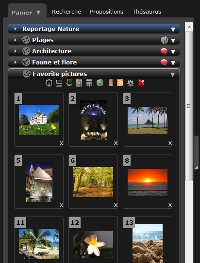
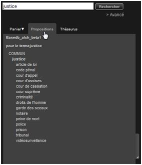
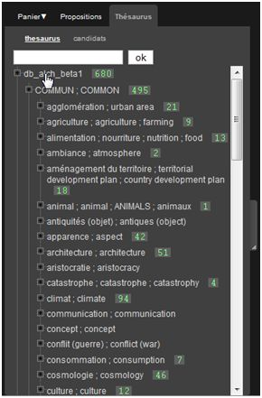
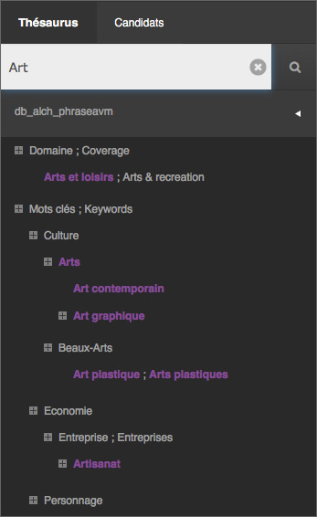
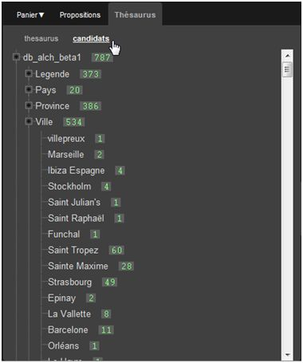
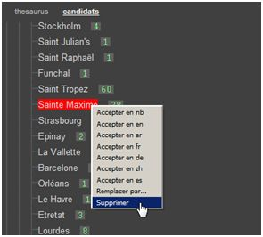

La Zone de Travail
==================
.. toctree::
    :maxdepth: 1
    :hidden:

.. topic:: L'essentiel

    Dans l'interface, cette zone de travail rétractable est présente sur le côté
    gauche de la fenêtre de *Phraseanet Production*. Elle propose :

    * Un espace de travail pour mettre de côté des sélections d'images et autres
      documents : ce sont les :doc:`Paniers et Reportages <PaniersReportages>`

    Si (et seulement si) un thésaurus Phraseanet est déployé,

    * une aide à la recherche avec des `Propositions`_
    * Le `thésaurus`_ mis en oeuvre

Les Paniers et les Reportages
-----------------------------

La Zone de travail présente par défaut les :doc:`Paniers et les Reportages
<PaniersReportages>` :

Les paniers et les reportages sont abordés dans un chapitre spécifique.
:doc:`Se reporter à la section consacrée aux Paniers et Reportages
<PaniersReportages>`.

Propositions
------------

Si un thésaurus est déployé, cet onglet peut afficher des propositions en
rapport avec la recherche de l'utilisateur et des termes de référence contenus
dans le thésaurus.
En remontant des termes issus du Thésaurus, les propositions suggèrent à l'
utilisateur des termes permettant de préciser davantage sa recherche ou au
contraire d'étendre sa recherche à un champ cognitif plus large.

Chacune des propositions affichées est cliquable et permet de lancer une
nouvelle recherche *thésaurus*.

.. note::

    La pertinence des propositions faites dans cet onglet sont
    dépendantes de la construction du thésaurus déployé.

Thésaurus
---------

Onglet Thésaurus
****************

L'onglet Thésaurus présente le ou les thesauri déployés sous forme d'un *arbre*
dont les noeuds et termes sont cliquables.

* Cliquer sur les branches du thésaurus pour le déployer.
* Double cliquer sur un terme pour lancer la recherche.

**Une recherche dans les termes du thésaurus est possible** au moyen d'un
formulaire.
Inscrire au minimum les trois premiers caractères d’un terme pour déclencher le
dispositif d'auto-complétion. L’affichage se met à jour et en double-cliquant
sur un terme l’application lance une requête thésaurus sur les bases et
collections ouvertes.

Onglet Candidats
****************

**Visible par les utilisateurs disposant des droits d'administration du
thésaurus**, cette rubrique affiche une liste de termes candidats issus de
l'indexation documentaire des médias.
Cette liste est alimentée en continu :

* D'une part par la récupération de métadonnées issues de l'indexation  de
  nouveaux documents par le moteur *Phrasea engine*.
* D'autre part, par l'édition des notices de documents dans le cas ou des termes
  utilisés pour décrire les médias ne seraient pas présents dans les champs
  documentaires liées à des branches de thésaurus.

Cliquer sur l'onglet *Thésaurus* de la zone de travail puis sur la rubrique
**Candidats**.
Les champs documentaires liés à des branches de thésaurus sont présentés et le
symbole **+** permet de déployer la liste des termes candidats.

Les termes candidats s’affichent :

Des recherches sur les termes candidats peuvent être lancées au moyen d'un
double-clic. La recherche effectuée est alors sur une interrogation par champ.

L'onglet *Candidat* permet une administration ponctuelle du Thésaurus. C'est une
option intéressante s'il y a peu de termes candidats à examiner.

**Pour ajouter un terme candidat** au Thésaurus :

* Effectuer un clic droit (ou cliquer en maintenant les touches "ctrl" enfoncée)
  sur un terme pour afficher le menu contextuel du terme.
* Cliquer sur Accepter en xx (xx étant la langue du terme)

**Pour supprimer des termes** de la liste des termes candidats du Thésaurus :

* Cliquer sur Supprimer pour supprimer le terme des candidats.

