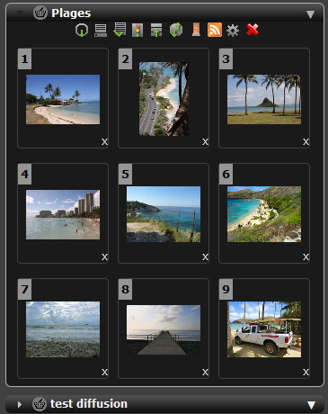
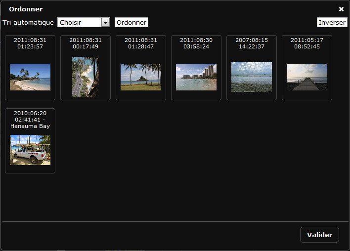

Paniers et Reportages
=====================
.. toctree::
   :maxdepth: 3

.. note:: Les Paniers et les Reportages sont regroupés dans le même onglet. Ils 
          sont différenciés par la *couleur bleue* de la barre de titre des reportages. 
          Les reportages sont placés dans cet onglet quand l'utilisateur a besoin 
          de travailler sur son contenu et peuvent être retirés de l'onglet. 

Onglet Paniers
--------------

.. topic:: L'essentiel

    Un :term:`Panier <Panier>` sert à mettre de côté des documents pour travailler. 
    Un panier n’est pas "cherchable". 
    Survoler la barre de titre d’un panier affiche son contenu (Titre, description, 
    date, contenu...)
    
    Les icônes affichées dans la barre de titre donnent les informations 
    suivantes :

    * Symbole Ampoule : Panier publié sur la page d'accueil
    * Infobulle Rouge : Panier faisant l'objet d'une demande de validation
    * Symbole RSS     : Panier publié
    * Symbole Push	  : Indique qu'un Panier a été reçu

    .. todo:: liste des symboles affichés dans les titres de panier
    
    * -> Cliquer sur la barre de titre pour ouvrir ou fermer un panier. 

    Chaque panier dispose d'un menu contextuel permettant d'accéder à certaines 
    actions.
    
    Les nouveaux paniers reçus sont d’une couleur différente "dorée" tant qu’ils 
    n’ont pas été ouverts.
    Les paniers disposent d'une palette d'outils intégrée, visible ci-dessous, 
    avec l'ouverture du panier dénommé "Plages".

Nouveau Panier
**************
  .. image:: ../../images/Paniers-Creation.jpg
	   :alt: alternate text
	   :align: center 

  * -> Cliquer sur le Menu contextuel de l'onglet
  * -> Cliquer sur Nouveau

  * => une fenêtre s'ouvre
  
  .. image:: ../../images/Affichage-Panier.jpg
	   :alt: alternate text
	   :align: center 

  * -> Cocher la case "Panier".
  * -> Cocher le cas échéant la case "Ajouter ma sélection courante" pour
    ajouter des documents préalablement sélectionnés dans les résultats.
  * -> Saisir le nom du nouveau panier et si besoin une description.
  * -> Cliquer sur le bouton Valider.

  * => Le nouveau panier est créé et s'affiche dans la liste. 

Ajouter des documents à un panier
*********************************

A partir des résultats
^^^^^^^^^^^^^^^^^^^^^^

  * -> Pour mettre un ou plusieurs documents dans un Panier: 
    faire un glisser-déposer d'une ou plusieurs vignettes, soit en 
    survolant le nom d’un Panier; son titre change de couleur et devient 
    rouge, ou en déposant la sélection dans le panier ouvert. 

.. note:: Les documents ajoutés sont affichés en dernier dans le panier.

A partir de la vue détaillée
^^^^^^^^^^^^^^^^^^^^^^^^^^^^

  * -> Sélectionner un panier en cliquant sur son titre
  * -> Lancer la vue détaillée sur une sélection de documents
  * -> Cliquer sur le picto "Panier" 
  * -> Le document est ajouté au panier actif 

.. note:: Le panier actif est soit le panier ouvert soit le dernier panier sur
          lequel une action a eu lieu (filet autour de la barre du titre).

Sélectionner des documents dans les paniers
*******************************************

Pour sélectionner des documents, se reporter à la section présente 
dans :doc:`Affichage <Afficher>`.

Afficher le contenu d'un panier dans la vue détaillée
*****************************************************
  
  * -> Faire un double clic sur une vignette

  * => La fenêtre de la vue détaillée s'ouvre.

Déplacer et dupliquer des documents entre des paniers
*****************************************************

Pour déplacer un ou plusieurs documents d'un panier vers un autre panier:

* -> Sélectionner les documents à déplacer.
* -> Glisser et déposer les documents sur la barre de titre de panier de 
  destination.

Pour dupliquer un ou plusieurs document d'un panier vers un autre panier:

* -> Maintenir enfoncée la touche "ctrl" depuis un PC ou la touche "cmd" depuis
  un Macintosh.
* -> Sélectionner les documents à déplacer.
* -> Glisser et déposer les documents sur la barre de titre de panier de 
  destination.

Retirer un document d'un panier
*******************************

Pour retirer un document d'un panier:

* -> Cliquer sur la "croix" qui se trouve sous les vignettes

.. image:: ../../images/Prod-Bonglet-panierretirerdoc.jpg
	   :height: 128 px
	   :width: 225 px
	   :alt: alternate text
	   :align: center 

Actions sur les paniers ou leur contenu
***************************************

Les actions sur les paniers fonctionnent de la même manière que les actions sur 
les documents depuis la fenêtre des résultats. 

Se reporter à la section :doc:`Palette des Actions <Actions>`.

Le menu contextuel des paniers
******************************

* -> Cliquer sur la flèche du menu contextuel d'un panier
* -> Sélectionner une action

Renommer un panier
^^^^^^^^^^^^^^^^^^

* -> Cliquer sur Renommer
* => La fenêtre s'ouvre 

* -> Donner un nouveau nom et si nécessaire une nouvelle description
* -> Cliquer sur Valider 

Réordonner un panier
^^^^^^^^^^^^^^^^^^^^

* -> Cliquer sur Ordonner
* => la fenêtre s'ouvre

* -> Utiliser le menu de tri
* -> **ou** Inverser l'ordre
* -> **ou** Sélectionner des documents et les glisser déplacer entre d'autres
  documents 
* -> Valider 

Supprimer un panier
^^^^^^^^^^^^^^^^^^^
* -> Cliquer sur Supprimer

* -> Une fenêtre s'ouvre pour confirmer la suppression définitive
  du panier

Onglet Reportages
-----------------

.. topic:: L'essentiel

    Un reportage est composé de documents provenant de la même base de données. 
    Le reportage est un enregistrement dans une collection (une fiche 
    descriptive, un document, une image de choix et une vignette) qui inclut 
    d’autres enregistrements, il peut donc être recherché.
    Un reportage appartient à une des collections de la base et dispose de sa 
    propre fiche documentaire.
    Il est possible de décrire un reportage dès sa création ou *a posteriori* en 
    s’appuyant sur le contenu documentaire des enregistrements ajoutés et aussi 
    fusionner les contenus documentaires. 

.. note:: La plupart des fonctions disponibles sur les paniers sont aussi 
          disponibles sur les Reportages, seules les fonctions propres aux 
          reportages sont documentées.

Nouveau Reportage
*****************

* -> Cliquer sur le menu contextuel de l'onglet Paniers
* -> Cliquer sur Nouveau

* => une fenêtre s'ouvre

* -> Cocher la case Reportage
* -> Choisir une collection
* -> Donner un nom et une description au Reportage
* -> Cliquer sur Valider

* => Le Reportage est créé 
* => Le Reportage est affiché "ouvert" dans l'onglet 

Ajouter des documents à une Reportage
*************************************

* -> Sélectionner des documents depuis les résultats ou depuis un panier
* -> Glisser Déposer les documents sur la barre de titre du Reportage ou
  directement dans le Reportage si celui-ci est ouvert.

Attacher et détacher un reportage de l'onglet
*********************************************

Les reportages sont placés dans l'onglet afin de faciliter le travail de
l'utilisateur.

Il n'y a pas d'intérêt à conserver un Reportage "terminé" dans l'onglet.

Pour attacher un Reportage

* -> faire une Recherche en mode Reportage 
* -> Glisser et déposer le reportage depuis la grille des résultats dans l'onglet 
  des Paniers

* => le reportage s'affiche

Pour détacher un Reportage

* -> Cliquer sur le menu contextuel du Reportage 
* -> Cliquer sur détacher

* => Le reportage est détaché (il n'apparaît plus dans l'onglet)

