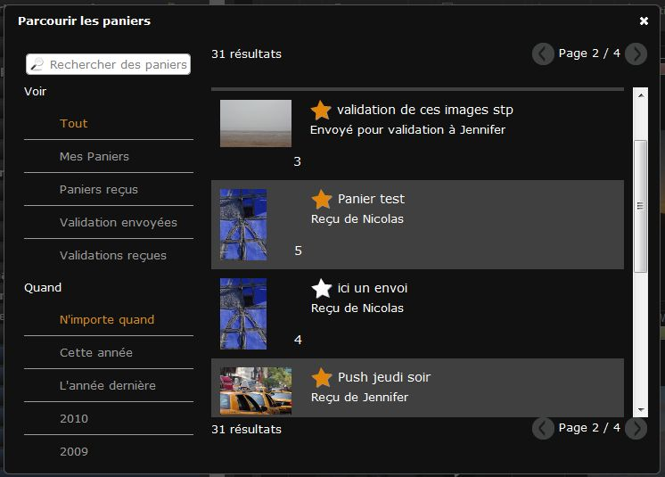
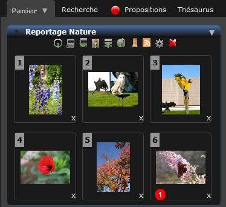

Paniers et Reportages
=====================
.. toctree::
    :maxdepth: 3

Les Paniers et les Reportages se trouvent dans
:doc:`la zone de travail <Onglets>` sur le même onglet.
Dans l'interface, ils sont différenciés par leurs couleurs :

    * *Gris* pour les paniers
    * *Doré* pour les paniers reçus tant qu’ils n’ont pas été ouverts
    * *Bleu* pour les reportages

Les paniers
-----------

.. topic:: L'essentiel

    Un :term:`Panier <Panier>` sert à mettre de côté des sélections de documents
    pour travailler.
    Un panier n’est pas "cherchable" et appartient à l'utilisateur qui l'a créé.
    Survoler la barre de titre d’un panier affiche son contenu dans une fenêtre
    modale (titre, description, date, contenu...)

    Des icônes affichées dans la barre de titre donnent des informations
    complémentaires sur les paniers

    .. todo :: Mettre les icônes explicatives

    * Infobulle Bleue : Réception d'une demande de validation
    * Infobulle Rouge : Demande de validation effectuée par l'utilisateur
    * Symbole Push	  : Indique qu'un Panier a été reçu

    Pour ouvrir ou fermer un panier, cliquer sur la barre de titre.

    Chaque panier dispose d'un :ref: `menu contextuel
    <Le menu contextuel des paniers>` permettant d'effectuer des actions :

    * *Exporter* pour télécharger le contenu du panier
    * *Lightbox* pour afficher le contenu du panier dans
      :doc:`l'interface Phraseanet Lightbox <Lightbox>`
    * Renommer pour donner un autre nom au panier
    * Archiver pour détacher le panier de la zone de travail
    * Supprimer pour supprimer le panier, sans toucher au contenu
    * Ordonner, pour altérer l'ordre d'affichage des documents dans un panier

    Les paniers (et les reportages) disposent d'une palette d'outils qui
    complète les actions proposées par le menu contextuel

.. figure:: ../../images/Prod-Bonglet-DetailPanier.jpg
    :align: center

Comment créer un nouveau Panier ?
*********************************
Il n'existe pas de panier de session par défaut. L'utilisateur doit le créer.
* Cliquer sur le Menu contextuel de l'onglet
* Cliquer sur **Nouveau**

  .. image:: ../../images/Paniers-Creation.jpg
    :align: center

* Une fenêtre s'ouvre

  .. image:: ../../images/Affichage-Panier.jpg
	   :alt: alternate text
	   :align: center

* Saisir le nom du nouveau panier et si besoin une description.
* Cocher la case **Ajouter ma sélection courante** pour ajouter des documents
  préalablement sélectionnés dans les Résultats.
* Cliquer sur le bouton **Créer**.

Le nouveau panier est créé et s'affiche dans la liste.

Ajouter des documents à un panier
*********************************

A partir des résultats
^^^^^^^^^^^^^^^^^^^^^^
  * -> Pour mettre un ou plusieurs documents dans un panier existant :
    faire un glisser-déposer d'une ou plusieurs vignettes, soit en
    survolant le nom d’un panier, soit en déposant la sélection dans le
    panier ouvert.

.. note:: Les documents ajoutés sont affichés en dernier dans le panier. Ils
  peuvent être ré ordonnés si besoin.

A partir de la vue détaillée
^^^^^^^^^^^^^^^^^^^^^^^^^^^^
  * -> Sélectionner un panier en cliquant sur son titre. Ce panier devient le
    panier actif
  * -> Lancer la vue détaillée sur une sélection de documents
  * -> Cliquer sur l'icône "Panier" pour ajouter le document au panier actif

.. note:: le panier actif correspond à un panier ouvert.

Sélectionner des documents dans les paniers
*******************************************

La sélection de documents dans un panier s'effectue de la même façon que dans la
zone d'affichage. Se reporter à la section présente relative aux sélections dans
la page consacrée à l' :doc:`affichage <Afficher>`.

Comment afficher le contenu d'un panier dans la vue détaillée ?
***************************************************************

  * -> Faire un double clic sur une vignette du panier

  * => La fenêtre de vue détaillée s'ouvre et présente le contenu du panier

Comment déplacer ou dupliquer des documents entre des paniers ?
***************************************************************

**Pour déplacer un ou plusieurs documents d'un panier vers un autre panier** :

* Sélectionner les documents à déplacer
* Glisser et déposer les documents sur la barre de titre du panier de
  destination

**Pour dupliquer un ou plusieurs documents d'un panier vers un autre panier** :

* Maintenir enfoncée la touche "ctrl" depuis un PC Windows ou la touche "cmd"
  depuis un Macintosh
* Sélectionner les documents à déplacer
* Glisser et déposer les documents sur la barre de titre du panier de
  destination

Comment supprimer un document d'un panier ?
*******************************************

Pour retirer un document d'un panier :

* -> Cliquer sur la "croix" qui se trouve sous les vignettes

.. image:: ../../images/Prod-Bonglet-panierretirerdoc.jpg
    :align: center

Actions sur les paniers ou leur contenu
***************************************

Les actions sur les paniers fonctionnent de la même manière que les actions sur
les documents depuis la fenêtre des résultats.

.. image:: ../../images/Prod-Bonglet-actionsPanier.jpg
    :align: center

Se reporter à la section consacrée à la :doc:`palette des Actions <Actions>`.

Le menu contextuel des paniers
******************************

* -> Cliquer sur la flèche du menu contextuel d'un panier
* -> Sélectionner une action

Renommer un panier
^^^^^^^^^^^^^^^^^^

* -> Cliquer sur *Renommer*
* -> Dans la fenêtre, indiquer le nouveau nom et si nécessaire une nouvelle
  description
* -> Cliquer sur Valider

Réordonner un panier
^^^^^^^^^^^^^^^^^^^^

* -> Cliquer sur Ordonner

.. image:: ../../images/Prod-Bonglet-ordonnersPanier.jpg
    :align: center

* -> Utiliser le menu de tri
* -> **ou** Inverser l'ordre
* -> **ou** Sélectionner des documents et les glisser déplacer entre d'autres
  documents
* -> Cliquer sur Valider

Supprimer un panier
^^^^^^^^^^^^^^^^^^^

* -> Cliquer sur **Supprimer**
* -> Une fenêtre s'ouvre pour demander la confirmation de la suppression
  définitive du panier

L'archivage des Paniers
***********************

Archiver un Panier
^^^^^^^^^^^^^^^^^^
Suite à la création de nombreux paniers, il est possible que la zone de travail
soit encombrée de paniers qu'il serait souhaitable de conserver pour une
raison ou pour une autre. **L'archivage de paniers** répond à cette demande.

**Pour archiver un panier**, ouvrir le menu contextuel du panier et cliquer sur
**Archiver** :

.. image:: ../../images/ArchivagePanier1.jpg
    :align: center

Celui-ci disparaît de la zone de travail latérale.

Il peut être ainsi conservé pour un usage futur, sans encombrer la zone de
travail.

Retrouver un Panier archivé
^^^^^^^^^^^^^^^^^^^^^^^^^^^
**Pour retrouver un panier archivé**, consulter l'historique des Paniers.
Cliquer sur la flèche présente dans la barre de titre des Paniers et cliquer la
sur rubrique *Parcourir les Paniers* :

.. image:: ../../images/Paniers-Parcourir.jpg
    :align: center

Une fenêtre s’ouvre:

Une zone de recherche est présente dans cette fenêtre. Elle permet de rechercher
des paniers par leurs titres.
Les critères suivants peuvent également être utilisés :

*Voir* : Tout, mes paniers, les paniers reçus, les validations envoyées, les
validations reçues.

*Quand* : Toute la période, cette année, l’année dernière, classement par année

L’autre partie de la fenêtre affiche la liste des paniers : pour chacun, les
informations suivantes sont affichées :  nombre d’images, une image de
représentation, un titre,...

En cliquant sur le titre du panier, les vignettes apparaissent:

.. image:: ../../images/Paniers-Parcourir2.jpg
    :align: center

Comment archiver ou désarchiver un panier ?
^^^^^^^^^^^^^^^^^^^^^^^^^^^^^^^^^^^^^^^^^^^
**Pour archiver ou désarchiver un panier** depuis l'historique des paniers,
utiliser l'icône étoile affichée à proximité du titre du panier.

  * Une étoile jaune signifie que le panier est affiché dans la zone de travail

  * Une étoile blanche indique un panier archivé

Cliquer sur les icônes étoiles pour faire varier l'état d'archivage des paniers.
Les modifications sont visibles en temps réel dans la zone de travail.

Les reportages
--------------

.. topic:: L'essentiel

    Un reportage est composé de documents d'une même base.
    Le reportage est un enregistrement dans une collection (une fiche
    descriptive, un document, une image de choix et une vignette) qui inclut
    d’autres enregistrements. A la différence d'un panier, **un reportage peut
    être recherché**.
    Un reportage appartient à une des collections de la base et dispose de sa
    propre notice documentaire.
    Il est possible de décrire un reportage dès sa création ou *a posteriori* en
    s’appuyant sur le contenu documentaire des enregistrements ajoutés ou la
    fusion des contenus documentaires.

.. note:: La plupart des fonctions disponibles sur les *Paniers* sont aussi
          disponibles sur les Reportages. Seules les fonctions propres aux
          reportages sont documentées.

    La plupart des fonctions disponibles sur les Paniers sont aussi
    disponibles sur les Reportages, seules les fonctions propres aux
    reportages sont documentées.

Comment créer un nouveau reportage ?
************************************

  * Cliquer sur le menu contextuel de l'onglet *Paniers*
  * Cliquer sur **Nouveau reportage**

  * => une fenêtre s'ouvre

  .. image:: ../../images/Reportage-creer.jpg
	   :alt: alternate text
	   :align: center

  * Choisir une collection de publication dans la liste des collections
    disponibles
  * Indiquer un nom au Reportage
  * Une option permet d'inclure éventuellement la sélection active comme contenu
    de reportage
  * Cliquer sur **Valider**

  * Le Reportage est créé. Il est affiché "ouvert" dans l'onglet des Paniers et
    reportages.

Comment ajouter des documents à un reportage ?
**********************************************

* Sélectionner des documents depuis les résultats ou depuis un panier
* Glisser Déposer les documents sur la barre de titre du Reportage ou
  directement dans le Reportage si celui-ci est ouvert.

La bulle rouge indique le nombre de documents placés dans le reportage. Une
notification est également affichée en haut à droite de l'écran.

Comment archiver ou désarchiver un reportage de l'onglet ?
**********************************************************

Les reportages sont placés dans l'onglet afin de faciliter le travail de
l'utilisateur.

Pour attacher un Reportage
^^^^^^^^^^^^^^^^^^^^^^^^^^
* -> Faire une recherche en mode Reportage et sélectionner le ou les reportages
  à attacher à la zone de travail.
* -> Glisser et déposer le ou les reportages depuis la zone d'affichage des
  résultats vers la zone de travail.

* => Le ou les reportages s'affichent.

Pour détacher un Reportage
^^^^^^^^^^^^^^^^^^^^^^^^^^
Il n'y a pas d'intérêt à conserver un Reportage "terminé" dans l'onglet. Afin de
ne pas encombrer la zone de travail, les reportages peuvent être détachés.
Pour se faire :

* Cliquer sur le menu contextuel du Reportage
* Cliquer sur **Détacher**

Le reportage est détaché et n'apparaît plus dans l'onglet Paniers et reportages
de la zone de travail.

Comment rattacher un Reportage à la zone de travail ?
^^^^^^^^^^^^^^^^^^^^^^^^^^^^^^^^^^^^^^^^^^^^^^^^^^^^^
Le plus simple est de rechercher le reportage, de le sélectionner puis de le
glisser dans la zone de travail afin d'éditer son contenu.
