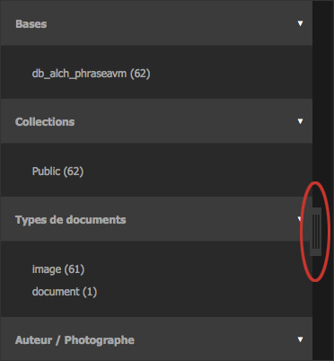
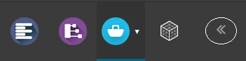
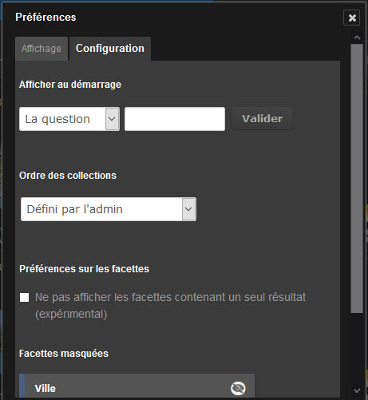

Personnaliser Production
========================

.. topic:: L'essentiel

    L'interface Production peut être adaptée par l'utilisateur selon ses
    besoins.

Ajuster la zone de travail
--------------------------

Redimensionner la zone de travail
*********************************

* Cliquer sur l’onglet séparant la zone de travail de celle des résultats.
* Déplacer le curseur vers la gauche ou la droite pour agir sur la taille des
  zones d'affichage.

Masquer ou afficher la zone de travail
**************************************

La zone de travail est rétractable :

* Cliquer sur l'icône présente sur le côté droit de la zone de travail pour la
  réduire et maximiser la surface dédiée à la zone d'affichage.
* Lorsque réduite, cliquer sur une partie du bandeau de la zone de travail pour
  la déployer.

Préférences d'affichage
-----------------------

Préférences d'affichage des résultats
*************************************

Cliquer sur le bouton **Préférences** à droite de la barre d'action.

Une fenêtre en surimpression rassemble des paramètres d'affichage et de
configuration.

L'onglet **Affichage** permet d'intervenir sur :

* La mémorisation de la dernière question posée au lancement de *Production*
* La langue d'interface
* Le mode d'affichage des résultats, en vignettes ou en liste
* Le jeu de couleurs de l'interface (thème sombre par défaut)
* Les informations affichées au survol des vignettes en cochant le mode
  *Iconographe* ou *Graphiste*
* L'affichage des informations techniques des documents dans la zone d'affichage
  ou dans la vue détaillée
* L'affichage d'icônes indicatives du type des documents
* Le nombre de résultats affichés par page
* La taille d'affichage des vignettes
* La couleur de sélection des enregistrement dans les interfaces

L'onglet **Configuration** permet de paramétrer :

* L'affichage de documents (avec ou sans recherche par défaut) ou de
  publications au lancement de *Production*
* L'ordre d'affichage des collections dans la recherche avancée
* De masquer les facettes correspondantes à un seul résultat

.. image:: ../../images/Affichage-Preferences2.jpg
    :align: center

Cliquer sur la croix pour quitter la fenêtre Préférences. Les changements
effectués sont prises en compte lors du rafraîchissement de l'affichage.

Préférences de tri et d'affichage des paniers et reportages
***********************************************************

Pour accéder aux préférences de tri et d'affichage des paniers et reportages,
cliquer sur le menu contextuel des paniers.

.. image:: ../../images/General-prefpaniers.jpg
   :align: center

Le menu permet deux rubriques permettant d'altérer l'affichage par :

* Ordre alphabétique
* Date de création

Cliquer sur la rubrique **Préférences** du menu contextuel des paniers pour
modifier d'autres paramètres d'affichage.

.. image:: ../../images/General-Prefpaniers2.jpg
   :align: center

Des cases à cocher permettent d'agir les informations affichées dans les paniers
et reportages. Cocher ou décocher les cases pour afficher ou masquer :

* Les :term:`status <Status>`
* Les notices
* Les titres des documents

Cliquer sur la croix pour quitter la fenêtre *Préférences*.

Réglage des notifications
-------------------------

Les notifications sont complétées d'e-mails reçus à l'adresse de l'utilisateur.

.. seealso::

    Se reporter à :ref:`l'onglet Informations <MenuPhraseanet-Informations>`
    des paramètres de compte pour agir sur la réception des notifications.
