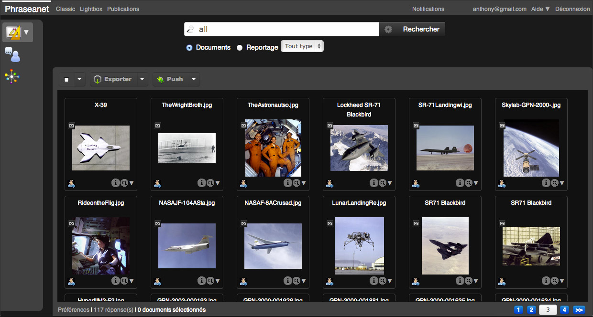
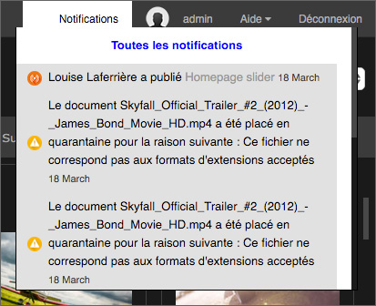
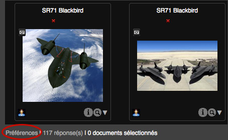
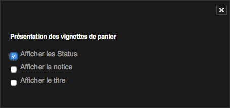

Personnaliser l'interface
=========================

Ajuster les dimensions des zones d'affichage
********************************************

Des poignées permettent d'ajuster les dimensions des zones d'affichage dans les
interfaces de *Phraseanet Production*.
Le principe est de sélectionner puis de déplacer les poignées pour ajuster la
taille des zones.

Re-dimensionner la zone de travail
----------------------------------

Cliquer sur l’onglet séparant la zone de travail de celle des résultats.

.. image:: ../../images/Onglet-Taille.jpg
    :align: center

Déplacer le curseur vers la gauche ou la droite pour changer la taille des zones
d’affichage.

Relâcher le curseur dès que le nombre souhaité de vignettes par ligne dans la
zone de travail est atteint. Ensuite, l'application ajuste seule l'espace pour
optimiser l'affichage.

Masquer ou afficher la zone de travail
**************************************

La zone de travail est rétractable :

.. image:: ../../images/Onglets-Retractable1.jpg
    :align: center

Cliquer sur l'icône présente sur le côté droit pour réduire la zone de
travail et maximiser la surface dédiée à l'affichage et à la consultation des
résultats.

Lorsque réduite, cliquer sur n'importe quelle partie de la zone de travail pour
la faire réapparaître instantanément.

Réglage des notifications
*************************

La partie droite de la barre de menu signale les notifications. Un chiffre peut
y figurer. Il indique le nombre de notifications n'ayant pas été encore lues.

.. figure:: ../../images/General-menu2.jpg
    :align: center

Les notifications rendent compte d'événements en temps réel dans l'application.
Selon les droits de l'utilisateur, ces notifications peuvent porter sur :

* les demandes d'inscription,
* l'échec de transferts dans Bridge,
* l'échec d'export par email,
* la reception de Push ou de demande de validation,
* la réception d'une commande ou son rejet par des gestionnaires de
  collections,
* la mise en quarantaine de documents uploadés,
* la mise à disposition de nouvelles publications.

.. note::

    Les notifications sont complétées d'emails reçus à l'adresse de l'
    utilisateur.
    La réception des emails liés aux notifications est paramétrable dans la
    section **Notification par e-mail** de l'onglet *Informations* du compte
    utilisateur.

Cliquer sur la rubrique **Notifications** de la barre de menu pour afficher les
notifications les plus récentes.

Pour toutes les visualiser, cliquer sur le lien **Toutes les notifications**.
Une fenêtre en surimpression récapitule tout l'historique des notifications.

Préférences d'affichage
***********************

Préférences d'affichage des résultats
-------------------------------------

L'utilisateur peut régler ses préférences pour l'affichage des résultats.
Cliquer sur le bouton **Préférences** situé en bas de la fenêtre, en dessous de
la zone d'affichage des résultats.

Une fenêtre en surimpression rassemble des paramètres d'affichage et de
configuration.

.. image:: ../../images/Affichage-Preferences1.jpg
    :align: center

Dans l'onglet **Affichage** l'utilisateur peut :

* Changer le mode d'affichage de *Vignettes* à *Liste* (notice affichée à gauche
  des vignettes).
* Modifier le jeu de couleur de l'interface (Thème par défaut: interface noire).
* Changer les informations qui s’affichent au survol des vignettes en cochant
  la case Iconographe ou Graphiste.
* Choisir d'afficher les informations techniques des documents (affichage du
  "i"), ou cocher la case "afficher dans la notice" pour que les
  informations soient ajoutées sous la notice documentaire au survol.
* Afficher ou non les icônes de typage des documents
* Modifier le nombre de résultats par page
* Changer la taille d'affichage des vignettes
* Choisir la couleur de sélection des documents dans les interfaces.

Dans l'onglet **Configuration** l'utilisateur peut paramétrer la question posée
par défaut lors d'une connexion aux interfaces *Phraseanet Production* et
*Classic*.

Cliquer sur la croix pour quitter la fenêtre *Préférences*. Les préférences
modifiées sont prises en compte lors du prochain rafraîchissement de l'
affichage.

Préférences de tri et d'affichage des paniers et reportages
-----------------------------------------------------------

Il est possible d'agir sur des préférences de tri et d'affichage des paniers et
reportages. Pour accéder à ces options, cliquer sur le menu contextuel des
paniers.

.. figure:: ../../images/General-prefpaniers.jpg
   :align: center

Il est possible de trier paniers et reportage par ordre de alphabétique de nom
ou par date de création.

La rubrique **Préférences** permet de modifier des paramètres d'affichage.
Cliquer sur *Préférences* ; une fenêtre s'ouvre en
:term:`surimpression <Overlay>`.

Cocher ou décocher les cases pour afficher ou masquer les
:term:`status <Status>`, la description et/ou le titre des documents dans les
paniers et reportages.
Fermer en cliquant sur la croix en haut à droite ou appuyer sur la touche
"Echap" du clavier.
