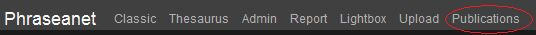
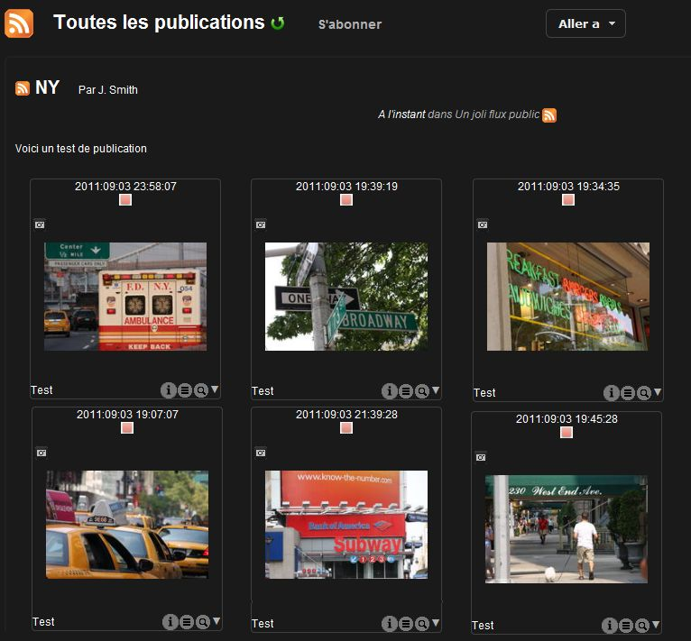

Publier et diffuser avec Phraseanet
===================================
.. toctree::
   :maxdepth: 3

.. topic:: L'essentiel

    Deux fonctionnalités de Phraseanet permettent de publier et de diffuser des
    médias issus d'un fonds : *Publication* et *Bridge*.

Publier des paniers et des reportages
-------------------------------------

Les publications Phraseanet permettent de mettre à la disposition d'utilisateurs
des :doc:`Paniers <PaniersReportages>` et des Reportages dans la page des
publications.
Ces publications sont également disponibles sous forme de flux media RSS hors de
l'application et exploitable dans des applications tierces.

* Ouvrir l'onglet des Paniers dans *Phraseanet Production*.
* Cliquer sur la barre de titre du panier souhaité pour le dérouler et faire
  apparaître son menu.
* Cliquer sur l'icône **Publier** (icône orange représentant les flux RSS).

* Cliquer sur la barre de titre du panier souhaité pour faire apparaître sa
  barre d'actions.

* Cliquer sur l'icône **Publier** (icône orange représentant les flux RSS).

Une fenêtre s'ouvre:

.. image:: ../../images/Publier-Panier2.jpg
    :align: center

Plusieurs champs peuvent être remplis:

* Le titre de la publication
* Le sous titre
* Auteur
* Email de l'auteur

Pour finir de remplir les informations:

* Choisir le fil disponible dans la liste (les fils sont créés préalablement
  dans la rubrique :doc:`Publications <AdministrationSolution>` de *Phraseanet
  Admin*).
* Cliquer enfin sur **Publier** pour valider

La publication est faite.

Elle est désormais visible dans les *Publications Phraseanet*

**L'utilisateur peut y accéder en cliquant sur le lien *Publications* dans la
barre de menu Phraseanet** :

Après avoir cliqué sur *Publications* dans la barre de menu, la publication
apparaît :

Des applications tierces, comme Phraseanet Showcase, peuvent également exploiter
les publications. Elles sont en effet disponibles sous forme de flux media RSS
hors de l'application.

Diffuser avec Bridge
--------------------

Le **Bridge Phraseanet** permet de publier ses photos et autres documents
multimédia vers des sites extérieurs, tels que :

* `FlickR`_
* `YouTube`_
* `Dailymotion`_

Pour publier des documents vers ces sites, sélectionner des documents, connecter
un compte `Flickr <http://www.flickr.com/>`_,
`YouTube <http://www.youtube.com/>`_ ou
`Dailymotion <http://www.dailymotion.com/>`_, à Phraseanet, et effectuer des
publications.

Sélection des médias
********************

* Sélectionner une ou plusieurs médias dans *Phraseanet Production*. Cela peut
  être des documents sélectionnés dans la zone d'affichage, ou regroupés dans
  des paniers ou des reportages.
* Cliquer, dans la :doc:`palette des Actions <Actions>`, sur le menu
  contextuel du bouton "Push".

Deux choix sont proposés: "Bridge" et "Publier" :

.. image:: ../../images/Bridge-1.jpg
    :align: center

* Cliquer sur **Bridge**

S'authentifier
**************

La fenêtre du **Bridge** s'ouvre:

* Cliquer sur **Nouveau** pour se connecter au compte choisi : Phraseanet
  propose de se connecter soit à son compte Flickr, Youtube ou Dailymotion...

.. image:: ../../images/Bridge-1b.jpg
    :align: center

Le site demande de s'authentifier, puis d'accorder la permission à Phraseanet de
se connecter.

Une fois connecté, Bridge récupère les informations existantes dans l'
application distante.

Dans le cas de Flickr, les photos existantes sont affichées dans l'onglet
"Photos" ou "Photosets" si les elles sont organisées en albums dans Flickr.

.. image:: ../../images/Bridge-3a.jpg
    :align: center

Publier sur Flickr
******************

Sélectionner des media dans le zone d'affichage, puis cliquer sur le bouton
**Ajouter**.

La fenêtre "Upload" de Bridge s'ouvre. Modifier les titres des images
sélectionnées, ajouter des tags et décrire vos media dans les formulaires de
description.

* Cliquer sur le bouton **Ajouter** en bas à gauche.

.. image:: ../../images/Bridge-2.jpg
    :align: center

A mesure que les images sont envoyées, il est possible de voir l'avancement du
transfert par un simple clic sur l'onglet **Fichiers envoyés**.

.. image:: ../../images/Bridge-4.jpg
    :align: center

* Le statut **OK** signale les media images ou vidéos transférés
* Une information de date indique depuis combien de temps l'envoi a été
  effectué.

Lancer *Flickr*. Les médias y sont bien présents.

.. image:: ../../images/Bridge-5.jpg
    :align: center
