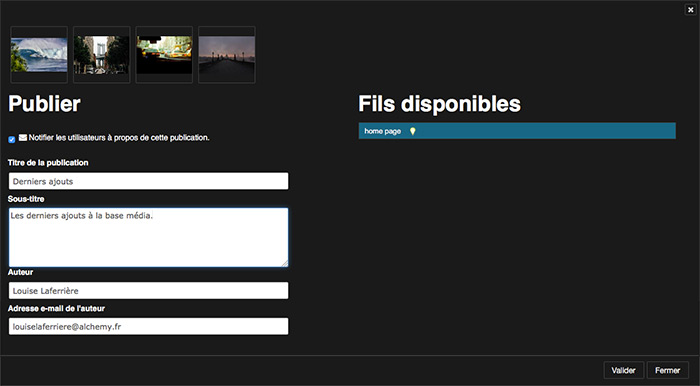

Publier et diffuser avec Phraseanet
===================================
.. toctree::
   :maxdepth: 3

.. topic:: L'essentiel

    Deux fonctionnalités de Phraseanet permettent de publier et de diffuser des
    médias issus d'un fonds : *Publication* et *Bridge*.

.. _Publier-Publications:

Publier des paniers et des reportages
-------------------------------------

Les publications Phraseanet permettent de mettre à la disposition d'utilisateurs
des :doc:`Paniers <PaniersReportages>` et des Reportages dans la page des
publications.
Ces publications sont également disponibles sous forme de flux mediaRSS
exploitables hors de *Phraseanet* dans des applications tierces.

* Sélectionner des documents ou ouvrir un panier dans *Phraseanet Production*.
* Cliquer sur l'icône **Publier** dans le menu contextuel Push de la barre
  d'action ou sur icône orange **RSS** dans le panier ouvert.

Une fenêtre s'ouvre:

Renseigner le formulaire :

* Cocher ou décocher la case à cocher pour notifier les utilisateurs à propos de
  cette publication
* Donner un titre, un sous titre,
* Le nom de l'auteur et l'adresse correspondent aux renseignements du compte
  utilisateur.

Sélectionner le fil de publication (se reporter à la rubrique
:doc:`Publications <AdministrationSolution>` de *Phraseanet Admin* pour créer
des fils) puis cliquer sur **Publier**.

La publication est visible dans la rubrique *Publications* de la barre de menu.

Les publications sont disponibles sous forme de flux mediaRSS hors de Phraseanet
Production et des des applications tierces, comme Phraseanet Showcase, peuvent
les exploiter.

.. _Publier-Bridge:

Diffuser avec Bridge
--------------------

Le **Bridge Phraseanet** permet de publier des médias vers des sites extérieurs,
tels :

* `FlickR`_
* `YouTube`_
* `Dailymotion`_

Pour publier des documents vers ces applications, sélectionner des documents,
connecter un compte `Flickr`_, `YouTube`_ ou `Dailymotion`_, à Phraseanet, puis
effectuer des publications avec **Bridge**.

Sélection des médias
********************

* Sélectionner une ou plusieurs médias dans *Phraseanet Production*. Ils peuvent
  être regroupés dans des paniers ou des reportages.
* Dans la :doc:`palette des Actions <Actions>`, développer le menu contextuel du
  bouton "Push" puis cliquer sur l'icône **Bridge**.

.. image:: ../../images/Bridge-1.jpg
    :align: center

S'authentifier
**************

La fenêtre du **Bridge** s'ouvre :

* Cliquer sur **Nouveau** pour se connecter au choix à un compte Flickr, Youtube
  ou Dailymotion selon les possibilités de partage configurées dans le
  paramétrage **Phraseanet Admin**.

.. image:: ../../images/Bridge-1b.jpg
    :align: center

S'authentifier au service, puis autoriser Phraseanet de se connecter.

**Bridge** récupère les informations existantes sur l'application distante.

Pour Flickr, les photos existantes sont affichées dans l'onglet "Photos" ou
"Photosets" si organisées en albums.

.. image:: ../../images/Bridge-3a.jpg
    :align: center

Publier sur Flickr
******************

Sélectionner des médias dans le zone d'affichage, puis cliquer sur le bouton
**Ajouter**.

La fenêtre "Upload" de Bridge s'ouvre. Modifier les titres des images
sélectionnées, ajouter des tags et décrire vos médias dans les formulaires de
description.

* Cliquer sur le bouton **Ajouter** en bas à gauche.

.. image:: ../../images/Bridge-2.jpg
    :align: center

Il est possible de suivre l'avancement du transfert par un simple clic sur
l'onglet **Fichiers envoyés**.

.. image:: ../../images/Bridge-4.jpg
    :align: center

* Le statut **OK** signale les médias images ou vidéos transférés
* Une information de date indique depuis combien de temps l'envoi a été
  effectué.

Lancer *Flickr*. Les médias transférés de Phraseanet sont bien présents.

.. image:: ../../images/Bridge-5.jpg
    :align: center

.. _Flickr: https://www.flickr.com/
.. _YouTube: http://www.youtube.com/
.. _Dailymotion: http://www.dailymotion.com/
