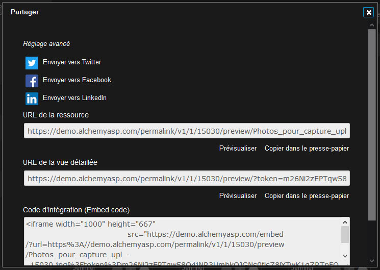

Publier et diffuser avec Phraseanet
===================================
.. toctree::
   :maxdepth: 3

.. topic:: L'essentiel

    Des fonctionnalités de Phraseanet permettent de diffuser des médias issus
    d'un fonds :

    * *Publications* permet de publier des médias dans un flux Media RSS
    * **Déprécié**, *Bridge* permet de publier sur les réseaux sociaux Flikr,
      YouTube ou Dailymotion

    Ces fonctionnalités sont liées au droit utilisateur **Publication**.

    La fonctionnalité **Partager** permet la diffusion de médias sur les
    réseaux sociaux Facebook et Twitter et révèle les URLs des permaliens des
    médias archivés dans Phraseanet.

    **Partager** s'active dans le paramétrage de l'instance.

.. _Publier-Publications:

Publier des médias
------------------

**Les publications** mettent à la disposition d'utilisateurs des documents ou
des reportages dans la page des publications. Ces publications sont aussi
disponibles et exploitables hors de Phraseanet dans des applications tierces
exploitant les flux Media RSS.

**Pour publier des médias** :

* Sélectionner des enregistrements dans la zone d'affichage puis cliquer sur
  la rubrique publier du menu contextuel du bouton Push dans la palette des
  actions.

**Ou bien**,

* Cliquer sur l'icône Publier dans le panier ou le reportage ouvert dans la
  zone de travail.

.. image:: ../../images/Publier-Panier2.jpg
    :align: center

Renseigner le formulaire :

* Cocher ou décocher la case à cocher pour notifier les utilisateurs à propos de
  cette publication
* Donner un titre, un sous titre,
* Les noms d'auteur et adresses correspondent aux renseignements du compte
  utilisateur
* Sélectionner le fil de publication

.. seealso::

    Se reporter à la rubrique Publications de Phraseanet Admin pour :ref:`créer
    des flux<Creer-un-flux-de-publication>`.

* Cliquer sur Publier

La publication est visible dans la rubrique Publications de la barre de menu
et est disponible sous forme de flux hors de l'application.

.. _Publier-Bridge:

Diffuser avec Bridge - **Déprécié**
-----------------------------------

Le Bridge (Pont en anglais) permet de publier des médias vers des sites
extérieurs, tels :

* FlickR
* YouTube
* Dailymotion

Pour publier des documents vers ces applications, sélectionner des documents,
connecter un compte `Flickr`_, `YouTube`_ ou `Dailymotion`_, à Phraseanet, puis
effectuer des publications avec **Bridge**.

Sélection des médias
********************

* Sélectionner une ou plusieurs médias dans Phraseanet Production. Ils peuvent
  être regroupés dans des paniers ou des reportages.
* Dans l'une des palette des Actions, développer le menu contextuel du bouton
  **Push** puis cliquer sur la rubrique **Bridge**.

* Sélectionner une ou plusieurs médias dans *Phraseanet Production*. Ils peuvent
  être regroupés dans des paniers ou des reportages.
* Dans la :doc:`palette des Actions <Actions>`, développer le menu contextuel du
  bouton "Push" puis cliquer sur l'icône **Bridge**.

.. image:: ../../images/Bridge-1.jpg
    :align: center

S'authentifier
**************

Dans la fenêtre **Bridge** :

* Cliquer sur **Nouveau** pour se connecter au choix à un compte Flickr, Youtube
  ou Dailymotion selon les possibilités de partage configurées dans le
  paramétrage **Phraseanet Admin**.

.. image:: ../../images/Bridge-1b.jpg
    :align: center

* Cliquer sur Nouveau pour se connecter au choix à un compte Flickr, Youtube
  ou Dailymotion selon les possibilités de partage configurées dans le
  paramétrage Phraseanet Admin.
* S'authentifier au service, puis autoriser Phraseanet de se connecter.

Bridge récupère les informations existantes sur l'application distante.

Pour Flickr, les photos existantes sont affichées dans l'onglet "Photos" ou
"Photosets" si organisées en albums.

.. image:: ../../images/Bridge-3a.jpg
    :align: center

Publier sur Flickr
******************

Sélectionner des médias dans la barre de défilement, puis cliquer sur le
bouton Ajouter.
Dans la fenêtre Upload de Bridge, modifier les titres des images sélectionnées,
ajouter des tags et décrire vos médias dans les formulaires de description.

* Cliquer sur le bouton **Ajouter** en bas à gauche.

.. image:: ../../images/Bridge-2.jpg
    :align: center

Il est possible de suivre l'avancement du transfert par un simple clic sur
l'onglet **Fichiers envoyés**.

* Le statut **OK** signale les médias images ou vidéos transférés
* Une information de date indique depuis combien de temps l'envoi a été
  effectué.

Lancer *Flickr*. Les médias transférés de Phraseanet sont bien présents.

.. image:: ../../images/Bridge-5.jpg
    :align: center

.. _Publier-Partage:

Partager des médias
-------------------

Située dans le menu contextuel de chaque enregistrement de type document,
la rubrique **Partager** donne accès à une fenêtre en surimpression.

Celle-ci révèle :

* Des liens de partages vers les réseaux sociaux `Facebook`_, `Twitter`_
* Des permaliens vers des ressources médias (fichiers de sous-définition ou
  documents originaux)
* Des URLs vers la vue détaillé du médias
* Une proposition de code d'intégration du média dans des pages HTML

Le lien *Réglage avancé* permet de sélectionner dans une liste la ressource
média (fichier de sous-définition ou document original) concernée par les
informations de partage.

.. _Flickr: https://www.flickr.com/
.. _YouTube: https://www.youtube.com/
.. _Dailymotion: https://www.dailymotion.com/
.. _Facebook: https://www.facebook.com/
.. _Twitter: https://www.twitter.com/
