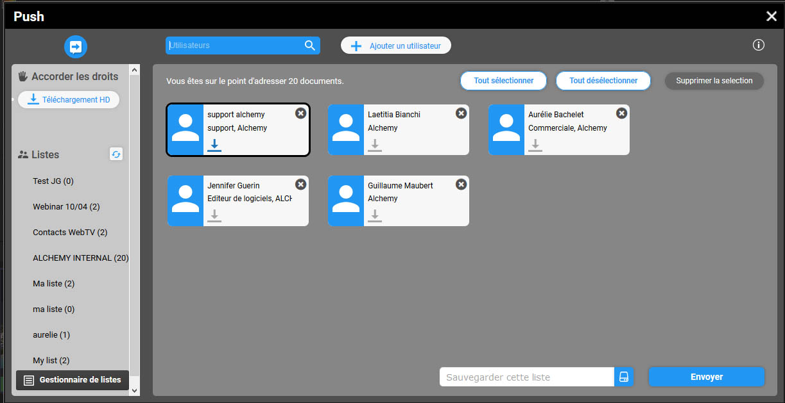

Push et Validation
==================

.. toctree::
    :maxdepth: 3

.. topic:: L'essentiel

    Le Push et la Validation sont deux actions destinées à transmettre des
    documents à des utilisateurs, qu'ils disposent ou non de comptes Phraseanet.

    Le Push sert à pousser des documents des utilisateurs, la Validation est
    destinée à recueillir des avis d'utilisateurs sur des médias.

    Un `Gestionnaire de listes`_ de liste permet de constituer des listes
    d'envoi pour répondre à des envois répétitifs vers de mêmes destinataires.

Le Push
-------

Le Push sert à transmettre de documents ou des paniers de documents. A la
différence d'un export par e-mail, le Push ne transmet pas physiquement les
documents. Il notifie dans l'interface, alerte par e-mail et met à la
disposition des utilisateurs des sélections de médias sous forme de paniers
qu'ils peuvent consulter et éventuellement télécharger.

Pousser des documents
*********************

* **Sélectionner un ou plusieurs documents** dans la zone d'affichage des
  résultats ou dans un panier ouvert ou ouvrir un reportage dans la zone
  de travail.
* **Cliquer sur le bouton Push** de l'une des palettes d'actions

Dans la fenêtre de Push...

* **Sélectionner un ou plusieurs utilisateurs** vers qui pousser les documents
  sélectionnés.

Pour ce faire, inscrire leurs noms, prénoms ou adresses e-mail dans le champ de
formulaire proposé en haut à gauche de l'interface. Un dispositif
d'auto-complétion entre en action à la saisie du troisième caractère pour
faciliter la recherche d'utilisateurs.
Une fois l'utilisateur Phraseanet repéré dans la liste proposé, cliquer sur son
nom pour l'ajouter à la liste d'envoi.

**Pour ajouter un ou plusieurs utilisateurs non enregistrés** dans la base de
comptes Phraseanet à une liste d'envoi, cliquer sur le lien **Ajouter un
utilisateur**.
Renseigner au minimum les champs obligatoires signalés par des astérisques dans
le formulaire de création d'utilisateur puis cliquer sur le bouton "Ajouter".
Le contact crée est ajouté à la zone des destinataires de l'envoi et son
compte est créé.

.. note::

    Les utilisateurs listés dans la zone des destinataires de l'envoi peuvent
    être regroupés et sauvegardés à la volée dans une liste d'envoi.

    Pour sauvegarder une liste d'envoi, renseigner le champ de formulaire situé
    à gauche de la zone des destinataires puis l'enregistrer en cliquant
    sur l'icône :

    .. image:: ../../images/Push-icone-disquette.jpg
        :align: center

    La liste créée est affichée dans la zone des listes d'envoi.

.. seealso::

    Se reporter aux fonctionnalités du
    :ref:`gestionnaire de liste <Push-Gestionnaire>`.

.. warning::

    Pour pouvoir créer des utilisateurs à partir des Pushs et Validations,
    l'utilisateur doit disposer des droits de gestion des utilisateurs.

Pour donner des droits spécifiques de téléchargement haute définition
(ou *Grant Rights*) sur les documents poussés aux utilisateurs figurants dans
la liste d'envoi, deux méthodes sont proposées :

* Sélectionner un ou plusieurs utilisateurs dans la zone des destinataires de
  l'envoi puis cliquer sur le bouton **Téléchargement HD** à gauche de la liste
  des destinataires de l'envoi.

**Ou bien**,

* Cliquer individuellement sur l'icône située sur l'étiquette représentative
  du destinataire à qui donner le droit de téléchargement haute définition.

.. image:: ../../images/Push-download-badge.jpg
    :align: center

* Cliquer sur le bouton **Envoyer** pour valider et transmettre le Push.

Un formulaire permet de donner un nom, une description à l'envoi et de réclamer,
si besoin, un accusé réception de l'e-mail si cette fonction est supportée par
la messagerie des destinataires.

La Validation
-------------

Le mode opératoire de la Validation est quasi identique à celui du Push. Il
ne diffère que par l'attribution de privilèges supplémentaires ou optionnels.

* Sélectionner un ou plusieurs documents dans la zone d'affichage des résultats
  ou dans un panier ouvert ou ouvrir un reportage dans la zone de travail.
* Cliquer sur la rubrique Validation du menu Push de la palette des actions ou
  sur l'icône Push d'un panier ou reportage ouvert en zone de travail

**Dans la fenêtre de validation**,

* Sélectionner le ou les utilisateurs Phraseanet vers lesquels adresser la
  demande de Validation. Pour adresser cette demande à des utilisateurs non
  enregistrés sur l'application, le mode opératoire demeure identique à celui
  d'un Push.

L'élévation des droits sur les documents (les *Grant Rights*) fonctionne de la
même manière que pour le Push. Les droits qu'il est possible de d'élever sont
plus étoffés :

* **Le téléchargement haute définition** pour donner l'accès au sous définition
  de la classe document
* **La contribution** à la validation, option par défaut qui permet de donner un
  avis sur les documents
* **Voir les autres** permet au destinataire de visualiser les avis et lire les
  commentaires des autres utilisateurs prenant part à la validation

Pour valider et transmettre une demande de Validation, cliquer sur le bouton
**Envoyer**.
Un formulaire permet de paramétrer la durée de validité de la demande de
Validation et de lui donner un nom et une description conviviale, éléments
repris dans l'e-mail reçu par les destinataires. Pour réclamer un accusé
réception de la demande de Validation, cocher la case prévue.

Réception d'un Push ou d'une Validation
---------------------------------------
Pushs et Validations sont notifiés de deux façons :

* Par les notifications dans l'interface Production
* Par e-mail

Chaque mode de notification présente un lien permettant l'affichage dans
Lightbox. Les Pushs et de les Validations reçus sont affichés comme des paniers
reçus dans la zone de travail de Production. Ils sont aussi regroupés dans
Phraseanet Lightbox.

.. Seealso::

    :doc:`Se reporter à la page consacrée à Lightbox <Lightbox>`

.. _Push-Gestionnaire:

Gestionnaire de listes
----------------------

.. topic:: L'essentiel

    Le Gestionnaire de listes permet la mise en place et l'exploitation des
    listes de destinataires pour la diffusion de Pushs et de Validations.

Le Gestionnaire de listes est accessible à partir des fenêtres de Push ou de
Validation. Cliquer sur le lien **Gestionnaire de listes** à gauche de la zone
des destinataires de l'envoi.

Créer et éditer une liste
*************************

Pour créer une liste dans le Gestionnaire de listes, cliquer sur le lien
**Ajouter**.

* Donner un nom à la nouvelle liste dans le formulaire présenté puis valider
  le formulaire. Le nom de la liste créée apparaît dans la zone de liste
  à gauche de l'interface. Cliquer sur son nom pour visualiser son
  contenu.
* Cliquer sur le bouton **Éditer** situé à gauche de la zone centrale de
  l'interface du Gestionnaire de listes pour éditer le contenu d'une liste.
  La liste des utilisateurs recensés sur un système Phraseanet est affichée.

.. image:: ../../images/Push-list_manager_editer.jpg
    :align: center

* Pour ajouter un ou plusieurs utilisateurs à la liste d'envoi, sélectionner
  les lignes des utilisateurs à ajouter. Les utilisateurs ajoutés ou présents
  dans la liste éditée sont surlignés d'une couleur ocre.
* Pour supprimer un utilisateur de la liste d'envoi, cliquer sur la ligne
  correspondante.

.. note::

    Un dispositif de recherche et de filtres permet de limiter l'affichage des
    utilisateurs par leurs identifiants, noms ou prénom, activité,
    société... *etc*.

* Pour retourner au sommaire de la liste, cliquer sur le bouton **Voir**.

Partager une liste
******************

Pour partager les listes d'envoi avec d'autres utilisateurs et leurs attribuer
des droits d'utilisation, de gestion ou d'administration, afficher la en la
sélectionnant dans la zone de liste.

**Pour partager cette liste avec un utilisateur**, chercher le par son nom,
prénom, son identifiant ou adresse email dans le formulaire de recherche. Un
dispositif d'auto-complétion facilite cette recherche.

L'utilisateur repéré, l'ajouter au partage en cliquant sur son étiquette de
présentation. Son nom s'ajoute à la liste des utilisateurs partageant la
liste d'envoi.

Par défaut, les droits de partage attribués correspondent à un niveau dit
d'accès. Ces droits de partage sont modifiables via la liste déroulante
figurant sur l'étiquette de l'utilisateur :

* **Le niveau Accès** donne un accès en lecture seule de la liste d'envoi
* **Le niveau Éditeur** donne des droits de lecture et modification du contenu de
  la liste d'envoi
* **Le niveau Admin** donne des droits de lecture, de modification et de
  suppression des listes partagées.

Supprimer une liste
*******************

Pour supprimer une liste d'envoi, l'afficher en la sélectionnant dans la liste
des listes d'envoi puis cliquer sur le bouton Supprimer en haut, à droite
de l'interface. Confirmer (ou annuler) la suppression.

.. note::

    Si le nom de la liste supprimée figure toujours dans la liste des listes
    d'envoi, cliquer sur le lien Rafraîchir à gauche de l'interface.
