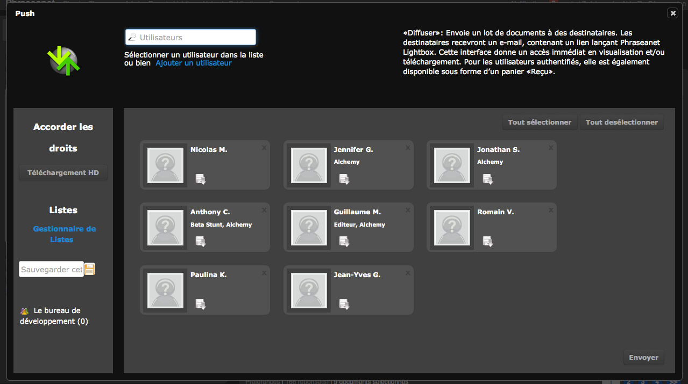

Push et Validation
==================

.. toctree::
   :maxdepth: 3

.. topic:: L'essentiel

    Le Push et la Validation sont deux actions destinées à transmettre des
    documents à des utilisateurs, qu'ils disposent de comptes Phraseanet ou
    pas.
    Le **Push** sert à pousser des documents vers ces utilisateurs, la **Validation**
    permet en plus d'obtenir des avis consultatifs sur des documents.

    Dans la version 3.6, Push et Validation sont deux interfaces distinctes. Elles
    permettent aussi à présent de constituer et de gérer des listes d'envois via le
    `Gestionnaire de listes`_.

Le Push
-------

Le Push est une soumission de documents dans Phraseanet Lightbox.
Contrairement à l'envoi par mail proposé par les fonctionnalités d'export, le
Push ne transmet pas physiquement les documents.
Il alerte par email et met à la disposition des utilisateurs un panier qu'ils
peuvent consulter et télécharger.

Comment pousser des documents ?
*******************************

* Sélectionner un ou plusieurs documents dans la zone d'affichage de
  :doc:`Résultats <Afficher>` de l'interface de *Production*.

* Cliquer sur le bouton Push de la :doc:`Palette des Actions <Actions>`
  Phraseanet : une fenêtre de type Overlay s'ouvre et présente alors la
  fenêtre de Push.

* Sélectionner un ou plusieurs utilisateurs Phraseanet vers qui pousser
  les documents sélectionnés.

Pour ce faire, inscrire leurs noms, prénoms ou adresses email dans le
champ de formulaire proposé en haut à gauche de l'interface.
Un dispositif d'auto-complétion entre en action dès la saisie du troisième
caractère afin de faciliter la recherche d'utilisateurs. Une fois l'utilisateur
Phraseanet repéré dans la liste d'utilisateurs proposés, cliquer sur son nom
pour l'ajouter à la liste d'envoi. Cela a pour effet d'ajouter l'utilisateur
dans la zone des destinataires de l'envoi.

Pour ajouter un ou plusieurs utilisateurs non enregistrés dans une
solution Phraseanet à une liste d'envoi, cliquer sur le lien *Ajouter un
utilisateur*. Un formulaire d'ajout d'utilisateur simplifié s'affiche.
Renseigner au minimum les champs obligatoires signalés par des
astérisques puis cliquer sur le bouton "Ajouter". Cela a pour effet d'
ajouter le contact crée dans la zone des destinataires de l'envoi tout en
créant un compte à son nom dans le système Phraseanet.

.. note:: Les utilisateurs listés dans la zone des destinataires de l'envoi peuvent
          être regroupés et sauvegardés dans des listes d'envoi pour une
          réutilisation ultérieure.
          Pour sauvegarder une liste d'envoi, renseigner le champ de formulaire
          situé à gauche de la zone des destinataires de l'envoi puis l'enregistrer
          en cliquant sur l'icône :

.. image:: ../../images/Push-icone-disquette.jpg
    :align: center

La liste créée est alors affichée dans la zone des listes d'envoi.
Les fonctionnalités relatives aux listes d'envoi sont décrites plus
après, dans la section dédiée au `Gestionnaire de listes`_.

Pour conférer des droits spécifiques de téléchargements haute définition
(ou Grant rights) sur les documents poussés aux utilisateurs figurants
dans la liste d'envoi, deux méthodes sont proposées:

Sélectionner un ou plusieurs utilisateurs dans la zone des destinataires de
l'envoi puis cliquer sur le bouton "Téléchargement HD" situé à gauche de la
liste des utilisateurs de l'envoi
*Ou:*
Cliquer individuellement sur l'icône

.. image:: ../../images/Push-download-badge.jpg
    :align: center

située sur l'étiquette représentative du destinataire à qui donner
le droit de téléchargement haute définition.

Pour valider et transmettre le Push, cliquer sur le bouton *Envoyer*.
Un formulaire permet de donner un nom et une description conviviale à l'envoi
et même réclamer un accusé réception de l'email envoyé si toutefois cette
fonctionnalité est supportée par le serveur de mails des destinataires.

La Validation
-------------

Le mode opératoire est quasi identique à l'envoi d'un Push. Il ne diffère que
par l'attribution de privilèges supplémentaires optionnels.

* Sélectionner un ou plusieurs documents dans la zone d'affichage de
  résultats de l'interface de Production

* Cliquer sur la rubrique Validation du menu Push de la palette des actions
  Phraseanet : une fenêtre de type overlay s'ouvre et présente alors la
  fenêtre de Validation.

.. image:: ../../images/Push-feedback_layout-1.jpg
    :align: center

* Sélectionner le ou les utilisateurs Phraseanet vers lesquels adresser la
  demande de Validation de la même manière que pour un Push.
  Là encore, pour adresser cette demande à des utilisateurs non enregistrés
  sur l'application, le mode opératoire demeure identique à celui d'un Push.

L'élévation des droits supplémentaires (les Grant rights) fonctionne de
la même manière que pour le Push. Les droits qu'il est possible de déléguer
sont plus étoffés.

En plus du **Téléchargement en haute définition**, il est possible de permettre
aux destinataires de contribuer à la demande de Validation (c'est d'ailleurs l'
option par défaut, sans quoi la réception d'une Validation ne serait que purement
informative – un cas tout à fait envisageable).

Pour activer ou désactiver cette option, cliquer sur le bouton Contribuer ou sur
l'icône

.. image:: ../../images/Push-contributeur_badge.jpg
    :align: center

Le bouton **Voir les autres** et son icône associée

.. image:: ../../images/Push-see_other_badge.jpg
    :align: center

permet à un destinataire de visualiser les avis et commentaires émis par les
autres destinataires contribuants à la demande de Validation.

Pour valider et transmettre une demande de Validation, cliquer sur le bouton
*Envoyer*. Un formulaire permet de paramétrer la durée de validité de la
demande de Validation et de lui donner un nom et une description conviviale,
éléments repris dans l'email reçu par les destinataires.
De même, pour réclamer un accusé réception de la demande de Validation, cocher
la case prévue à cet effet pour peu que le serveur d'email du destinataire en
tienne compte.

Réception d'un Push ou d'une Validation dans la Lightbox Phraseanet
-------------------------------------------------------------------

Push et Validation sont notifiées de deux façons. D'une part, par les
notifications dans l'interface de Production de Phraseanet. D'autre part, par
email. Chacun de ces modes de notification présente un lien permettant
l'affichage dans Phraseanet Lightbox.
Les *Push* et de les *Validations* reçus sont regroupés dans le module
:doc:`Phraseanet Lightbox <Lightbox>`, une interface de consultation collaborative.

Gestionnaire de listes
----------------------

.. topic:: L'essentiel

    Nouveauté de la version 3.6, le *Gestionnaire de listes* permet de mettre en
    place et d'administrer des listes de destinataires pour la diffusion de Push
    et de Validation dans Phraseanet Lightbox.
    Il devient ainsi encore plus simple de diffuser des média ou de demander de
    les apprécier dans Phraseanet.

Le *Gestionnaire de listes* est accessible à partir des fenêtres de Push et de
Validation du module production de l'application Phraseanet : Cliquer sur le
lien *Gestionnaire de listes* situé à gauche de la zone des destinataires
d'envoi.

Créer et éditer une liste d'envoi
*********************************
Pour créer une nouvelle liste dans le *Gestionnaire de listes*, cliquer sur le
lien *Ajouter*.

* Donner un nom à la nouvelle liste dans le formulaire qui se présente puis
  valider le formulaire. Le nom de la liste créée apparaît alors
  dans la zone de liste située à gauche de l'interface. Cliquer sur son nom
  pour visualiser son contenu.

.. image:: ../../images/Push-list_manager_creer.jpg
    :align: center

* Cliquer sur le bouton *Editer* situé à gauche de la zone centrale de l'
  interface du Gestionnaire de listes pour éditer le contenu d'une liste.
  Cela a pour effet de présenter la liste des utilisateurs recensé sur un
  système Phraseanet.

.. image:: ../../images/Push-list_manager_editer.jpg
    :align: center

* Pour ajouter un ou plusieurs utilisateurs à la liste d'envoi, sélectionner
  les lignes des utilisateurs à ajouter.
  Les utilisateurs ajoutés ou présent dans la liste éditée sont surlignés en
  couleur ocre.

* Pour supprimer un ou plusieurs utilisateurs de la liste d'envoi éditée,
  sélectionner les lignes des utilisateurs correspondants : cela a pour effet
  de les supprimer de la liste.

.. note:: Un dispositif de recherche et de filtres permet de limiter l'affichage des
          utilisateurs par leurs identifiants, noms ou prénom, activité, société… *etc.*

* Pour retourner au sommaire de la liste, cliquer sur le bouton *Voir* .

Partager une liste
******************

Pour partager les listes d'envoi avec d'autres utilisateurs Phraseanet et
leurs attribuer des droits d'utilisation, de gestion ou d'administration des
listes, afficher la liste à partager en la sélectionnant dans la zone de liste.

Pour partager la liste avec un utilisateur Phraseanet, rechercher le par son
nom, prénom, son identifiant ou adresse email dans le formulaire de recherche.
Un dispositif d'auto-complétion facilite cette recherche.

Une fois l'utilisateur repéré, l'ajouter au partage en cliquant sur son
étiquette de présentation. Son nom s'ajoute à la liste des utilisateurs Phraseanet
partageant cette liste d'envoi.

Par défaut, les droits de partage attribués correspondent à un niveau dit d'accès.
Ces droits de partage sont modifiables via la liste déroulante figurant sur
l'étiquette de l'utilisateur.

* Le niveau **Accès** donne un accès en lecture seule de la liste d'envoi
* Le niveau **Editeur** donne des droits de lecture et modification du contenu
  de la liste d'envoi
* Le niveau **Admin** donne des droits de lecture, de modification et de
  suppression des listes partagées.

Supprimer une liste
*******************

Pour supprimer une liste d'envoi, l'afficher en la sélectionnant dans la liste
des listes d'envoi puis cliquer sur le bouton *Supprimer* situé en haut à droite
de l'interface.
Une fenêtre de contrôle demande alors de confirmer la suppression. Cliquer sur *Ok*
pour supprimer définitivement cette liste.

.. Note :: Si le nom de la liste supprimée figure toujours dans la liste des
          listes d'envoi, cliquer sur le lien *Rafraîchir* situé à gauche de l'interface.
