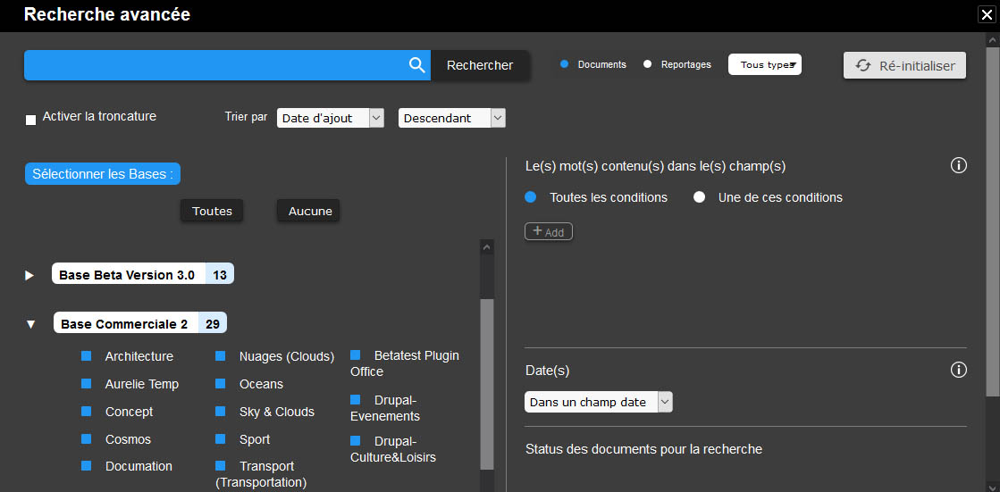
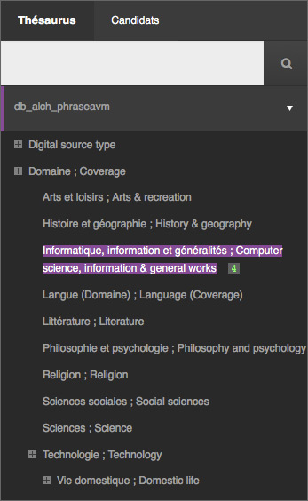
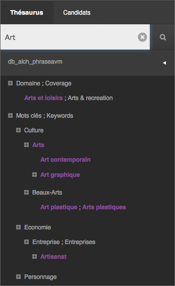
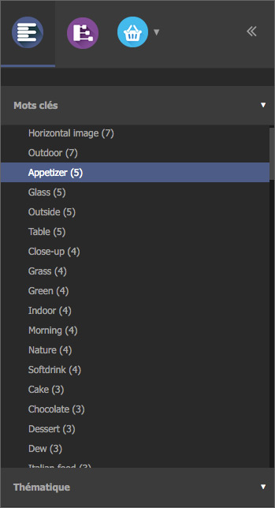

Rechercher des enregistrements
==============================
.. toctree::
    :maxdepth: 3

.. topic:: L'essentiel

    Les recherches de médias et de reportages dans Phraseanet s'effectuent au
    moyen d'un moteur de recherche en texte intégral (ou plein texte). Le mode
    de fonctionnement est similaire à celui des moteurs de recherche présents
    dans d'autres applications ou sur le Net.

    Combinés avec des opérateurs de recherche courants, ces recherches
    permettent de gagner en pertinence. Des recherches approfondies se
    pratiquent au moyen d'opérateurs moins fréquemment utilisés et il demeure
    possible de recherche dans des champs précis si besoin.

    Si un thésaurus est activé, la recherche et le parcours des résultats
    peuvent être grandement améliorés.

    Reste que la qualité de l'indexation est un facteur déterminant.

La recherche en texte intégral
------------------------------

*Phraseanet* propose par défaut un mode de recherche en texte intégral qui
permet d'afficher des documents ou des reportages selon les informations
contenues dans les champs documentaires des notices descriptives.

Par défaut, **la recherche porte sur les documents** des bases et collections
auxquelles a accès l'utilisateur. A la connexion, les médias affichés sont
ceux résultants d'une
:doc:`question initiale paramétrable <Personnaliser>`.

.. image:: ../../images/Rechercheavancee1.jpg
    :align: center

.. _Rechercher-des-reportages:

**Pour rechercher des reportages**, placer le bouton radio du mode de recherche
en position reportage. Dans ce mode, la recherche porte sur le contenu de la
notice des reportages.

.. note::

    La recherche simultanée sur les documents et les reportages n'est pas
    possible.

Pour effectuer une recherche :

* Inscrire le ou les termes recherchés dans le formulaire de recherche
* Cliquer sur **Rechercher**

Le moteur de recherche est insensible à la casse et ne fait pas la différence
entre les caractères accentués et ceux qui ne le sont pas.

Les résultats obtenus sont affichés dans la zone d'affichage. Leurs pertinences
dépendent de la qualité d'indexation documentaire ainsi que de la requête
formulée.

.. note::

    Le nombre de résultats par page est ajustable. Se référer à la page
    consacrée à la :doc:`personnalisation de l'interface <Personnaliser>`.

Opérateurs booléens et troncature
*********************************

Par défaut, l'opérateur mis en oeuvre entre les termes saisis est l'opérateur
de conjonction **ET** booléen. Il n'est pas nécessaire de le saisir.
Tous les termes saisis dans le formulaire sont présents dans les notices
descriptives des médias affichés à l'issue de la recherche.

D'autres opérateurs courants sont disponibles :

* L'opérateur **OU** permet de rechercher alternativement plusieurs termes dans
  les notices des médias. Par exemple, si la recherche est **mer OU montagne**
  les fiches descriptives des médias affichées contiennent soit le mot mer, soit
  le mot montagne, soit les deux à la fois.
* L'opérateur **SAUF** permet d'exclure un terme de la recherche. Si la
  recherche porte sur des plages qui ne sont pas en France, taper **plage SAUF
  France**.
* L'opérateur ***** permet une troncature à la droite du terme recherché : une
  recherche telle **natur*** affiche des médias dont les notices contiennent des
  mots commençants par "natur" comme nature, naturel, nature-morte,
  naturisme... *etc*.
* **La recherche entre guillemets** permet la recherche des termes contigus ou
  d'expressions dans les notices des médias. "Porte-manteau",
  "Avant-première"...etc.

D'autres possibilités existent au moyen d'opérateurs avancés.

.. seealso::

    :doc:`Voir la liste exhaustive de ces opérateurs <../../FAQ/Medias/Tous-les-operateurs-de-recherche>`
    dans la FAQ.

Opérateurs spécifiques
**********************

*Phraseanet* dispose d'autres opérateurs spécifiques :

* **Tout** ou **All** : pour afficher tous les documents des bases et
  collections sélectionnées.
* **Derniers** ou **Last** ( avec ou sans précision de nombre) pour afficher les
  derniers documents ajoutés par base dans les collections sélectionnées.
  Combiné avec un nombre entier, ce sont les *n* derniers documents qui sont
  affichés. Sans précision, le nombre de documents est des 12.

Dans une recherche **Derniers 100** avec trois bases/collections ouvertes,
le nombre de médias affichés peut s'élever jusqu'à 300 (les 100 derniers médias
ajoutés dans trois bases) pour peu que le nombre de documents soit supérieur ou
égal à 100 dans chacune des bases et collections affichées.

Recherche dans un champ précis
------------------------------

Il est possible de limiter la recherche à un champ de la notice.
La syntaxe a utiliser est le terme recherché **dans** un champ en particulier.
**In** peut être utilisé à la place de **Dans** dans l'équation de recherche.

Une recherche **Londres dans Ville** affiche les enregistrements qui
contiennent le terme **Londres** dans un champs intitulé **Ville**.

Une recherche **France dans Pays** affiche les documents qui
contiennent le terme **France** dans un champs intitulé **Pays**.

.. image:: ../../images/Rechercher-motdanslegende.jpg
    :align: center

.. note::

    Pour une recherche par champ, veiller à employer le nom du champ tel que
    déclaré dans la structure documentaire (en respectant la casse).

Recherche avancée
-----------------

Pour afficher le formulaire de recherche avancée, cliquer sur la roue crantée
située entre le champ de recherche et le bouton **Rechercher**.

La fenêtre de recherche avancée se présente en trois parties :

* Le formulaire de recherche
* La liste des bases et collections disponibles
* La liste des filtres de recherche

Cocher ou décocher les cases correspondantes aux collections sur lesquelles
doivent s'effectuer les recherches.

Il est possible de désélectionner toutes les :term:`bases <Base>` et
collections. Cliquer sur "Aucune" ou bien sur les noms des bases pour les
sélectionner ou désélectionner individuellement.

.. note::

    Si aucune collection n'est sélectionnée, la recherche porte sur toutes
    les bases et collections disponibles.

Les filtres disponibles apportent de la granularité aux équations de recherche :

* Activer ou désactiver la recherche par :term:`Stemme`
* Rechercher dans un ou plusieurs champs spécifiques
* Filtrer par status
* Limiter les recherches à des intervalles de dates

**Les options de la recherche avancée sont persistantes**. Les choix adoptés
dans la fenêtre de recherche avancée restent valables tant qu'ils ne sont pas
modifiés.
La présence d'options de recherche se matérialise par la teinte jaune du
formulaire de recherche.

Recherche avec le Thésaurus
---------------------------

Si un thésaurus est activé, la recherche et le parcours des résultats peuvent
être grandement améliorés.

Afficher le thésaurus
*********************

La recherche avec le Thésaurus s'effectue à partir de l'onglet Thésaurus de la
zone de travail.

Il présente le ou les *thesauri* déployés sous forme d'arbres dont les
noeuds et termes sont cliquables.

* Cliquer sur les "+" des noeuds du thésaurus pour le déployer et naviguer dans
  les termes qu'il contient.
* Double cliquer sur un des termes pour lancer la recherche.

**Une recherche dans les termes du thésaurus est possible** au moyen d'un
formulaire.
Inscrire au minimum les trois premiers caractères d'un terme pour déclencher le
dispositif d'auto-complétion.

Utiliser les propositions
*************************

Cet onglet affiche des propositions en rapport avec la recherche de
l'utilisateur et les termes de référence contenus dans le ou les thésaurus des
bases interrogées.

En remontant des termes issus du thésaurus lors des recherches, les propositions
suggèrent des termes permettant de préciser davantage la recherche ou au
contraire de l'étendre à un champ cognitif plus large.

Chaque proposition affichée est cliquable et permet de relancer une recherche.

.. note::

    La pertinence des propositions faites dépend de la construction du
    thésaurus déployé.
