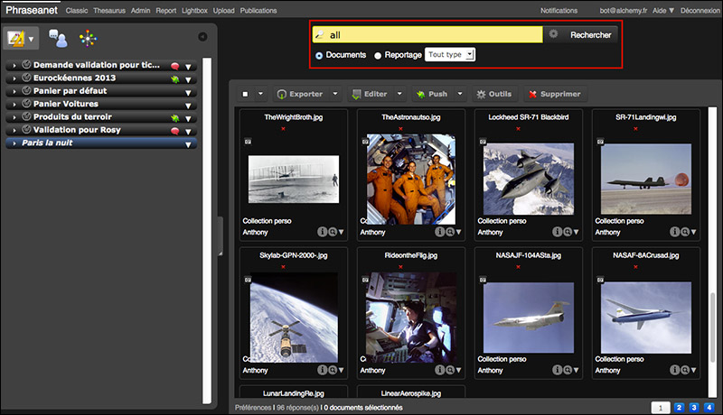
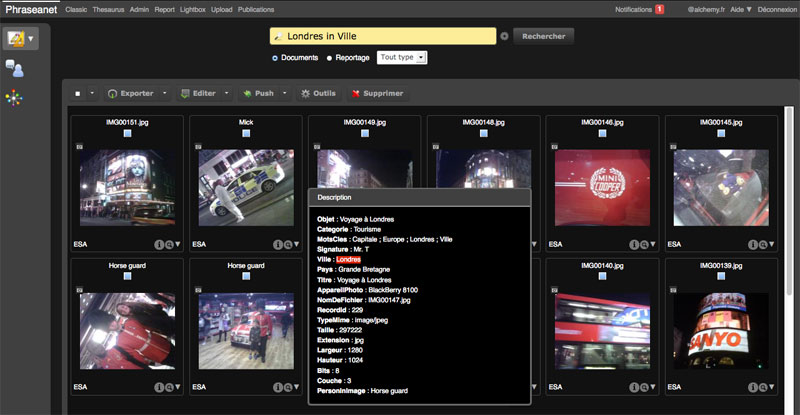
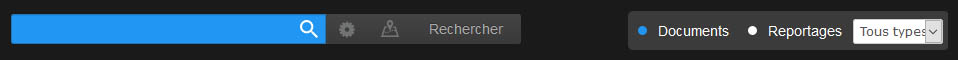

Rechercher des Médias
=====================
.. toctree::
    :maxdepth: 3

.. topic:: L'essentiel

    Les recherches de médias dans *Phraseanet* se font au traver d'un moteur de
    recherche en texte intégral (ou plein texte) dont le mode de fonctionnement
    est similaire à celle de moteur de recherche classique dans d'autres
    applications ou sur le Net.

    Combinés avec des opérateurs de recherche courants, ces recherches
    permettent de gagner en pertinence même si la qualité de l'indexation reste
    primoridale.

    Des recherches approfondies peuvent se pratiquer au moyens d'opérateurs
    moins fréquemment utilisés. Il demeure possible de recherche dans des champs
    précis si besoin.

    Si un thésaurus est activé, la recherche et le parcours des résultats peut
    être grandement amélioré.

La recherche en texte intégral
------------------------------

*Phraseanet* propose par défaut un mode de recherche en texte intégral qui
permet d'afficher des médias selon des informations contenus dans les champs
documentaires constituant leurs notices descriptives.

Cette technique de recherche est largement répandue sur les moteurs de recherche
du web et le mode de fonctionnement proposé dans *Phraseanet* est similaire.

Par défaut, la recherche porte sur les documents des bases et collections
auxquelles à accés l'utilisateur et les médias affichés sont ceux résultants d'
:doc:`une question initiale paramétrable <PersonnaliserInterface>`.

Un groupe de boutons radio permet de choisir si la recherche doit porter sur
les documents ou sur les reportages. Dans une recherche portant sur les
reportages la recherche porte sur la fiche d'indexation des reportages.
La recherche simulatanée sur les documents et les reportages n'est pas
possibles.

Pour effectuer une recherche :
* Inscriver le ou les termes recherchés dans le formulaire de recherche
* Lancer la recherche en cliquant sur **Rechercher**

.. note :: le moteur de recherche est insensible à la casse et ne fait pas la
           différence entre les caractères accentués et ceux qui ne le sont pas.

Les résultats obtenus sont affichés dans la zone d'affichage. La pertinence des
dépend grandement de la qualité d'indexation des médias et de la requête
formulée.
Le nombre de résultats par page est personnalisable. Se reporter à la page
:doc:`Personnaliser l'interface <PersonnaliserInterface>` pour plus d'
explications.

Par défaut, l'opérateur mis en oeuvre entre les termes saisis dans le formulaire
de recherche est le **ET** booléen et il n'est donc pas nécessaire de le saisir.
Tous les termes saisis dans le formulaire sont présents dans les notices
descriptives des médias affichés à l'issue de la recherche.

D'autres opérateurs courants sont disponibles :
* L'opérateur **OU** permet de rechercher alternativement plusieurs termes dans
les notices des médias. Par exemple, si la recherche est **mer OU montagne**
les fiches descriptives des médias affichées contiennent soit le mot mer, soit
le mot montagne, soit les deux à la fois.
* L'opérateur **SAUF** permet d'exclure un terme de la recherche. Si la
recherche porte sur des plages qui ne sont pas en France, taper **plage SAUF
France**.
* L'opérateur ***** est l'opérateur de troncature. il permet une troncature à
droite du terme recherché : une recherche telle **natur*** affiche des médias
dont les notices descriptives contiennent des mots commençants par "natur" comme
nature, naturel, nature-morte, naturisme...*etc*.

La recherche entre guillemets est possible : elle permet de rechercher des
termes contigues dans les notices descriptives des médias.

D'autres possibilités existent également au moyens d'opérateurs avancés.
Se reporter à la liste exhaustive des opérateurs de recherche sur cette page.

*Phraseanet* dispose d'autres opérateurs spécifiques :
* **Tout** ou **All** : pour rechercher tous les documents parmi les bases et
collections sélectionnées.
* **Derniers** ou **Last** ( avec ou sans précision de nombre) affiche par
défaut les douze derniers documents ajoutés dans par base dans les collections
sélectionnée. Combiné avec un nombre entier, ce sont les *n* derniers documents
qui sont affichés.

Dans une recherche **Derniers 100** avec trois bases/collections ouvertes,
le nombre de médias affiché peut s'élevé jusqu'à 300 (3 fois les 100 derniers
médias ajoutés) pour peu que le nombre de documents soit supérieur ou égal à
100 dans chacune des bases et collections affichées.

Recherche dans un champ précis
------------------------------

Il est possible de limiter la recherche à un champ de la description.
Le motif de recherche est le terme recherché *dans* un champ en particulier.

Une recherche **Marrakech *dans* Ville** affiche les documents qui
contiennent le terme *marrakech dans un champs *Ville*.

Recherche avancée
-----------------

Pour afficher le formulaire de recherche avancée, cliquer sur la roue crantée
située entre le champ de recherche et le bouton **Rechercher**.

Une fenêtre Overlay s'ouvre. La fenêtre de recherche avancée se présente en
trois parties :

.. image:: ../../images/Rechercheavancee0.jpg
    :align: center

La partie haute présente un formulaire similaire à celui de la recherche simple.

La partie gauche présente la liste des bases et collections consultables par l'
utilisateur.
Cocher ou décocher les bases et collections sur lesquels doivent
s'effectuer les recherche.

.. note::

    Il est possible de désélectionner toutes les :term:`bases <Base>` et
    collections en cliquant sur "Aucune" ou de cliquer directement sur les
    noms des :term:`bases <Base>` pour les sélectionner ou désélectionner
    individuellement ou encore dans les cases à cocher proposées pour
    chaque collection disponible.

La partie droite présente les différents filtres disponibles pour affiner les
recherches :

* Trier par mots clés contenus dans un ou plusieurs champs spécifiques,
* Trier par status,
* Trier sur des intervalles de dates,...

Les documents s'affichent dans la fenêtre *Résultats*.

.. note::

    **Les options de la recherche avancée sont persistantes**. Les choix
    adoptés dans la fenêtre de recherche avancée restent valables tant qu'
    ils ne sont pas modifiés.
    Dans le formulaire de recherche simple, la présence d'options de
    recherche est matérialisé par la teinte jaune du formulaire de
    recherche.

Recherche avec le Thésaurus
---------------------------

Si un thésaurus est activé, la recherche et le parcours des résultats peuvent
être grandement amélioré.
La recherche à partir du Thesaurus s'effectue à partir de l'onglet Thésaurus de
la Zone de travail.

.. image:: ../../images/Recherche-Thesaurus.jpg
    :align: center

Se reporter à la section Thésaurus :doc:`cette page <Onglets>`.

Synthèse des opérateurs de recherche disponible dans Phraseanet
---------------------------------------------------------------

Voici la liste des différents opérateurs de recherche disponibles dans
*Phraseanet*.

Les opérateurs booléens
***********************

L'opérateur de conjonction *ET*
^^^^^^^^^^^^^^^^^^^^^^^^^^^^^^^

Utilisé par défaut, si bien qu'il n'est pas utile de l'indiquer, l'opérateur
*ET* affiche les médias dont tous les termes saisis sont présents dans les
notices descriptives des médias.

L'opérateur de disjonction *OU*
^^^^^^^^^^^^^^^^^^^^^^^^^^^^^^^

Il permet de rechercher alternativement plusieurs termes dans les notices des
médias.
Ainsi, si la recherche est **sucré OU salé** les fiches descriptives des
médias affichées contiennent soit le mot mer, soit le mot montagne, soit les
deux à la fois.

L'opérateur de négation *SAUF*
^^^^^^^^^^^^^^^^^^^^^^^^^^^^^^

Il permet d'exclure des termes de la recherche.

Les opérateurs ordinaux **TOUT** et **DERNIERS**
************************************************

* *Tout* (ou *all*): pour rechercher tous les documents parmi les :term:`bases
  <Base>` et collections sélectionnées.

* *Derniers* ou *last* (sans précision de nombre) affiche par défaut les 12
  derniers documents ajoutés dans une base.

L'opérateur *Derniers* est valable par :term:`bases <Base>` et collections
ouvertes.

Les opérateurs de substitution
******************************

Le caractère de troncature *****
^^^^^^^^^^^^^^^^^^^^^^^^^^^^^^^^

Le caractère de troncature *****, utilisé à gauche d'une chaine de caractères
permet de rechercher des médias dont les notices descriptives contiennent des
termes commençants par les caractères précédents l'astérisque.

Le caractère de remplacement **?**
^^^^^^^^^^^^^^^^^^^^^^^^^^^^^^^^^^

Un caractère peut être remplacé par **?**.
Ainsi, la recherche *mo?s* affiche les médias sont les notices descriptives
contiennent des termes tels *mois* ou *mots*.

Les opérateurs de proximité
***************************

L'opérateur **PRES**
^^^^^^^^^^^^^^^^^^^^

Il permet de repérer tous les médias dans lesquels le résultat du terme
1 apparaît à une distance spécifiée (n) du terme 2.

Par exemple, (Tour PRES 2 Eiffel) sélectionnera les enregistrements dans
lesquels une distance de 2 mots maximum sépare le mot *Tour* du mot *Eiffel*.

.. note::

    Si aucune distance n’est précisée, l’opérateur PRES est traité comme un
    opérateur booléen ET.

L'opérateur **AVANT**
^^^^^^^^^^^^^^^^^^^^^

Il permet de repérer tous les enregistrements dans lesquels le
résultat du terme 1 apparaît avant le terme 2 et a une distance spécifiée (n).
Par exemple, (Tour AVANT 2 Eiffel) sélectionnera les enregistrements dans
lesquels le terme *Tour* est situé, au maximum, deux mots avant le mot Eiffel.

.. note::

    Il n'est pas nécessaire de spécifier la distance. Si la distance n'est
    pas précisée, la valeur par défaut est 12.

L'opérateur **APRES**
^^^^^^^^^^^^^^^^^^^^^

Il permet de repérer tous les enregistrements dans lesquels le
résultat du terme 1 apparaît après le terme 2 à une distance spécifie (n).
Par exemple, (Eiffel APRES 2 Tour) sélectionnera les enregistrements dans
lesquels le mot Eiffel est situé, au maximum, deux mots après le mot Tour.

.. note::

    Il n'est pas nécessaire de spécifier la distance.
    Si la distance n'est pas précisée, la valeur par défaut est 12.

.. warning:: Pour tous les opérateurs mentionnés préalablement, leur recherche
             dans une expression entre guillemets annule la fonction de l'
             opérateur utilisé.

Les comparaisons numériques
***************************

Il est possible de sélectionner des documents en comparant des dates et
nombres, pour des champs documentaires typé comme Date ou Nombre.
Ainsi la recherche **date > 14/07/2012** affiche les médias dont un champ nommé
date est renseigné d'une date postérieure au 14 juillet 2012.

Les opérateurs de comparaison sont : >, <, =, <=, >=, entre (les bornes sont
incluses).

Les Jours (JJ), mois (MM), Années (AAAA) peuvent être collés ou séparés par un
slash /, un tiret -, un espace.

* Recherche sur un jour: JJ/MM/AAAA, AAAAMMJJ, JJ/MM/AA, AAAA/MM/JJ,
  JJ-MM-AAAA, AA-MM-JJ
* Recherche sur un mois: MM/AA, AAAA/MM, AAAAMM, MM/AAAA
* Recherche sur une année: AAAA

La saisie des champs de type date est stricte. L'utilisateur peut préférer de
mettre ce type de recherche au moyen de la fenêtre de recherche avancée.
