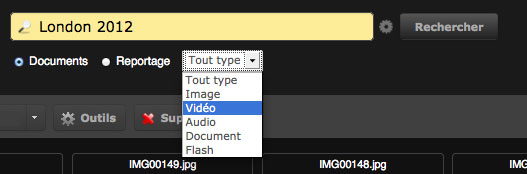

Rechercher
==========
.. toctree::
   :maxdepth: 3

.. topic:: L'essentiel

    L'interface du module Production est repensée dans la version 3.6 de
    Phraseanet. La majorité des utilisateurs consultés ont trouvé intéressant
    de rassembler toutes les options relatives à la recherche documentaire au
    sein d’une même zone de l'écran du module Production.

    Dans *Production* et *Classic*, deux modes de recherche sont possibles:

    La zone de `Recherche simple`_ permet d'effectuer des recherches simples en
    texte intégral dans les :term:`bases <base>`/collections de documents.

    La `Recherche avancée`_ permet d'effectuer des requêtes plus
    évoluées et de mettre en place un certain nombre de filtres sur les
    :term:`bases <base>` et collections.

    Phraseanet embarque deux moteurs de recherche: un moteur texte intégral et
    un moteur thesaurus.

    Le premier moteur est le moteur texte intégral. Il permet d’effectuer des
    recherches sur tous les champs de toutes les :term:`bases <base>` et toutes
    les collections auxquels l’utilisateur est connecté.
    Le deuxième moteur est le moteur de recherche du Thesaurus. Il n’est activé
    que lorsqu’un thesaurus existe.

Recherche simple
----------------
La Recherche simple se trouve dans la partie centrale de la page, au-dessus de la
palette des Actions et de l’affichage des Résultats.

.. image:: ../../images/Rechercher-simple.jpg
    :align: center

Saisir un critère de recherche.

Par défaut, le critère *derniers* ou *last* peut être affiché. Celui-ci va afficher
les derniers documents entrés dans la base.

Pour commencer, l'un des mots clés que nous conseillons d'utiliser dans Phraseanet
est: *tout* ou *all*, qui permet d'afficher l'intégralité des documents de la
collection cochée.

  * Taper le mot clé.
  * Cliquer sur Chercher.

Les réponses qui correspondent à la recherche s'affichent dans la zone des
résultats sous forme de vignettes.

Choisir si la recherche doit se faire sur des reportages (uniquement les fiches
d'indexation des reportages) ou sur les documents.

.. note::

    Il n'est pas possible de chercher à la fois sur des reportages et des
    documents.

Recherche par opérateur ordinal
*******************************
  * *Derniers 100* (ou *last 100*): pour sélectionner les 100 derniers documents
    ajoutés ou archivés dans la base/collection.

Le nombre de documents sélectionnés est valable par :term:`bases <base>` / collections
ouvertes.
Si trois bases/collections sont ouvertes, la sélection comporte 300 documents
(3 x 100).

  * *Derniers* ou *last* (sans précision de nombre) affiche par défaut les 12
    derniers documents ajoutés.
  * *Tout* (ou *all*): pour rechercher tous les documents parmi les :term:`bases
    <base>` et collections sélectionnées.

Recherche sur un mot contenu dans la description
*************************************************
N'importe quel mot peut être saisi. Par exemple: en saisissant le mot *tour*,
on obtient tous les documents dont la description contient le mot tour, comme
*Tour Eiffel*.

Attention, la recherche porte sur le mot entier, ainsi en saisissant *tou*, on
n'obtient pas de documents sur des tours. Par défaut, on recherche sur tous les
champs descripteurs de la :term:`base`/collection.

Un caractère peut être remplacé par *?*. Ainsi, la recherche *mo?s* sélectionnera
notamment les documents dont la description contient *mois* ou *mots*.

Un nombre indéfini de caractères peut être remplacé par un astérisque:

Ainsi, la saisie des lettres "co*res" sélectionnera notamment les documents dont
la fiche descriptive contient *Palais des Congrès*. Attention, il faut saisir au
moins 2 caractères avant l'astérisque (co*).

Recherche avec plusieurs mots (utilisation des opérateurs Booléens)
*******************************************************************
Plusieurs mots peuvent être combinés pour affiner la sélection. Utiliser
les opérateurs logiques *ET, OU, SAUF*. Par exemple: *Tour sauf Eiffel* sélectionnera
tous les documents dont la description contient le mot *Tour* mais pas celles sur
la *Tour Eiffel*.

.. note::

    L’opérateur par défaut mis en œuvre sur le système peut être soit ET
    soit PRES.

**ET** impose que la première condition soit satisfaite et que la deuxième
condition soit satisfaite.

**OU** impose qu’au moins une des conditions soit satisfaite.

**SAUF** impose que la condition ne soit pas satisfaite.

.. note::

    Ordre de priorité des opérateurs: les parenthèses ou les doubles cotes
    sont prioritaires sur le reste.

Recherche dans un champ précis
******************************
Il est possible de limiter le cadre de la recherche à une rubrique de la description.
Ainsi rechercher marra* dans legende affichera les documents qui contiennent
le mot *marrakech dans le champs légende*.

Les mots, réponses aux questions sont surlignés dans la description. Ici, un exemple
avec le terme "mer", qui est surligné dans le champ Mot clé.

.. image:: ../../images/Rechercher-motdanslegende.jpg
    :align: center

Recherche avec les opérateurs de proximité
******************************************
**L’opérateur PRES** permet de repérer tous les enregistrements dans lesquels le
résultat du terme 1 apparaît à une distance spécifiée (n) du terme 2.
Par exemple, (Tour PRES 2 Eiffel) sélectionnera les enregistrements dans lesquels
une distance de 2 mots maximum sépare le mot *Tour* du mot *Eiffel*.

.. note::

    Si aucune distance n’est précisée, l’opérateur PRES est traité comme un
    opérateur ET.

**L’opérateur AVANT** permet de repérer tous les enregistrements dans lesquels le
résultat du terme 1 apparaît avant le terme 2 et a une distance spécifiée (n).
Par exemple, (Tour AVANT 2 Eiffel) sélectionnera les enregistrements dans lesquels
le mot Tour est situé, au maximum, deux mots avant le mot Eiffel.

.. note::

    Il n'est pas nécessaire de spécifier la distance. Si la distance n'est
    pas précisée, la valeur par défaut est 12.

**L’opérateur APRES** permet de repérer tous les enregistrements dans lesquels le
résultat du terme 1 apparaît après le terme 2 à une distance spécifie (n).
Par exemple, (Eiffel APRES 2 Tour) sélectionnera les enregistrements dans lesquels
le mot Eiffel est situé, au maximum, deux mots après le mot Tour.

.. note::

    Il n'est pas nécessaire de spécifier la distance.
    Si la distance n'est pas précisée, la valeur par défaut est 12.

Recherche avec comparaison numérique
************************************
Il est possible de sélectionner des documents en comparant des quantités, pour
les rubriques de type Date, Heure et Numérique.
Ainsi: *date > 14/07/2005* sélectionnera les documents datés après le 14 juillet
2005.

Les opérateurs de comparaison sont : >, <, =, <=, >=, entre (les bornes sont
incluses).

Les Jours (JJ), mois (MM), Années (AAAA) peuvent être collés ou séparés par un
slash /, un tiret -, un espace.

  * Recherche sur un jour: JJ/MM/AAAA, AAAAMMJJ, JJ/MM/AA, AAAA/MM/JJ, JJ-MM-AAAA,
    AA-MM-JJ
  * Recherche sur un mois: MM/AA, AAAA/MM, AAAAMM, MM/AAAA
  * Recherche sur une année: AAAA

.. note::

    La saisie des champs de type date est stricte.

Recherche avancée
-----------------
La Recherche Avancée ne se trouve plus au sein de la :doc:`Barre des Onglets <Onglets>`,
contrairement à la version précédente : Cliquez simplement sur la roue située
entre le champ pour la recherche et le bouton «Rechercher».

.. image:: ../../images/Rechercheavancee1.jpg
    :align: center

Une fenêtre Overlay s’ouvre. La nouvelle Recherche Avancée se présente en deux
parties, pour une meilleure visibilité :

.. image:: ../../images/Rechercheavancee0.jpg
    :align: center

D’un côté, le choix des collections dans lesquelles effectuer la recherche.
Choisir les :term:`bases <base>` et collections où rechercher.

De l’autre, les différents filtres disponibles pour affiner sa recherche :

  * Trier par mots clés contenus dans un ou plusieurs champs spécifiques,
  * Trier par status,
  * Trier sur des intervalles de dates,...

Les documents s'affichent dans la fenêtre *Résultats*.

.. note::

    Il est possible de désélectionner toutes les :term:`bases <base>` et
    collections en cliquant sur "Aucune" ou de cliquer directement sur les
    noms des :term:`bases <base>` pour les sélectionner ou désélectionner
    individuellement ou encore dans les cases à cocher proposées pour chaque
    collection disponible.

Recherche à partir du Thesaurus
-------------------------------
La recherche à partir du Thesaurus se fait via la barre des Onglets dans *Phraseanet
Production*: se reporter à la section :doc:`Barre des Onglets <Onglets>`.

La recherche dans les interfaces
--------------------------------
Voici un aperçu de la zone de recherche dans les deux interfaces *Production* et
*Classic*.

Elle présente un champ de recherche, dans lequel l'utilisateur peut entrer des
mots clés incluant des opérateurs booléens et autres critères vus précédemment
(exemples: all, last, plage, mer OU océan ET plage SAUF mouettes,...).

Production
**********

Ci-contre, la zone de recherche dans l'interface de *Production*:
Voici la `Recherche Simple`_.

Pour accéder à la `Recherche Avancée`_, cliquer sur la roue.

Pour effectuer une recherche dans l'interface de Production:

  * Entrer un mot clé dans le champ de recherche.

  * Sélectionner s'il faut rechercher dans les Documents ou dans les Reportages
    (par défaut, la recherche s'effectue dans les Documents).

  * Eventuellement, sélectionner un type de document: ne rechercher que dans les
    images, que dans les vidéos, ou bien uniquement parmi les documents de type
    audio, document, flash...

  * Dans la Recherche Avancée, sélectionner les base(s) / collection(s).

  * Enfin, cliquer sur le bouton Rechercher.

Classic
*******
.. image:: ../../images/Rechercher-Classic1.jpg
    :align: right

Trois onglets dans l'interface *Classic*, au-dessus de la zone de recherche :

  * La Recherche simple
  * La Recherche avancée
  * Les Thèmes

De la même manière que dans *Production*, l'utilisateur doit entrer un mot clé,
puis choisir la collection dans laquelle il souhaite faire sa recherche.
Pour de plus amples informations sur la manière avec laquelle l'utilisateur peut
effectuer ses recherches, se reporter aux sections précédentes `Recherche Simple`_
et `Recherche avancée`_.

Dans *Classic*, il est possible de choisir facilement le mode d'affichage des
images: Choisir d'après les propositions du menu déroulant.
Par défaut, 7 modes d'affichage sont présentés.

Quelques exemples:

  * 4*10 signifie 4 colonnes et 10 lignes, soit 40 vignettes par page.
  * Liste*10 affiche 10 vignettes en mode liste avec la description.

Deux onglets présents en-dessous du menu déroulant pour choisir le mode d'affichage
des images, se nomment: "Propositions" et "Historique".

Sur la capture d'écran à droite, c'est l'onglet "Historique" qui est montré.
Ici figurent toutes les questions posées lors des dernières recherches sur ces
bases.
