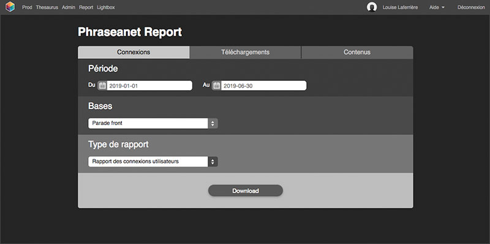
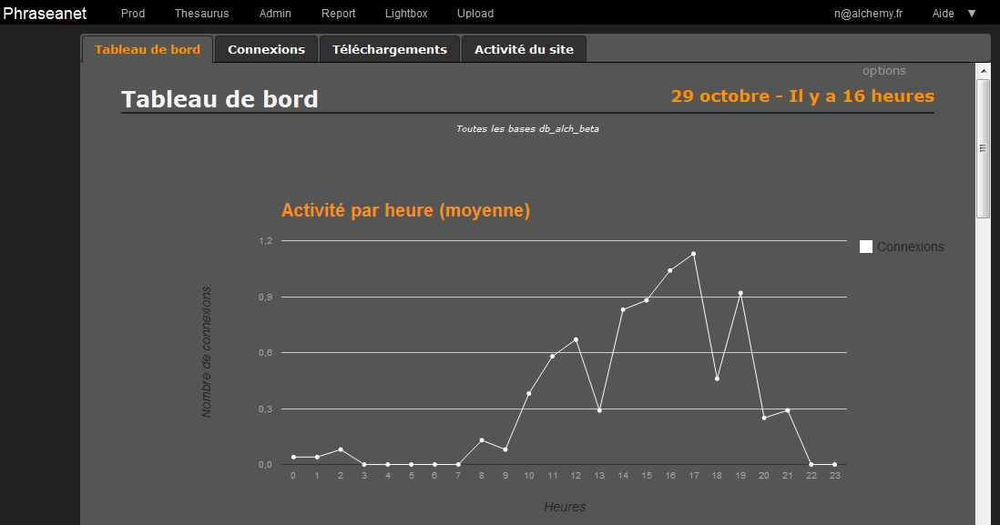
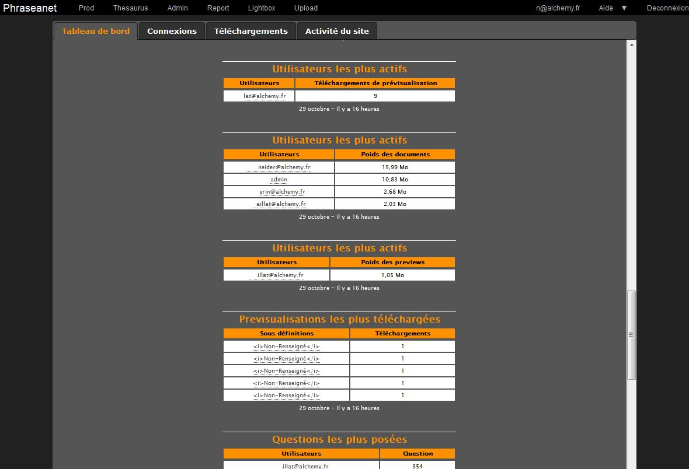
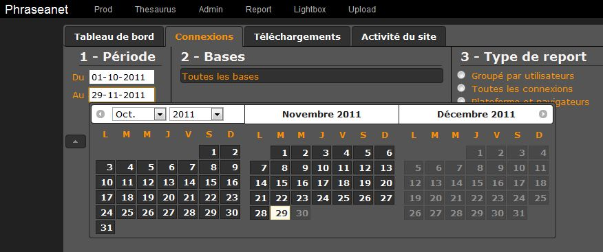
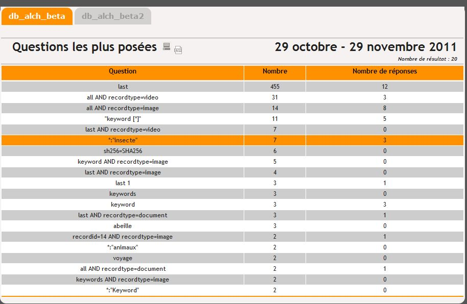

Statistiques
=============

.. toctree::
    :maxdepth: 3

.. topic:: L'essentiel

    De nombreuses statistiques sont accessibles dans *Phraseanet*. Dans l'
    interface *Phraseanet Production*, elles sont directement visibles dans
    l'onglet *Popularité* du document (:doc:`voir section Afficher <Afficher>`).
    Elles font également l'objet d'une interface dédiée, *Phraseanet Report*,
    dans laquelle l'utilisateur peut trouver un tableau de bord général
    permettant de visualiser l'activité du site et de consulter des rapports
    détaillés. *Phraseanet Report* permet de révéler des statistiques sur une
    période, sur un type d'information et sur pour une ou plusieurs bases et
    collections.

Les rapports sont classés dans 4 onglets :

Au lancement du module, un *tableau de bord* propose sur une période d’un mois
un ensemble de statistiques généralistes.

Les trois autres onglets proposent des statistiques qui concernent
respectivement les *connexions des utilisateurs*, les *téléchargements* de
documents et enfin *l’activité du site*.

Tableau de bord
---------------

Les statistiques proposées par le tableau de bord sont globales pour toutes les
:term:`bases <base>` et collections publiées à partir du site et sont données
sur un mois glissant.

La page du tableau de bord comprend de nombreuses données statistiques.

Voici une liste des tableaux disponibles et significations

* **Activité par heure** : Contenu et informations proposés non définitifs
  (courbe).
* **Activité par jour** : Contenu et informations proposés non définitifs
  (courbe)
* **Documents ajoutés** : Nombre de documents ajoutés par jour (Histogramme).
* **Documents édités** : Nombre de documents édités par jour (Histogramme).
* **Cumul téléchargements et connexions** : Nombre total de téléchargements,
  documents toutes sous résolutions sur un mois.
* **Nombre total de connexions utilisateurs**
* **Utilisateurs les plus actifs** (Tableau)
* **Prévisualisations des médias les plus téléchargées** (Tableau)
* **Questions les plus fréquentes** : Liste des 10 questions les plus posées par
  les utilisateurs
* **Volumétrie des questions les plus posées sur Phraseanet** : Liste des
  utilisateurs posant le plus de questions (Tableau)
* Sites d'où les documents sont les plus consultés (Tableau)

Les trois onglets suivants: `Connexion`_, `Téléchargements`_ et
`Activité du Site`_, se présentent de la même façon : L'utilisateur doit
sélectionner 3 critères afin d'accéder aux statistiques :

* `Période`_
* `Bases`_
* `Types de rapports`_

* Questions les plus posées: (Tableau)
  Liste des 10 questions les plus posées par les utilisateurs
* Volumétrie des questions les plus posées sur Phraseanet: (Tableau)
  Liste des utilisateurs posant le plus de questions
* Sites d'où les documents sont les plus consultés (Tableau)

Les trois onglets suivants : `Connexion`_, `Téléchargements`_ et
`Activité du Site`_, se présentent de la même façon : L'utilisateur doit
sélectionner 3 critères afin d'accéder aux statistiques :

* `Période`_
* `Bases`_
* `Types de rapports`_

Connexion
----------

L'utilisateur clique sur l'onglet "Connexion" s'il souhaite voir combien
de connexions ont eu lieu sur son système Phraseanet.

Période
*******

Par défaut, la période est définie sur le mois passé.
Pour changer l’intervalle, cliquer sur l'une des deux zones de saisie de date.

Utiliser un intervalle proposé par les trois calendriers.
Il faut utiliser le premier calendrier de la liste pour remonter
vers un passé plus lointain.

Bases
*****

Sélectionner les :term:`bases <base>` et collections sur lesquelles on souhaite
obtenir des statistiques.

Cliquer sur **Toutes les bases** pour afficher la liste des bases de données
disponibles.
Deux boutons permettent de sélectionner/dé-sélectionner toutes les :term:`bases
<base>`.

.. image:: ../../images/Statistiques-Connexions2.jpg
    :align: center

Un menu contextuel (flèche dans le coin gauche en bas) permet d’afficher la
liste des collections de la :term:`bases <base>`, afin d’affiner les rapports,
en décochant les collections à exclure.

.. note::
    Les options sélectionnées pour les intervalles et bases / collections
    sont mémorisées d’un onglet à l’autre.

Types de rapports
*****************

Enfin, il est nécessaire de choisir le type de rapport. Trois choix :

* Groupé par utilisateurs :

Liste et fréquence de connexion des utilisateurs

* Toutes les connexions :

Liste de toutes les connexions faites par chaque utilisateur présentée
par défaut sur un critère chronologique

* Plateformes et navigateurs :

Ensemble de listes et graphiques des connexions par type de navigateurs,
systèmes d’exploitation ou résolutions d’affichage employés par les
utilisateurs.
Ce rapport liste aussi les modules Phraseanet utilisés lors des connexions.
Enfin, une liste et un graphique avec les couples systèmes d’exploitation /
navigateurs les plus fréquemment utilisés pour les connexions.

En cliquant sur l'un de ces types de rapport, les statistiques s'affichent
immédiatement.

.. figure:: ../../images/Statistiques-Connexions3.jpg
    :align: center

    Exemple avec un rapport Plateformes et navigateurs

Téléchargements
---------------

L'onglet **Téléchargement** se présente de la même manière que l'onglet
`Connexion`_ :
Sélectionner la période, puis les :term:`bases <base>` et collections.

Le choix pour le type de rapport change. En effet, il est possible d'afficher
les statistiques en se basant sur les rapports :

* Par utilisateurs :

Pour chaque utilisateur ayant réalisé des téléchargements, ce rapport
affiche le nombre et poids des documents et des sous définitions.

* Tous les téléchargements :

Liste de l’ensemble des téléchargements réalisés sur l’intervalle.
Ce tableau propose des fonctions de regroupement, de tri, ...*etc*.

* Par jour :

Nombre total et ventilation par document et sous résolutions de téléchargements
faits jour par jour.

* Par document, sur la base :

* **Par utilisateurs** : Pour chaque utilisateur ayant réalisé des
  téléchargements, ce rapport affiche le nombre et poids des documents et sous
  résolutions.
* **Tous les téléchargements** : Liste de l’ensemble des téléchargements
  réalisés sur l’intervalle. Ce tableau propose de fonctions de regroupement,
  de tri, ...*etc*.
* Par jour : Nombre total et ventilation par document et sous résolutions de
  téléchargements faits jour par jour.
* Par document, sur la base: Active une option permettant de rechercher si un
  document en particulier à partir de son Recordid ou si un document pour lequel
  un terme à chercher est présent dans un champs a été téléchargé sur la
  période.

.. figure:: ../../images/Statistiques-Telechargements.jpg
    :align:     center

    Exemple de rapport de statistiques par document sur la bases.

Activité du Site
----------------

Cet onglet se présente de la même manière que les deux précédents.
Sélectionner la période et la :term:`base` puis le type de rapports
disponibles :

* **Toutes les questions** liste chronologique les questions posées par les
  utilisateurs.
* **Questions les plus posées** liste les questions les plus posées et nombre de
  d'occurrences retournées.
* **Questions sans réponses** liste des questions n’ayant fourni aucune réponse.
* **Activité du site** fournit des informations relatives à l'activité par heure
  (moyenne).

    Exemple de rapport incluant les données relatives aux questions les plus
    posées.

Les rapports
------------

Les rapports sont présentés sous forme de tableaux, listes et graphiques qui
affichent les informations attendues et proposent des options. Les rapports
précisent l’intervalle de date du rapport.

Ils affichent le nombre de résultat total du rapport demandé. Certains tableaux
proposent des options pour afficher d’avantage ou réduire le nombre de colonnes.

Cliquer sur la roue pour afficher la liste et sélectionner/désélectionner
l’affichage de certaines colonnes.

La plupart des tableaux, listes et graphiques sont imprimables en cliquant
sur le symbole de l'imprimante.

Les rapports sont générés par :term:`base` et tiennent compte des filtres
d’exclusion de collections.

Pour naviguer dans la liste "onglets" des :term:`bases <base>`, positionner
le curseur en début ou fin de liste.

Certaines colonnes des tableaux de rapports proposés sont implémentées de:

* fonctions de tri
* fonctions de filtres

Les filtres sont en relation avec les valeurs disponibles dans la colonne.

* regroupements logiques par valeurs identiques

Certaines valeurs dans les colonnes sont des liens cliquables *soulignées*
et réagissant au survol. Cliquables, ils affichent dans une fenêtre
:term:`Overlay` des informations en relation avec la valeur du lien.

Lorsqu’ils sont constitués d’un grand nombre de lignes, les rapports sont
répartis sur plusieurs pages.

Cette information est affichée en bas de page et il est possible :

* De changer de page
* D’afficher d’avantage de lignes en changeant la valeur saisie

.. note::
    Le total du nombre de lignes disponibles correspond au nombre total de
    résultats.
