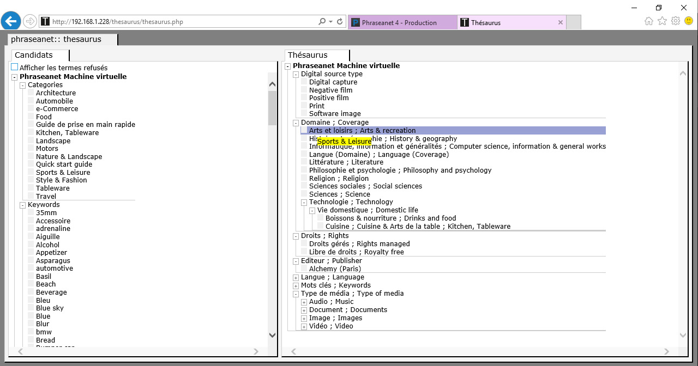
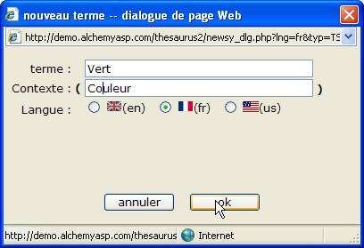
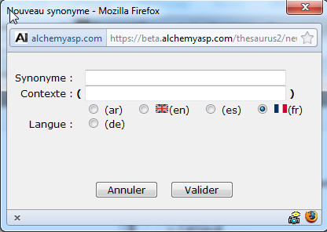

Thesaurus
=========

.. toctree::
    :maxdepth: 3

.. topic:: L'essentiel

    Cette application permet de gérer le ou les thésaurus attachés aux bases
    de données Phraseanet.

    Un Thésaurus peut servir à gérer des synonymes, des traductions,
    à aider les utilisateurs dans leur recherche.
    L’objectif d’un thésaurus est d'aider à l’indexation et de faciliter
    la recherche des documents dans une base de données.
    Le Thésaurus est proposé dans *Phraseanet Production* comme outil d'aide à
    l'indexation.
    Le Thésaurus sert aussi à faire des propositions et ainsi étendre ou
    restreindre le nombre de réponses aux recherches faites par les
    utilisateurs.

.. warning::

    Un thésaurus est un outil très performant mais sa mise en place
    d’apparence simple peut nécessiter, selon l’utilisation que l’on
    veut en faire et le résultat qu’on en attend, de devoir faire appel
    à des compétences de documentaliste.

Ouvrir un Thesaurus
-------------------

* -> Choisir un Thesaurus dans la liste
* -> Sélectionner la langue de travail
* -> Cliquer sur Valider

* => La fenêtre du thésaurus s'ouvre

La fenêtre de l’application Thésaurus est découpée en deux parties.

La partie gauche de la fenêtre présente la liste des « termes candidats »,
mots et expressions issus de l’indexation de documents ainsi que la liste de
termes refusés et supprimés qui sont présentés par champs d'indexation de la
base de données.

La partie droite présente le thésaurus existant, sous forme « d’un arbre »
qui se déploie.
En positionnant le curseur sur une branche ou un terme, on affiche en "Rollover"
l’ensemble des synonymes qui lui sont associés et le nombre d’occurrences dans
la base de données.

Pour ouvrir une branche, cliquer sur le symbole "Plus".
Pour fermer une branche, cliquer sur le symbole "Moins".

Travailler sur un thésaurus
---------------------------

Créer un nouveau terme spécifique
*********************************

Ajouter un nouveau terme spécifique à une branche signifie que l’on rajoute
un terme au niveau inférieur, il s’agit donc d’une relation « Père / Fils »
(ou Terme générique / Terme spécifique).
Un nouveau terme spécifique dans le thesaurus peut être ajouté sur
n'importe quelle branche existante depuis le branche racine intitulée
"Thésaurus".

* -> Faire un clic Droit sur une branche
* -> Cliquer sur "nouveau terme".

* => Une fenêtre s'ouvre

* -> Saisir le terme
* -> Saisir si besoin un contexte
* -> Sélectionner une langue pour le terme
* -> Cliquer sur Valider

* => Une fenêtre s'ouvre si le terme ne faisait pas partie de candidats.

.. image:: ../../images/Thesaurus-nouveautermereindexer.jpg
    :align: center

Par défaut la case " Ajouter le terme sans ré-indexer" est cochée.

Une vérification dans Phraseanet Prodcution permettra de savoir si le terme
existe déjà dans la base et dans ce cas une ré-indexation sera nécessaire
pour que les notices des documents et les termes du thésaurus soit liés.

* -> Cocher la case "Ajouter le terme et ré-indexer"

.. note::

    La ré-indexation immédiate n'est pas nécessaire si d'autre termes
    doivent être encore ajoutés. la ré-indexation peut se faire à posteriori
    depuis Phraseanet Admin.

* -> Cliquer sur Valider

Créer un nouveau synonyme
*************************

Un synonyme permet de prendre en compte aussi bien les besoins de traduction,
que les besoins de synonymie.

* -> Faire un clic Droit sur une branche
* -> Cliquer sur "nouveau synonyme".

* => Une fenêtre s'ouvre

* -> Saisir le terme
* -> Saisir si besoin un contexte
* -> Sélectionner une langue pour le terme
* -> Cliquer sur Valider

* => Une fenêtre s'ouvre si le terme ne faisait pas partie de candidats

.. image:: ../../images/Thesaurus-nouveautermereindexer.jpg
    :align: center

Par défaut la case " Ajouter le terme sans ré-indexer" est cochée.

Une vérification dans Phraseanet Prodcution permettra de savoir si le terme
existe déjà dans la base et dans ce cas, une ré-indexation sera nécessaire
pour que les notices des documents et les termes du thésaurus soient liés.

* -> Cocher la case "Ajouter le terme et ré-indexer"

.. note::

    La ré-indexation immédiate n'est pas nécessaire si d'autre termes
    doivent être encore ajoutés. la ré-indexation pourra se faire à posteriori
    depuis Phraseanet Admin.

* -> Cliquer sur Valider

Supprimer une branche, un terme
*******************************

* -> Faire un clic Droit sur une branche
* -> Cliquer sur "Supprimer".

* => Une fenêtre s'ouvre

.. image:: ../../images/Thesaurus-supprimer.jpg
    :align: center

* -> Cliquer sur OK

La branche ou le terme sont supprimés du thésaurus et sont copiés dans la
branche Stock des candidats.

Rechercher dans un Thesaurus
****************************

* -> Faire un clic Droit sur une branche
* -> Cliquer sur "Chercher".

* => Une fenêtre s'ouvre

* -> Choisir parmi les options de recherche
* -> CLiquer sur Chercher

* => L'affichage du thésaurus se met à jour et les termes trouvés sont
  affichés

Lier une ou plusieurs branches du thésaurus à un champs documentaire
********************************************************************

* -> Faire un clic Droit sur une branche
* -> Cliquer sur "Chercher".

* => Une fenêtre s'ouvre

.. image:: ../../images/Thesaurus-lierachamps.jpg
    :align: center

* -> Cocher la ou les cases des champs à associer
* -> Cliquer sur Valider

.. note::

    Tous les nouveaux termes contenus dans les fiches documentaires
    des documents qui seront ajoutés ou dont l’indexation sera modifiée,
    apparaîtront désormais sous forme de mots candidats
    dans une branche portant le nom du champ.

Travailler sur les candidats
----------------------------

Les Termes candidats sont les nouveaux termes et expressions qui ont été
ajoutés lors de l’indexation de nouveaux mots dans la base de données.
Ces termes peuvent provenir soit des informations extraites depuis
métadonnées d’un fichier ajouté, soit des informations saisies depuis la fenêtre
Editer dans Phraseanet Production.
Pour que des termes en provenance d’un champ deviennent mots candidats,
il faut au préalable lier un champ de la structure de la base à une branche
du thésaurus.

Accepter un candidat
********************

* -> Cliquer sur un terme candidat dans la fenêtre Stock et le glisser/déposer
  à la racine ou sur une branche du thésaurus dans la fenêtre thésaurus

* => une fenêtre s'ouvre

* -> choisir d'ajouter comme terme spécifique ou synonyme
* -> Cliquer sur Valider

Refuser un candidat
*******************

* -> Faire un clic Droit sur un terme
* -> Cliquer sur Refuser

* => Une fenêtre s'ouvre

Supprimer un candidat
*********************
