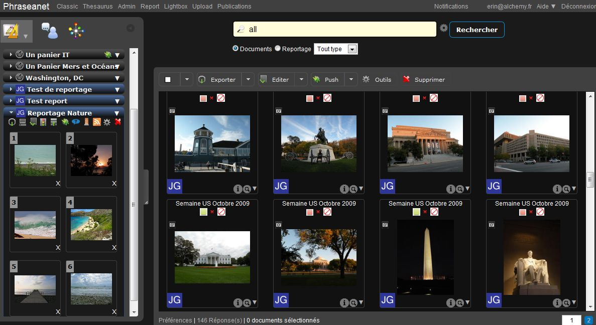
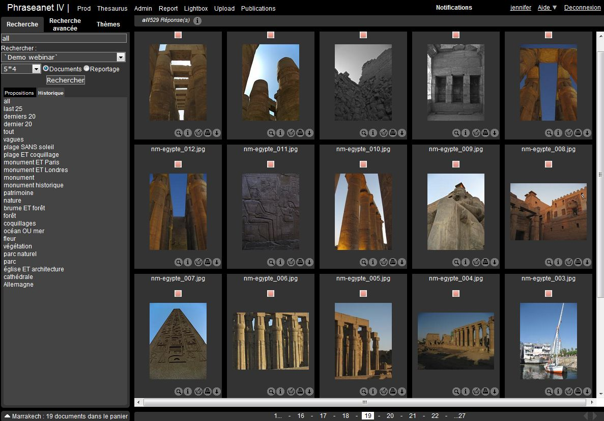

Affichage des résultats
=======================
.. toctree::
   :maxdepth: 3
   
.. topic:: L'essentiel

    Vous pouvez visualiser vos images et autres documents à partir des interfaces 
    *Phraseanet Production* soit *Classic*.
	
    *Production* est une interface dédiée à la consultation, à la recherche, 
    gestion et à l'édition des documents, tandis que *Classic* n'est qu'une simple 
    interface de visualisation et de recherche des documents.

	 *Interface Phraseanet Production*

.. note:: La zone d'affichage des résultats, dans *Prod* (ci-dessus) ou dans 
          *Classic* (ci-dessous), est la zone centrale où apparaissent les images.

	 *Interface Phraseanet Classic*

Présentation de la zone d'affichage
-----------------------------------
Dans *Production*:
**Le bandeau supérieur donne le nombre de réponses et affiche les "pages" 
de réponses.**

  .. image:: ../../images/Affichage-pages.jpg
	   :height: 130 px
	   :width: 600 px
	   :alt: alternate text
	   :align: center 
	   
Il permet de se déplacer de pages en pages en cliquant sur le 
numéro de la page, d'aller en fin de sélection en cliquant sur *Suivant* et de 
revenir en début en cliquant sur *Précédent*.

Les vignettes sont surmontées par le contenu d'un champ (ici "Objet"). 
Le choix de ce champ est paramétrable. Par défaut, c’est le nom d’origine du 
document qui est affiché.

**La collection d’appartenance du document est affichée dans le coin inférieur 
gauche:**

  .. image:: ../../images/Affichage-nomcoll.jpg
	   :height: 230 px
	   :width: 530 px
	   :alt: alternate text
	   :align: center 
	   
.. note:: Le nom de la collection peut être substitué par un minilogo de collection.

**Passer le curseur sur une vignette pour afficher la description du document.**
Cette description est composée de champs.

Pour modifier cette description, utiliser la fonction :doc:`Editer <Editer>`.
Il est possible de mettre en page l’affichage de la description, la liste et 
le nom des champs affichés (voir Phraseanet Administration).

  .. image:: ../../images/Affichage-surlignagemc.jpg
	   :height: 380 px
	   :width: 510 px
	   :alt: alternate text
	   :align: center 
	   
Dans l'exemple, le mot "plage" est surligné car il a servi de critère de 
recherche.

**Se positionner sur la "Loupe" pour afficher l’image de choix, lancer la lecture 
d’un fichier audio, afficher un "résumé" pour les séquences vidéos…**
   
  .. image:: ../../images/Affichage-Loupe.jpg
	   :height: 400 px
	   :width: 600 px
	   :alt: alternate text
	   :align: center 

.. note:: Si la loupe n’est pas visible, c’est que l’utilisateur n’a pas le droit 
          de voir les images de choix ou qu’il n’existe pas d’image de choix.

**Se positionner sur le «i» pour obtenir les informations de production du document 
original telles que : largeur, hauteur, type, poids, taille d’impression…**

  .. image:: ../../images/Affichage-i.jpg
	   :height: 270 px
	   :width: 500 px
	   :alt: alternate text
	   :align: center 

La Sélection dans l'affichage
-----------------------------
Pour sélectionner des documents pour les afficher ensuite dans la vue détaillée
ou bien pour effectuer ensuite des actions diverses (édition, suppression, etc.),
deux possibilités:

  * La sélection simple

Sélectionner une vignette dans la zone des résultats, dans les paniers ou dans 
les reportages en cliquant dans son cadre.
La couleur de fonds de la vignette change. (La couleur de sélection peut être 
modifiée dans les `Préférences d'affichage`_).

  .. image:: ../../images/Affichage-selection1.jpg
	   :height: 200 px
	   :width: 350 px
	   :alt: alternate text
	   :align: center 

  * La sélection multiple

**Pour sélectionner une série de vignettes continues**, appuyer sur le bouton Maj 
(shift) et cliquer sur la première vignette de la série, puis sur la dernière 
vignette de la série à sélectionner. *Toutes les vignettes comprises entre ces 
deux vignettes sont sélectionnées.*

  .. image:: ../../images/Affichage-selection2.jpg
	   :height: 230 px
	   :width: 400 px
	   :alt: alternate text
	   :align: center 

**Pour sélectionner plusieurs vignettes "en discontinu"**, appuyer sur le bouton 
Alt et cliquer successivement sur les vignettes à sélectionner.

  .. image:: ../../images/Affichage-selection3.jpg
	   :height: 230 px
	   :width: 400 px
	   :alt: alternate text
	   :align: center 

**Pour sélectionner plusieurs vignettes sur plusieurs pages de résultats**, 
sélectionner d’abord les images sur une page, cliquer sur la page à atteindre, 
maintenir enfoncer la touche "Alt" du clavier puis cliquer sur une vignette 
de la nouvelle page de résultats.

  .. image:: ../../images/Affichage-selection5.jpg
	   :height: 40 px
	   :width: 600 px
	   :alt: alternate text
	   :align: center 

  * La sélection par type de documents

Pour sélectionner tous les documents d’une recherche selon leur type, cliquer 
sur un des liens:

  .. image:: ../../images/Affichage-selection6a.jpg
	   :height: 18 px
	   :width: 350 px
	   :alt: alternate text
	   :align: center 

.. note:: Une sélection de documents est faite, si vous créez un nouveau panier 
          ou un nouveau reportage, une case à cocher vous permet d’ajouter 
          toute la sélection active au panier ou au reportage.

La vue détaillée
----------------
Lancer la vue détaillée en faisant un double clic sur une vignette depuis la zone 
des résultats ou depuis la zone des paniers.

Une fenêtre s’ouvre. Elle affiche la liste de documents sous forme de "bandeau 
d’image" en haut.

  * Elle affiche l’image de choix du document cliqué.

  * Elle affiche avec trois onglets la description, l’historique depuis l’ajout 
    et la popularité du document. 

  * Elle affiche la liste de tous les paniers et reportages auxquels le document 
    appartient dans la partie droite de la fenêtre.

Cliquer sur une vignette pour afficher l’image de choix ou utiliser les flèches 
"gauche" et "droite" du clavier.

Onglet Description
******************
Sur la partie gauche, l'utilisateur retrouve son image de choix. 
Sur la partie droite, l'onglet *Description* ou *Notice* qui permet de visualiser 
les informations issues des champs remplis, tels que les mots clés, la légende,...

  .. image:: ../../images/Affichage-vuedetaillee1.jpg
	   :height: 450 px
	   :width: 600 px
	   :alt: alternate text
	   :align: center 

.. note:: Selon la configuration de la solution et l’existence d’un thesaurus 
          attaché à la base, certains mots clés de la légende sont "cliquables". 
          Soulignés de pointillés, ils permettent de rebondir sur d'autres recherches.
		  
Onglet Historique
*****************
Cliquer sur l’onglet *Historique* pour afficher le contenu.

Cette onglet liste l’historique de toutes les opérations réalisées par les 
utilisateurs sur le document depuis son ajout.
  
  .. image:: ../../images/Affichage-vuedetaillee2.jpg
	   :height: 430 px
	   :width: 300 px
	   :alt: alternate text
	   :align: center 

Onglet Popularité
*****************
Cet onglet affiche les statistiques de consultation et de téléchargement du 
document en temps réel.

  * Les statistiques de visualisation montrent d’abord sous forme de courbe le 
    nombre total de visualisations.

  * Le diagramme "Camembert" montre les sources d’accès au document.

  .. image:: ../../images/Affichage-vuedetaillee3.jpg
	   :height: 450 px
	   :width: 320 px
	   :alt: alternate text
	   :align: center 

Les statistiques de téléchargement affichent jour par jour le nombre de 
téléchargements du document.

Cliquer sur "Fermer" ou sur la touche "Echap" pour fermer la fenêtre.

.. note:: Pour des rapports de statistiques détaillés concernant votre base Phraseanet, 
          rendez-vous sur la page consacrée aux :doc:`Statistiques <Statistiques>`. 

Préférences d'affichage
-----------------------
**L'utilisateur peut, dans Production, régler ses préférences pour l'affichage 
des résultats.**

  .. image:: ../../images/Affichage-Preferences.jpg
	   :height: 160 px
	   :width: 370 px
	   :alt: alternate text
	   :align: center 
	   
Afficher les préférences d’affichage des résultats en cliquant sur *Préférences*. 
Une fenêtre en « Overlay » s’ouvre, comme ci-dessus. Puis les différents paramètres:

  .. image:: ../../images/Affichage-Preferences1.jpg
	   :height: 300 px
	   :width: 300 px
	   :alt: alternate text
	   :align: center

Parmi ces paramètres, l'utilisateur peut:

  * Changer le mode d’affichage de Mosaïque à Liste (notice affichée à gauche 
    des vignettes).

  * Modifier le jeu de couleur de l’interface (Thème par défaut: interface noire).
  * Changer les informations qui s’affichent au survol des vignettes en cochant 
    la case Iconographe ou Graphiste.

  * Choisir d’afficher les informations techniques des documents (affichage du 
    "i"), ou cocher la case "afficher dans la notice" pour que les 
    informations soient ajoutées sous la notice documentaire au survol.

  * Afficher ou non les icônes de typage des documents

  * Modifier le nombre de résultats par page

  * Changer la taille d’affichage des vignettes

  * Choisir la couleur de sélection des documents dans les interfaces.

Il est également possible de choisir, pour la prochaine connexion à Phraseanet,
quelle recherche afficher automatiquement au démarrage: la dernière question posée,
les publications ou bien encore l'aide :

  .. image:: ../../images/Affichage-Preferences2.jpg
	   :height: 150 px
	   :width: 300 px
	   :alt: alternate text
	   :align: center
	   
Une fois les réglages faits, cliquer n’importe où dans l’interface pour fermer 
la fenêtre Overlay.

Relancer une recherche pour modifier les préférences d’affichage des documents.

