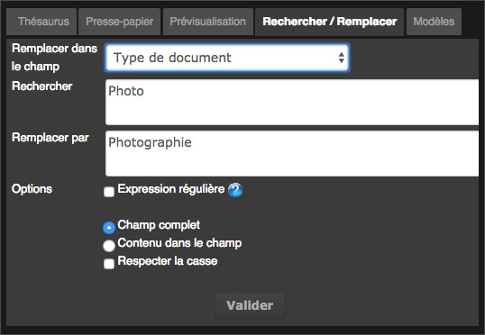

Editer
=======
.. toctree::
   :maxdepth: 3

   

Edition des documents
---------------------

.. topic:: L'essentiel

    Cette action permet d'éditer la ou les fiches descriptives des Enregistrements, 
    des Reportages, des Paniers, pour saisir, compléter ou modifier le contenu des 
    champs.
    Il est possible d’éditer à l’unité ou en lots et sous lots des 
    Enregistrements, des Paniers, des Reportages depuis la zone des résultats ou
    depuis la zone des paniers 
    La fenêtre est découpée en 3 espaces :
    La barre de défilement affiche les documents sélectionnés. La taille de la 
    zone est modifiable
    La taille des vignettes est modifiable en déplaçant le curseur.
    La zone inférieure affiche la liste des champs descripteurs, 
    la liste des status, et réserve un espace pour afficher le contenu du champs 
    actif.
    La zone inférieure droite affiche des onglets d’assistance à l’indexation.

.. image:: ../../images/Prod-Editer.jpg
	   :height: 350 px
	   :width: 712 px
	   :alt: alternate text
	   :align: center

* -> Sélectionner des documents, un panier ou un reportage

* -> Cliquer sur le bouton Editer 

* => La fenêtre **Editer** s'ouvre

Toutes les vignettes sont sélectionnées.
Les champs dont le contenu est identique pour les documents sélectionnés
apparaissent en clair.
Les champs dont le contenu est hétérogène apparaissent avec des xxxxx orange
Il est possible de désélectionner / sélectionner les documents en cliquant 
sur les vignettes et en utilisant les combinaisons de touche «Maj» ou «Alt» 
Cette fonction permet de commencer par renseigner tout ce qui est commun au 
lot (toutes les vignettes des documents sélectionnées).
L’utilisateur peut ensuite désélectionner une partie des documents en 
cliquant sur les vignettes et renseigner un ou plusieurs champs.
Aucune modification ou ajout n’est validé tant que l’utilisateur n’a pas 
cliqué sur le bouton  «Valider»

*  -> Pour passer d'une rubrique à une autre, appuyer sur la touche **TAB**.

*  -> Pour annuler les modifications en cours, cliquer sur Annuler ou appuyer 
   sur la touche **Echap**.

Editer des champs de type date
******************************

*  -> Sélectionner le ou les documents pour lesquels la date doit être modifiée 
   ou ajoutée

* -> Saisir manuellement la date selon le format aaaammjj
* -> Ou utiliser le calendrier proposé
* -> Cliquer sur Valider pour enregistrer les modifications

Editer des champs de type texte intégral
**************************************** 

* -> Sélectionner le ou les documents sur lesquels apporter une  modification
* -> Cliquer dans un champs de type texte
* -> Saisir les informations souhaitées

.. image:: ../../images/Prod-Editer-texte.jpg
	   :height: 350 px
	   :width: 712 px
	   :alt: alternate text
	   :align: center

Si le champ contient déjà des valeurs et que celles sont hétérogènes « xxxxx » 
entre les différents documents, il est possible d’ajouter les nouveaux termes 
saisis sur chaque fiche en cliquant sur le bouton « ajouter ».

.. image:: ../../images/Prod-Editer-texte-ajouter.jpg
	   :height: 38 px
	   :width: 262 px
	   :alt: alternate text
	   :align: center

Editer des champs textuels multi-valués
***************************************

* -> Sélectionner le ou les documents sur lesquels apporter une  modification
* -> Cliquer dans un champs textuel de type multi-valué

Les informations déjà présentes dans les notices de chaque document sélectionné 
sont affichées dans le champs ici « Mots Clés »
Les mots clés communs à toutes les notices sont en caractères blancs, ceux 
présents seulement sur certaines notices en Orange

.. image:: ../../images/Prod-Editer-textemulti.jpg
	   :height: 350 px
	   :width: 712 px
	   :alt: alternate text
	   :align: center

* -> Cliquer sur un des mots clés « Orange »

* => Le terme  s’affiche dans le masque de saisi

Le terme  est absent des notices des document ou le symbole "plus" s'affiche 
sous la vignette.

* -> Cliquer sur le symbole « plus » pour ajouter le terme pour ce document
* => Le symbole "plus" se transforme en symbole "moins"

Pour ajouter le terme à toutes les notices sélectionnées

* -> Appuyer sur la touche "entrée" du clavier ou cliquer sur le symbole "plus"
  qui se trouve à gauche du masque de saisie.

* -> Cliquer sur le symbole "moins" à gauche du masque de saisie pour 
  supprimer le terme de toutes les notices.

Editer à partir du thésaurus
****************************
 
L’onglet Thésaurus permet à l’utilisateur d’indexer rapidement à partir des 
termes contenus dans le thésaurus associé à la :term:`base`.
Les saisies sont assistées pour les champs qui ont été liés à des branches de 
thésaurus.

* -> Cliquer sur l'onglet thésaurus
* -> Sélectionner un champs du type textuel lié au thésaurus"
* -> Commencer à saisir un terme
 

* => L'onglet thésaurus s'actualise et affiche les termes commençant par...

.. image:: ../../images/Prod-Editer-thesaurus.jpg
	   :height: 153 px
	   :width: 330 px
	   :alt: alternate text
	   :align: center

* -> Faire un double clic sur le terme à indexer

* => il est immédiatement ajouté aux documents sélectionnés

.. note:: Il est aussi possible de déployer "l'arbre" du thésaurus pour
          chercher et sélectionner des termes à indexer. Cliquer sur les 
          symboles "plus" qui se trouvent devant les termes.

Editer à partir des valeurs suggérées
*************************************

Si des valeurs suggérées ont été définies pour le champs, la liste apparaît 
sous forme de menu contextuel dans la fenêtre à gauche du nom du champs.

.. todo:: faire un lien vers Préférences : Valeur suggérées dans la 
          documentation Phraseanet Administrateur.

.. image:: ../../images/Prod-Editer-valeurssugg.jpg
	   :height: 436 px
	   :width: 419 px
	   :alt: alternate text
	   :align: center

* -> Cliquer sur le menu contextuel
* -> Faire un double clic pour sélectionner une valeur dans la liste

* => la valeur est ajoutée au champs. 

.. note:: Pour cumuler des valeurs, sélectionner une valeur dans la liste  en 
          appuyant sur la touche "cmd" ou "ctrl"

Utiliser l'onglet Presse Papier
*******************************

* -> Cliquer sur l'onglet Presse Papier

Copier et coller des termes ou des expressions dans ou depuis le presse papier
vers des masques de saisie de champs

Utiliser l'onglet  Rechercher/Remplacer
***************************************

L’onglet permet à l’utilisateur de chercher et remplacer des termes contenus 
sur les documents en cours d’édition

* -> Cliquer sur l’onglet Rechercher / Remplacer

* -> Restreindre si nécessaire la fonction à un champs en particulier, 
     à partir du menu déroulant, par défaut dans tous les champs
* -> Saisir le terme à Rechercher dans les notices des documents en cours 
     d’édition
* -> Saisir le terme de remplacement
* -> Appliquer les options si nécessaire
* -> Cliquer sur Valider

* => Le nouveau terme remplace le précédent dans les notices 

 
Utiliser l'onglet  Modèles
**************************

Cette fonction permet de créer et d'utiliser ensuite des modèles de notices
pré remplies.

Un modèle est créé à partir d'une notice en cours d'édition.

* -> Cliquer sur l’onglet Modèles
* -> Sélectionner une notice en cliquant sur une vignette

.. note:: Si plusieurs documents sont sélectionnés, le modèle ne pourra 
          reprendre que le contenu hétérogène des champs

* -> Cliquer sur Ajouter

.. image:: ../../images/Prod-Editer-modeles.jpg
	   :height: 227 px
	   :width: 365 px
	   :alt: alternate text
	   :align: center

* -> Donner un titre au modèle
* -> Choisir les champs à reprendre, les champs contenant des termes sont 
     sélectionnés par défaut
* -> Cliquer sur Valider pour enregistrer le modèle

* => Le nouveau modèle est affiché dans la liste des modèles

Appliquer un modèle à une sélection de documents

* -> Sélectionner les documents
* -> Faire un double clic sur le titre d'un modèle

* => l'ensemble des informations contenus dans le modèle est appliqué aux 
     documents

.. note:: Il est possible de revoir les valeurs des champs d'un modèle en
          cliquant sur la flèche se trouvant devant le titre du modèle.

.. warning:: Un modèle est la propriété de l'utilisateur qui l'a créé, il ne
             peut être utilisé que par lui.

Editer des reportages
*********************

Chaque reportage dispose de sa propre notice descriptive. Il est donc possible
d'éditer en lots ces notices de reportage.

Editer Les notices de reportages
^^^^^^^^^^^^^^^^^^^^^^^^^^^^^^^^

En mode recherche reportage 

* -> Sélectionner plusieurs reportages depuis les résultats
* -> Cliquer sur Editer

* => la fenêtre Editer s'ouvre

Le principe de fonctionnement est identique à celle de l'édition des documents 
mais seules les notices des reportages seront modifiées 
(pas les notices des documents contenus dans les reportages).

Editer un reportage et son contenu
^^^^^^^^^^^^^^^^^^^^^^^^^^^^^^^^^^

* -> Sélectionner un seul reportage depuis les résultats
* ->cliquer sur Editer

ou 

* -> Cliquer sur Editer depuis la barre d'action locale du reportage quand 
  celui ci est dans la zone de travail.

* => La fenêtre Editer s'ouvre

.. image:: ../../images/Prod-Editer-reportage.jpg
	   :height: 232 px
	   :width: 476 px
	   :alt: alternate text
	   :align: center

Les reportages ont par défaut une image de "dossier" pour les illustrer.

* -> Cliquer sur le menu contextuel d’une des vignettes
* -> Cliquer sur « Définir comme image principale
* -> L’image du dossier est remplacée par la vignette du document choisi

Pour compléter la notice du reportage

* -> Cliquer sur l’image de représentation du reportage «  en haut à gauche de 
     la fenêtre "Editer"
* -> Seule la notice du reportage sera modifiée

* -> Sélectionner l’image de représentation du reportage et les autres 
     vignettes pour modifier à la fois la notice reportage et les notices des 
     documents qui composent le reportage.
* -> Compléter les champs à modifier
 	
* -> Cliquer sur Valider pour enregistrer les modifications.

Editer les Status
*****************

La première ligne de la liste de champs permet de changer les status des 
documents sélectionnés.

* -> Cliquer sur la première ligne de la liste de champs "Status".
* -> Cocher les cases correspondant au changement d’état à appliquer sur les 
     documents 
* -> Cliquer sur Valider pour enregistrer les modifications ou poursuivre 
     l’indexation.

Test

