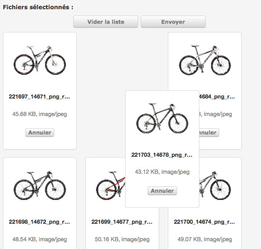
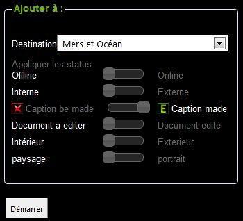
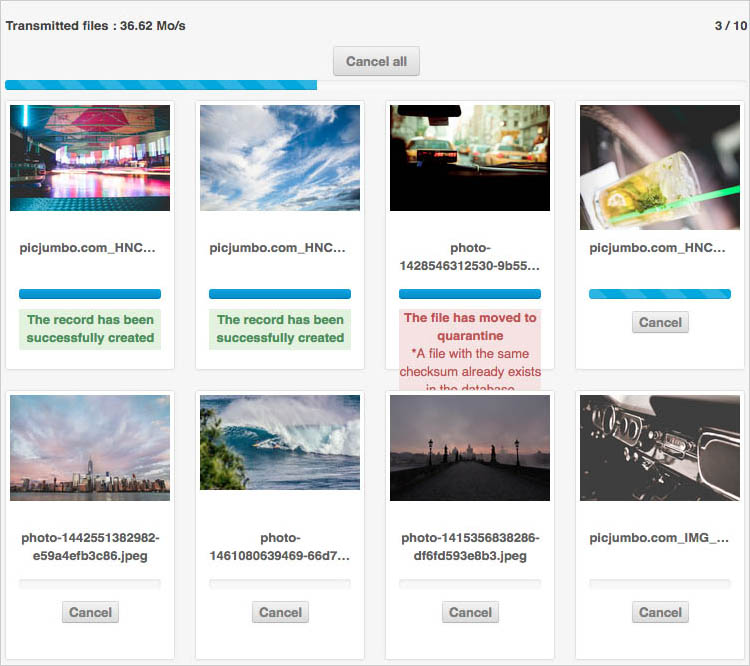
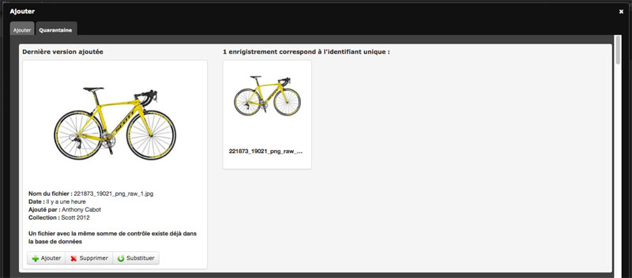

Importer
=========
.. toctree::
   :maxdepth: 3

.. topic:: L'essentiel

    Vous pouvez importer des documents en utilisant l'interface **Phraseanet 
    Upload**. C'est une application dédiée pour ajouter des documents à des 
    collections sur lesquelles l'utilisateur dispose des droits d'ajout. 
    L'interface présente plusieurs zones de travail: 

    * Sélectionnez vos fichiers à ajouter (1)
    * Réordonnez-les éventuellement (2)
    * Choisissez la collection où vont se trouver les documents et en-dessous, 
      appliquez des Status si besoin (3)
    * Zone indiquant l'état du transfert des documents (4)

.. image:: ../../images/Upload-zones.jpg
	   :alt: alternate text
	   :align: center 

Importer en trois étapes
-------------------------
Cliquer sur Upload dans la barre d'applications Phraseanet.
*Phraseanet Upload* se lance dans un nouvel onglet du navigateur. 

Ajouter des documents
*********************
**Sélectionner les fichiers à ajouter**

.. image:: ../../images/Upload-zone1.jpg
	   :alt: alternate text
	   :align: center 

  * Cliquer sur *Choisir les fichiers à ajouter*.

L'application lance l'explorateur de fichiers, aller jusqu'au dossier où se 
trouvent les fichiers à ajouter. Cliquer sur Ouvrir.

.. image:: ../../images/Upload-fichiers.jpg
	   :alt: alternate text
	   :align: center 
	   
*Phraseanet Upload* affiche la liste des fichiers sélectionnés.

.. image:: ../../images/Upload-zone2.jpg
	   :alt: alternate text
	   :align: center 

Réordonner avant import
***********************
Cette étape est facultative. Mais si l'ordre dans lequel les images seront transférées 
est important, il est utile dans ce cas d'utiliser cette zone de travail avant d'importer 
les documents.

  * Cliquer sur un fichier et le glisser/ déposer ailleurs dans la liste. 

Il est également possible de cliquer sur "Inverser l'ordre".

Sélectionner la collection 
***************************	
Il faut désormais sélectionner la collection de destination et vous pourrez également
appliquer des status.

  * Cliquer sur le menu déroulant des collections disponibles. 

  * Choisissez la collection où vous souhaitez ajouter vos documents multimédia.

Appliquer ensuite, si nécessaire, un état aux status disponibles.

Exemple de status appliqués aux images: public/privé, à éditer/édité, online/offline, 
portrait/paysage, etc.

  * Cliquer enfin sur **Démarrer** pour commencer le transfert.

La liste des fichiers à ajouter est vidée et la liste des fichiers transférés 
se remplit.

Chaque fichier est transféré.
Les documents sont ajoutés à la collection de destination.

Il est désormais possible d'aller consulter vos documents, à partir des interfaces 
*Phraseanet Production* (consultation et gestion des documents) ou *Phraseanet 
Classic* (simple consultation).

La Quarantaine
--------------
Après avoir été ajoutés, certains fichiers de type image peuvent être placés 
en "quarantaine" (fichiers placés en jaune sur l'image ci-dessous).

La quarantaine est un espace où sont isolés des fichiers en attente d'une action 
utilisateur.
La quarantaine ne s'active que si des fichiers photos sont identifiés comme 
étant des nouvelles versions de documents existants préalablement téléchargés, 
modifiés puis ajoutés à nouveau.
La quarantaine permet aussi d'isoler des fichiers photos ne répondant pas à des 
critères paramétrés.

**Voici des cas de mise en quarantaine:**

Mise à jour de fichiers photos
******************************
Les fichiers sont identifiés comme étant des documents déjà existants s'ils ont 
été téléchargés depuis Phraseanet, puis ajoutés à nouveau, modifiés ou non.
Cette fonction permet de gérer les retouches à faire sur des images qui ont 
ajoutées à l'application.

  * Ajouter des fichiers
  * Les fichiers sont ajoutés 
  * L'onglet quarantaine s'active 
  * Cliquer sur l'onglet quarantaine

.. image:: ../../images/Upload-quarantaine.jpg
	   :alt: alternate text
	   :align: center 

Les images ajoutées identifiées comme existantes sont présentées, 
à gauche la version ajoutée; à droite la version déjà dans la :term:`base`.

Trois choix sont alors proposés à l’utilisateur:

  * Ajouter le fichier comme nouveau document dans la :term:`base`
  * Rejeter le fichier
  * Remplacer le fichier existant

L'utilisateur doit cliquer l'une des icônes:

.. image:: ../../images/Upload-quarantaine-icones.jpg
	   :alt: alternate text
	   :align: center 

Puis passer au document suivant, le cas échéant.

Fichiers à multiples versions
******************************
D’autres versions d’un même fichier peuvent déjà être en attente en quarantaine.

  * Cliquer sur « Voir/Cacher ».

Choisir ensuite quelle version en quarantaine à ajouter, rejeter ou substituer.

.. image:: ../../images/Upload-quarantaine-multiples.jpg
	   :alt: alternate text
	   :align: center 
	   
Un fichier en quarantaine peut être identifié à plusieurs documents dans 
la :term:`base`.

.. image:: ../../images/Upload-quarantaine-multiples2.jpg
	   :alt: alternate text
	   :align: center 

Les possibilités: 

  * Choisir d’ajouter comme une nouvelle version, rejeter ou :
  * Cliquer sur le menu déroulant « Document à substituer »
  * Choisir un des documents identifiés dans la :term:`base`
  * Enfin, cliquer sur la flèche verte.

*Astuce: Traiter en lot*

Pour traiter vos documents dans la quarantaine en lot, cliquez d'abord sur 
*Ajouter / supprimer tous les candidats*:

.. image:: ../../images/Upload-quarantaine-lot1.jpg
	   :alt: alternate text
	   :align: center 

Une fenêtre s’ouvre.

.. image:: ../../images/Upload-quarantaine-lot2.jpg
	   :alt: alternate text
	   :align: center

* Cliquer sur le menu déroulant.
* Cliquer sur « Ajouter les documents bloqués » pour créer des nouveaux 
  enregistrements pour chaque fichier en quarantaine
* Cliquer « Substituer quand possible ou ajouter les documents bloqués » 
  permet de substituer tous les fichiers uniques en quarantaines et uniques 
  dans la :term:`base`.

La quarantaine permet aussi d’isoler des nouveaux fichiers ne répondant pas à 
des critères.

  * Il est aussi possible de traiter en lot les fichiers bloqués 
    et « Ajouter les documents bloqués ».
  * Cliquer sur « Supprimer les documents bloqués » pour rejeter tous les fichiers 
    en quarantaine.
  * Cliquer sur « Valider » ou « Annuler » 

L’onglet de la quarantaine se vide.

Fichiers non conformes
**********************

Si des critères ont été définis dans la structure concernant des 
caractéristiques attendues pour des fichiers images ont été définit certaines 
images peuvent être mises en quarantaine.
Ces critères peuvent être des critères de dimensions spatiales, d’espaces 
colorimétriques…
La raison de mise en quarantaine du fichier est donnée sous la vignette.

  * Cliquer sur le + vert pour ajouter quand même ces fichiers 
  * Cliquer sur la croix rouge pour rejeter le fichier

  .. image:: ../../images/Upload-quarantaine-nonconforme.jpg
	   :alt: alternate text
	   :align: center 
	   
	   
