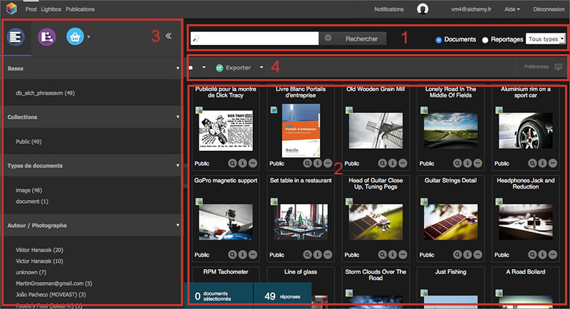

Presentation
============

.. toctree::
   :maxdepth: 3

About Us
--------
Qui sommes nous?
****************
Alchemy est une entreprise fondée en 1996 dont le siège se trouve à Paris, France. 
Editeur de solutions de bases de données multimédia, Alchemy édite, développe et 
distribue Phraseanet depuis 2005.
Elle fournit de nombreux services autour de la solution: contrats de support, 
hébergement, formation, aide à l'installation...

Qu'est ce que Phraseanet?
*************************
Phraseanet est la solution phare d'Alchemy, une solution full web de gestion de photothèques/médiathèques 
qui permet aux entreprises, 
collectivités et photographes de gérer leurs documents multimédia.
Phraseanet gère aussi bien les images que les vidéos, les documents audio et PDF. 
Appelée aussi Digital Asset Management.
Depuis 2010, Phraseanet est une solution Open Source distribuée sous licence GNU GPL v3.
Phraseanet est une application web: les utilisateurs n'ont besoin que d'un navigateur web 
standard (IE, Firefox, Safari, Chrome...) pour se connecter à leur photothèque.
La solution est compatible Windows, Mac, Linux.

*Phraseanet en quelques dates:*

  * 2005 : Lancement de Phraseanet 1.0 en Avril
  * 2007 : Sortie de la version 2.1 en Septembre, avec une nouvelle interface (s’ajoutant à Prod, Client, Admin et Report) : Thesaurus. 
  * 2008 : Sortie de la version 2.2, avec la nouvelle application Check it.
  * 2010 : Sortie de la version 3.0 en Mars, en Open Source, avec le redesign de Prod, et l’ajout d’Upload et de Lightbox
  * Sortie de la version 3.0.3 en Juillet, avec un renouveau de l’interface de Report. 
  * 2011:  Sortie de la version 3.1 au mois de février 2011. Nouvelle interface de Lightbox, compatible smartphones, le nouveau gestionnaire de commandes ; la quarantaine dans le module d’Upload (gestion des doublons)...
  * Sortie de la version 3.5  au mois d’octobre  2011. Nouveautés : moteur de recherche Sphinx, 1ère version d’API, le Bridge, nouvelle gestion des paniers et des publications,...

Présentation des modules
------------------------
Phraseanet est un système complet pour l’archivage, l’organisation et la diffusion de vos documents multimédia. 
La solution se compose des 7 interfaces suivantes, accessibles à partir d’un menu principal:

- Phraseanet Upload
- Phraseanet Production
- Phraseanet Classic
- Phraseanet Administration 
- Phraseanet Report
- Phraseanet Thesaurus
- Phraseanet Lightbox

Upload
******
*Phraseanet Upload* vous permet d’importer vos documents multimédia à partir de votre disque dur. 
Vous choisissez la collection dans laquelle vous souhaitez voir vos documents archivés, vous les réordonnez éventuellement, puis effectuez l’import. Ce gestionnaire de téléchargement vous permet de transfér vos documents  depuis un navigateur web à la vitesse d’un transfert FTP !

.. image:: ../images/Upload1.jpg
   :height: 200 px
   :width: 400 px
   :alt: alternate text
   :align: center
   
Production & Classic
********************
*Phraseanet Production* est le module le plus important. Il permet d’éditer, d’organiser, de partager vos documents. 
Cette interface est dédiée aux gestionnaires et contributeurs. 
*Phraseanet Classic* est une vue dédiée aux utilisateurs finaux, permettant de visualiser simplement les documents. 

.. image:: ../images/Classic-interface.jpg
   :height: 300 px
   :width: 400 px
   :alt: alternate text
   :align: center

Administration
**************
*Phraseanet Administration* permet de gérer votre système, de créer des bases et des collections, de créer 
des utilisateurs et de gérer leurs droits. La gestion des droits est très fine : on peut ainsi donner ou non des 
droits à un utilisateur sur une collection donnée, mais également sur le type d’actions qu’il peut effectuer
sur les documents. 
Admin est l’interface la plus technique de Phraseanet et elle reste pourtant très simple d’utilisation.

Report
******
Véritable application de statistiques, *Phraseanet Report* présente de très nombreux détails 
sur l’activité de votre base Phraseanet : quelles ont été les questions les plus posées, 
quels sont les utilisateurs les plus actifs sur le système, et des informations telles que 
le nombre de connexions, le nombre de téléchargements, le nombre de connexions ou de 
téléchargement par plateformes et navigateurs, etc.

Thesaurus
*********
La création et la gestion de *Phraseanet Thesaurus* est possible dans Phraseanet. 
Il gère la synonymie, permet de lever des ambiguités selon le contexte. On rebondit de terme en terme. 
Il représente un vrai plus dans l’utilisation d’une solution de photothèque.

Lightbox
********
Interface collaborative, *Phraseanet Lightbox* permet entre autres de connaître les avis d’utilisateurs 
sur des documents. Elle permet aussi de pouvoir visualiser et/ou télécharger des documents spécifiques 
envoyés par un autre utilisateur Phraseanet.

Présentation des interfaces
---------------------------
Menu général
************

Phraseanet s'ouvre.
La dernière application utilisée pour quitter se lance par défaut.
Toutes les applications proposent en haut de la fenêtre la même barre de navigation.

La partie gauche de la fenêtre affiche la liste les applications auxquelles vous avez accès.

.. image:: ../images/Menu.jpg
   :height: 200 px
   :width: 400 px
   :alt: alternate text
   :align: center

En cliquant sur le Nom d’une application, le navigateur internet lance celle-ci dans un nouvel onglet.

Dans la partie supérieure droite, se trouvent  vos informations de compte, l’aide en ligne et le lien 
pour se déconnecter.

IMAGE

Présentation des zones dans l'interface de Production
*****************************************************
Nous allons vous présenter ci-dessous l'interface de *Production*.

Les zones principales dans Production

  * La zone 1 représente l'espace de recherche: Entrez un mot clé
  * La zone 2 c'est la zone d'affichage des réponses
  * La zone 3 concerne les paniers: votre sélection de documents
  * La zone 4 est la palette des actions. Elle permet d'effectuer des actions sur les documents: éditer, supprimer, partager,...

